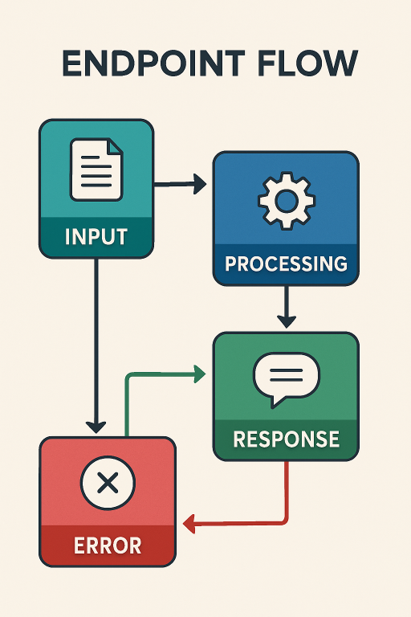
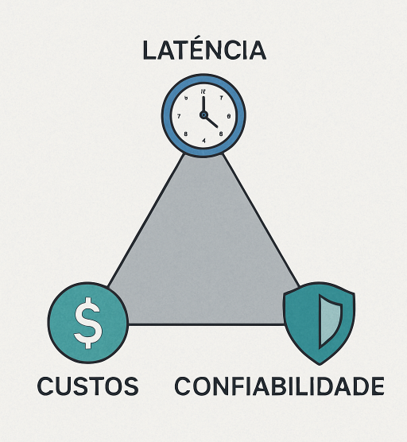

# Do modelo ao produto: como uma API de LLM vira funcionalidade em um app de entrega


Você já parou para pensar por que grandes apps de delivery parecem "inteligentes" ao resumir avaliações de restaurantes? Não é mágica — é engenharia sólida por trás de um LLM simples. Neste post, vou desmistificar essa jornada: de um protótipo rápido em Jupyter para uma feature robusta em produção, lidando com latência, custos e escalabilidade. Como dev full stack e DevOps, vi isso na prática em apps de alto tráfego. Vamos mergulhar?


_Figura 1: Pipeline de LLM em produção: de protótipo a feature escalável_

## 1. Contexto e Propósito: Por que isso importa no mundo real?

Nos últimos anos, integrar LLMs virou algo trivial: gere uma chave de API, escreva poucas linhas de código e _voilà_ — respostas "inteligentes". Mas em um app de delivery processando milhares de pedidos por minuto, isso é só o começo.

O grande desafio? **Transformar essa capacidade bruta em valor real para o usuário**, sem quebrar o app com timeouts ou custos exorbitantes. Aqui, compartilho a jornada de protótipo para produção, focando em desafios de engenharia que todo dev precisa dominar.

> **Por que ler isso?** Se você constrói features com IA, vai evitar armadilhas comuns que eu já cometi — e escalar de forma sustentável.

## 2. Abordagem: Um caso prático em apps de delivery

Para tornar concreto, vamos usar um exemplo clássico: **resumir avaliações de restaurantes**. Em vez de listar dezenas de reviews, o app gera um parágrafo imparcial destacando prós e contras.

**Estrutura do post:**

- **Conceitos básicos**: Diferença entre modelo e feature.
- **Arquitetura**: Fluxo de dados do app ao LLM.
- **Código prático**: Implementação em Python/FastAPI.
- **Produção**: Métricas, riscos e soluções reais.

## 3. Conceitos Fundamentais: Alinhando o vocabulário

Antes de codar, vamos alinhar termos para evitar confusões.

| Termo              | Definição                                                 | Contexto de Delivery                        |
| :----------------- | :-------------------------------------------------------- | :------------------------------------------ |
| **O Modelo (LLM)** | O "cérebro" (GPT-4, Llama 3). Stateless e probabilístico. | A engine que processa o texto.              |
| **A Feature**      | O pacote completo.                                        | Inclui busca no DB, prompts, API e UI.      |
| **Context Window** | Limite de tokens processados de uma vez.                  | Foque nas últimas 20 avaliações para caber. |

> **Mudança de mindset chave**: Pare de tratar o LLM como oráculo infalível. Veja-o como um **transformador de texto** em um pipeline clássico de software.

## 4. Mão na Massa: Exemplo Prático - Implementando o endpoint

Agora, o prático: crie um endpoint GET /restaurants/{id}/reviews/summary. Ele pega as últimas 20 reviews textuais e retorna um resumo conciso.

O Fluxo Passo a Passo
App pede o resumo (ex: ao abrir a página do restaurante).
Backend consulta o banco (Postgres ou DynamoDB).
Backend constrói o prompt com as reviews.
Backend chama o LLM via API.
Backend formata a resposta e devolve ao app.
Código Exemplo (Python com FastAPI)
Aqui vai um snippet funcional — teste no seu ambiente local:

```python
import os
from typing import List
from fastapi import FastAPI, HTTPException
from openai import OpenAI

app = FastAPI()
# Certifique-se de ter a variável de ambiente OPENAI_API_KEY configurada
client = OpenAI(api_key=os.getenv("OPENAI_API_KEY"))

# Simula busca no banco (em prod: use SQLAlchemy ou similar)
def get_recent_reviews(restaurant_id: str) -> List[str]:
    return [
        "A comida chegou fria, mas estava saborosa.",
        "Entrega super rápida! O sushi estava fresco.",
        "Demorou muito e o entregador foi rude.",
        "Melhor hambúrguer da cidade, recomendo o de cheddar."
    ]

def generate_summary_prompt(reviews: List[str]) -> str:
    reviews_text = "\n".join([f"- {r}" for r in reviews])
    return f"""
    Você é um assistente útil de um app de delivery.
    Analise as seguintes avaliações de um restaurante e gere um resumo curto (max 3 linhas)
    destacando os pontos positivos e negativos. Seja imparcial.

    Avaliações:
    {reviews_text}

    Resumo:
    """

@app.get("/restaurants/{restaurant_id}/reviews/summary")
async def get_review_summary(restaurant_id: str):
    try:
        reviews = get_recent_reviews(restaurant_id)

        if not reviews:
            return {"summary": "Este restaurante ainda não possui avaliações suficientes."}

        prompt = generate_summary_prompt(reviews)

        # Chama LLM (em prod: use async e retry logic)
        response = client.chat.completions.create(
            model="gpt-3.5-turbo",
            messages=[{"role": "user", "content": prompt}],
            max_tokens=150,
            temperature=0.5  # Consistência > criatividade
        )

        summary = response.choices[0].message.content.strip()

        return {
            "restaurant_id": restaurant_id,
            "summary": summary,
            "source_count": len(reviews)
        }

    except Exception as e:
        print(f"Erro ao gerar resumo: {e}")  # Log real em prod
        raise HTTPException(status_code=503, detail="Resumo indisponível no momento.")
```

> [!TIP] > **Dica de Performance**: Em produção, troque por chamadas assíncronas (`aiohttp`) para não bloquear o endpoint.


_Figura 2: Fluxo de resumo de reviews em app de delivery_

## 5. Métricas, Riscos e Boas Práticas: Lidando com Latência, Custos e Falhas

Código pronto? Ótimo, mas em escala, LLMs são traiçoeiros. Aqui vão os pilares para tornar sua feature _production-ready_:


_Figura 3: Desafios de produção_

| Desafio               | Problema                               | Solução de Engenharia                                                                          |
| :-------------------- | :------------------------------------- | :--------------------------------------------------------------------------------------------- |
| **Latência** ⏱️       | Chamadas de 2-10s geram abandono.      | **Cache (Redis)**: Gere resumos em batch ou cacheie por 24h. Leitura em ms.                    |
| **Custos** 💸         | Milhares de chamadas explodem a conta. | **Rate Limiting**: Limite por restaurante. Use modelos menores (GPT-3.5) para tarefas simples. |
| **Confiabilidade** 🛡️ | API cai ou alucina.                    | **Circuit Breaker**: Se falhar, retorne reviews originais. O app nunca quebra.                 |

> [!NOTE]
> Essas práticas vêm da engenharia tradicional — IA é só mais um componente.

## 6. Evidence & Exploration: Medindo o Impacto

Não confie só no "parece bom". Teste de verdade:


_Figura 4: Métricas de impacto_

- **A/B Testing**: 50% dos users veem resumo; 50% veem lista raw. Métrica? Aumento em pedidos ou tempo de decisão.
- **Feedback Loop**: Botões "Útil/Não útil" no app. Use isso para refinar prompts (human-in-the-loop).
- **Métricas Chave**: Taxa de engajamento, custo por feature, taxa de erro.

> Em projetos reais, isso dobrou a retenção em telas de restaurante.

## 7. Reflexões Pessoais & Próximos Passos: Lições de Quem Já Escalou Isso

Como dev full stack e DevOps, aprendi que 90% do sucesso com IA é engenharia clássica: cache, monitoramento, resiliência. O prompt é o tempero, mas sem base sólida, não escala.

**Próximos passos no meu radar:**

- **Para 10k+ reviews**: Integre RAG (Retrieval-Augmented Generation) — tema para outro post.
- **Combatendo alucinações**: Guardrails e validações — vem por aí.

> E você, já integrou LLMs em apps de produção? Qual foi o maior desafio com latência ou custos? Compartilhe nos comentários — sua experiência pode ajudar outros devs a evitar dores de cabeça!
