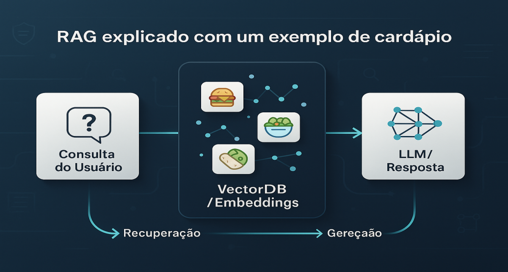

# RAG (Retrieval-Augmented Generation) explicado com um exemplo de cardápio

<div align="center">
  
</div>

## 1. Contexto e Propósito (Purpose)

Imagine que você pergunte ao ChatGPT: "Quanto custa o X-Bacon no 'Lanches do Zé' em São Paulo?". O modelo provavelmente vai alucinar um preço ou dizer que não sabe. Por quê? Porque o LLM foi treinado com dados da internet até uma data de corte, e ele não tem acesso em tempo real ao banco de dados do seu aplicativo de delivery.

Além disso, cardápios mudam. Preços sobem, ingredientes acabam. Não faz sentido re-treinar (Fine-Tuning) um modelo gigante toda vez que o Zé muda o preço do hambúrguer.

O propósito deste artigo é apresentar o padrão arquitetural RAG (Retrieval-Augmented Generation). É a técnica padrão de mercado para conectar a capacidade linguística da IA com os dados proprietários e dinâmicos do seu negócio (como cardápios, estoque e políticas de cancelamento).

## 2. Abordagem (Approach)

Vamos construir mentalmente (e com código) um assistente de pedidos que conhece o cardápio de um restaurante específico.

Nossa abordagem cobrirá:

O Problema da Memória: Por que o prompt simples falha.

A Solução RAG: Recuperar antes de Gerar.

Conceitos: Embeddings e Busca Vetorial.

Prática: Um fluxo de busca semântica para encontrar "algo leve para comer".

<div align="center">
  
  <p><em>Figura 1: O fluxo de dados na arquitetura RAG: Recuperação (Retrieval) antes da Geração.</em></p>
</div>

### RAG vs. Fine-Tuning: Qual escolher?

Uma confusão comum é achar que precisamos "ensinar" o cardápio para a IA treinando-a novamente. Na engenharia de IA, separamos conhecimento de comportamento.

| Critério                   | RAG (Retrieval-Augmented Gen.)             | Fine-Tuning (Treinamento)                 |
| -------------------------- | ------------------------------------------ | ----------------------------------------- |
| **O que a IA aprende?**    | Fatos novos (preços, itens, estoque).      | Padrões (estilo, tom, formato JSON).      |
| **Analogia**               | Fazer uma prova com consulta ao livro.     | Estudar anos para decorar o livro.        |
| **Atualização de Dados**   | Imediata. Atualizou o banco, a IA já sabe. | Lenta. Requer novo treino (horas/dias).   |
| **Alucinação**             | Baixa. A resposta é ancorada nos dados.    | Média. Pode inventar fatos com convicção. |
| **Custo**                  | Custo por token (input maior).             | Custo de treino + hospedagem de modelo.   |
| **Veredito para Delivery** | ✅ Ideal (Cardápios mudam todo dia).       | ❌ Inviável para dados dinâmicos.         |

## 3. Conceitos Fundamentais

Para entender RAG, precisamos de três conceitos:

**1. Embeddings:** É a tradução de texto para uma lista de números (vetor). A frase "Hambúrguer suculento" terá números matematicamente próximos de "X-Salada gostoso" e distantes de "Salada de frutas". Isso permite que o computador entenda significado, não apenas palavras-chave.

**2. Vector Database:** Um banco de dados otimizado para guardar esses vetores e fazer buscas por similaridade (ex: Pinecone, Chroma, pgvector).

**3. Retrieval (Recuperação):** O ato de ir ao banco, pegar os dados relevantes para a pergunta do usuário e trazê-los para o contexto.

<div align="center">
  
  <p><em>Figura 2: Visualização simplificada do Espaço Vetorial. Itens semanticamente similares ficam próximos.</em></p>
</div>

### A Fórmula do RAG

```
Prompt Final = Instrução do Sistema + Dados Recuperados (Contexto) + Pergunta do Usuário
```

## 4. Mão na Massa: Exemplo Prático

**Cenário:** O usuário pergunta: _"Quero algo vegetariano que não seja muito caro."_

Se enviarmos isso direto ao LLM, ele vai sugerir pratos genéricos. Com RAG, fazemos assim:

### Passo 1: Indexação (Feito previamente)

Transformamos o cardápio em vetores.

```python
# Exemplo conceitual

menu = [
{"id": 1, "name": "X-Bacon", "desc": "Carne, queijo, bacon", "price": 35.00, "tags": ["carne"]},
{"id": 2, "name": "Salada Caesar", "desc": "Alface, croutons, molho", "price": 22.00, "tags": ["vegetariano", "leve"]},
]

# Convertemos "name" + "desc" em vetores e salvamos no VectorDB
```

### Passo 2: O Fluxo de Atendimento (Runtime)

```python
import openai

def search_menu(query: str): # 1. Converter a pergunta do usuário em vetor (Embedding) # 2. Buscar no VectorDB os itens mais similares semanticamente # Simulando o retorno da busca vetorial para "vegetariano barato":
return [
{"name": "Salada Caesar", "price": 22.00, "desc": "Alface, croutons..."},
{"name": "Wrap de Cogumelos", "price": 28.00, "desc": "Tortilla, shimeji..."}
]

def answer_user(user_query: str): # 1. Retrieval
relevant_items = search_menu(user_query)

    # 2. Augmentation (Montar o contexto)
    context_text = "\n".join([f"- {item['name']} (R$ {item['price']}): {item['desc']}" for item in relevant_items])

    prompt = f"""
    Você é um garçom digital. Use APENAS as informações abaixo para responder.

    Cardápio Disponível:
    {context_text}

    Pergunta do cliente: {user_query}
    """

    # 3. Generation
    response = openai.ChatCompletion.create(
        model="gpt-3.5-turbo",
        messages=[{"role": "user", "content": prompt}]
    )

    return response.choices[0].message.content
print(answer_user("Tem algo vegetariano por menos de 30 reais?"))

# Resposta esperada: "Sim! Temos a Salada Caesar por R$ 22,00 e o Wrap de Cogumelos por R$ 28,00."
```

**Perceba:** O LLM não "sabia" o preço. Nós demos o preço a ele no momento da pergunta.

## 5. Métricas, Riscos e Boas Práticas

### Riscos Comuns

**Dados Desatualizados:** Se o preço mudar no SQL mas não no VectorDB, o RAG vai informar o preço errado. Solução: Sincronização de dados em tempo real ou CDC (Change Data Capture).

**Context Window Limit:** Se o cardápio for enorme, não dá para trazer tudo. O Retrieval precisa ser preciso para trazer apenas o Top-5 ou Top-10 itens relevantes.

### Métricas de Qualidade: A Tríade do RAG

Como saber se o bot está funcionando? "Parece bom" não é métrica de engenharia.
Utilizamos frameworks de avaliação (como o **Ragas**) que medem três pilares essenciais:

#### 1. Context Relevance (Precisão da Busca)

- **Pergunta:** "Quero algo vegano."
- **Contexto Recuperado:** O sistema trouxe o "Hambúrguer de Soja" (bom) ou trouxe "Picanha" (ruim)?
- **Objetivo:** Garantir que não estamos poluindo o prompt com lixo (ruído).

#### 2. Groundedness (Fidelidade aos Dados)

- **Contexto:** "A Pizza custa R$ 50."
- **Resposta da IA:** "A Pizza custa R$ 40."
- **Erro:** Alucinação. A IA ignorou o contexto e inventou um dado.
- **Objetivo:** A resposta deve ser 100% baseada no contexto recuperado.

#### 3. Answer Relevance (Utilidade)

- **Pergunta:** "Tem Coca-Cola?"
- **Resposta:** "Temos Pepsi e Guaraná."
- **Objetivo:** A IA respondeu a dúvida do usuário de forma direta, mesmo que a resposta seja negativa?

## 6. Evidence & Exploration

### Busca Híbrida: O Próximo Nível

Para explorar mais, precisamos falar de **Busca Híbrida**.

A solução de engenharia é o **filtro híbrido:**

1. **Busca Vetorial (Semântica):** Encontra itens com descrição próxima de "algo leve".
2. **Filtro Metadata (Exato/SQL):** Aplica um filtro rígido `price < 30` ou `category == 'vegetarian'`.

A maioria dos bancos vetoriais modernos (como **Qdrant**, **Weaviate** ou **pgvector**) suporta essa filtragem pré-processamento. Isso é essencial para e-commerce e delivery, onde o cliente não aceita uma sugestão fora do filtro de preço só porque ela é "semanticamente parecida".

### Experimentos Sugeridos

- **Teste A/B:** Compare respostas com RAG vs. sem RAG e meça taxa de conversão.
- **Golden Dataset:** Crie 50 perguntas típicas de usuários e valide se o RAG recupera os itens corretos.
- **Monitoramento:** Acompanhe métricas como tempo de resposta, relevância do contexto e satisfação do usuário.

## 7. Reflexões Pessoais & Próximos Passos

RAG é a ponte entre o cérebro da IA e o corpo do seu negócio (seus dados). Sem RAG, a IA é um consultor inteligente que não leu os memorandos da empresa.

Ao escrever este artigo, percebi como RAG resolve elegantamente o problema de dados dinâmicos. Não é sobre treinar modelos gigantes — é sobre engenharia de dados inteligente.

### Próximos Passos

- **E se a pergunta for muito complexa para um único passo de busca?** (Ex: "Qual a pizza mais vendida mês passado?") → Explorar **Agentic RAG** ou **Multi-hop Retrieval**.
- **E se precisarmos ajustar o comportamento do modelo para falar como a nossa marca?** → Aí entra o **Fine-Tuning**, que já vimos na tabela comparativa, mas aprofundaremos em casos de uso de estilo no **artigo 04**.
- **Como garantir que o VectorDB está sempre sincronizado com o SQL?** → Estudar padrões de **CDC (Change Data Capture)** e **Event-Driven Architecture** (ver **artigo 09**).

---

**Artigos Relacionados:**

- [01 - Do modelo ao produto](./01-do-modelo-ao-produto.md)
- [04 - Fine-tuning vs Prompt vs RAG](./04-finetuning-vs-prompt-vs-rag.md)
- [16 - Alucinações de LLM](./16-alucinacoes-llm-mitigacao.md)
