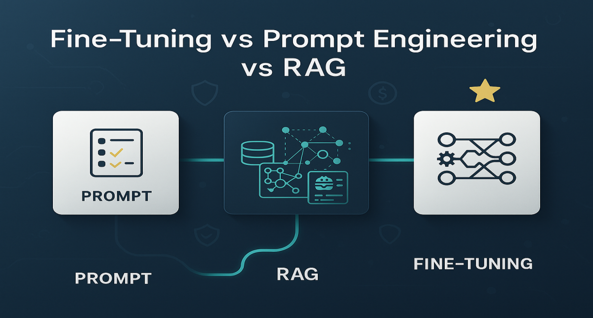

# Fine-tuning vs Prompt Engineering vs RAG: O Framework de Decisão

<div align="center">
  
</div>

## 1. Contexto e Propósito (Purpose)

Uma das dúvidas mais comuns em times de engenharia que estão começando com GenAI é: "Devemos treinar nosso próprio modelo?". A resposta curta quase sempre é não (ou pelo menos, "ainda não"). A resposta longa é o tema deste artigo.

Em um ecossistema de delivery, enfrentamos problemas distintos:

- **Cardápios mudam a cada minuto** (dados dinâmicos).
- **O tom de voz do suporte precisa ser consistente** (estilo).
- **Precisamos extrair dados estruturados de milhares de avaliações diariamente** (tarefa específica de alto volume).

O propósito aqui é criar um framework de decisão. Vamos entender quando usar Prompt Engineering (o mais barato para começar), RAG (o mais confiável para fatos) ou Fine-Tuning (o mais especializado), e como a solução ideal geralmente combina os três.

## 2. Abordagem (Approach)

Para facilitar a decisão, manteremos nossos três cenários reais de um app de entrega, aplicando a técnica correta (e atualizada) para cada um:

- **Cenário A:** Responder dúvidas sobre o cardápio atual e promoções relâmpago.
- **Cenário B:** Classificar milhares de avaliações de texto em tags JSON (Sabor, Entrega, Preço).
- **Cenário C:** Um chatbot com a personalidade marcante do mascote da marca ("Zequinha do Delivery").

<div align="center">
  
  <p><em>Figura 1: Árvore de decisão para escolher entre Prompt Engineering, RAG e Fine-Tuning.</em></p>
</div>

## 3. Conceitos Fundamentais

Antes de codar, precisamos alinhar as definições:

### 1. Prompt Engineering

É ensinar "in-context". Rápido e sem custo de infraestrutura.

**⚠️ Atenção:** Com modelos atuais suportando janelas de 1M+ tokens (Long Context), muitas tarefas que antes exigiam RAG agora podem ser resolvidas apenas colocando todos os documentos no prompt, embora isso aumente o custo por chamada e a latência.

### 2. RAG (Retrieval-Augmented Generation)

É dar ao modelo acesso a dados externos em tempo real. Pode ser via busca vetorial (textos não estruturados) ou Function Calling (bancos SQL/APIs). O modelo não "aprende" a informação, ele a consulta para reduzir alucinações.

### 3. Fine-Tuning

É especialização. Você altera os pesos do modelo para que ele aprenda um comportamento, formato ou estilo específico. É ideal para tarefas repetitivas onde você quer trocar um modelo gigante (caro) por um modelo pequeno e especializado (barato e rápido).

### A Regra de Ouro Atualizada

- **Precisa de conhecimento novo/dinâmico?** → RAG.
- **Precisa de estilo consistente ou formato rígido?** → Fine-Tuning.
- **Precisa processar alto volume com baixa latência?** → Fine-Tuning (em modelos pequenos/SLMs).

<div align="center">
  
  <p><em>Figura 2: Tabela comparativa entre Prompt Engineering, RAG e Fine-Tuning.</em></p>
</div>

## 4. Mão na Massa: Exemplo Prático

Vamos resolver os cenários propostos com a arquitetura ideal:

### Cenário A: Dúvidas sobre Cardápio (Dados Dinâmicos)

**Problema:** "Tem Coca-Cola hoje?" ou "Qual a promoção de agora?"

**Solução:** RAG (via Function Calling/SQL).

**Por que não Fine-Tuning?** Se acabar a Coca-Cola agora, o modelo treinado ontem estará desatualizado. Re-treinar a cada minuto é impossível.

**Implementação:** O LLM detecta a intenção e executa uma query:

```sql
SELECT * FROM products WHERE name LIKE '%Coca%' AND stock > 0
```

### Cenário B: Classificação de Reviews (Tarefa Específica & Custo)

**Problema:** Ler "O motoboy foi 10, mas a comida tava fria" e sair com o JSON:

```json
{ "entrega": "positiva", "comida": "negativa" }
```

**Solução:** Fine-Tuning (de um SLM - Small Language Model).

**Racional:** Você pode fazer isso com GPT-4 e Prompting, mas sairá caro. Um modelo pequeno (ex: Llama-3-8B ou Phi-3) fine-tunado com 500 exemplos dessa tarefa terá performance similar ao GPT-4, custando uma fração do preço e rodando muito mais rápido.

### Cenário C: O Mascote "Zequinha" (Estilo e Tom)

**Problema:** O bot precisa falar gírias locais, ser engraçado, mas útil.

**Solução:** Fine-Tuning (ou System Prompt com Caching).

**Por que Fine-Tuning?** Para incorporar profundamente a "persona". Com Prompting, você gasta tokens a cada chamada descrevendo quem é o Zequinha. Com Fine-Tuning, o modelo "é" o Zequinha. Isso economiza tokens de entrada e garante que ele nunca "saia do personagem" (jailbreak de estilo).

<div align="center">
  
  <p><em>Figura 3: Arquitetura de solução para cada cenário (A: RAG, B: Fine-Tuning SLM, C: Fine-Tuning Persona).</em></p>
</div>

## 5. Métricas, Riscos e Boas Práticas

### O Verdadeiro Custo do Fine-Tuning

Muitos acham que o custo é a GPU. **O custo real é a Curadoria de Dados.**

Para um Fine-Tuning funcionar, você precisa de um Dataset de "Ouro" (ex: 500 a 1000 pares de pergunta/resposta perfeitos).

⚠️ **Garbage in, Garbage out:** Se treinar com dados ruins, o modelo apenas aprenderá a alucinar com convicção.

### Riscos: Catastrophic Forgetting

Ao treinar excessivamente um modelo para ele entender de "pizzas", ele pode esquecer conhecimentos básicos de lógica ou linguagem (**Catastrophic Forgetting**).

### Boas Práticas

✅ **Use Fine-Tuning para ensinar a forma** (como responder), e **use RAG para fornecer o conteúdo** (o que responder).

### Avaliação (Evals)

Não coloque um modelo fine-tunado em produção baseado em "feeling". Tenha um **set de teste** (dados que o modelo não viu no treino) e compare métricas específicas:

- Precisão do formato JSON
- Aderência ao estilo
- Taxa de alucinação
- Latência e custo por requisição

<div align="center">
  
  <p><em>Figura 4: Dashboard de métricas para avaliar Fine-Tuning vs Baseline.</em></p>
</div>

## 6. Evidence & Exploration

Um experimento valioso para seu time de engenharia:

### Experimento Proposto: Fine-Tuning vs GPT-4o

1. **Pegue uma tarefa de extração de dados repetitiva.**
2. **Benchmark 1 (Qualidade):** Resolva com o modelo mais inteligente (ex: GPT-4o) usando Few-Shot Prompting.
3. **Benchmark 2 (Custo/Latência):** Faça Fine-Tuning de um modelo open-source leve (ex: Mistral ou Llama 8B) com 200 exemplos gerados pelo GPT-4o.
4. **Compare:** Muitas vezes, o modelo pequeno especializado bate o modelo gigante genérico em velocidade e custo, mantendo a qualidade para aquela tarefa específica.

### Métricas a Coletar

- **Precisão** (% de respostas corretas)
- **Latência** (tempo de resposta médio)
- **Custo por 1000 requisições**
- **Taxa de erro** (% de falhas)

## 7. Reflexões Pessoais & Próximos Passos

No hype da IA, todo mundo quer "treinar sua própria IA". Na prática de engenharia de software robusta, **80% dos casos se resolvem com RAG bem arquitetado + Bons Prompts**. Fine-tuning é uma ferramenta de otimização de performance e custo, geralmente o último passo da jornada, não o primeiro.

Ao escrever este artigo, percebi que a pergunta não é "qual técnica usar?", mas sim "qual combinação de técnicas resolve meu problema com o melhor custo-benefício?". A arquitetura ideal geralmente é híbrida: RAG para fatos, Fine-Tuning para estilo, Prompting para flexibilidade.

### Próximos Passos

- **Explorar LoRA (Low-Rank Adaptation):** Técnica de Fine-Tuning eficiente que reduz drasticamente o custo de treino.
- **Aprofundar em Function Calling:** Como RAG pode chamar APIs externas de forma estruturada (ver **artigo 07**).
- **Estudar Distillation:** Como criar modelos pequenos e rápidos a partir de modelos gigantes.
- **Entender Evaluation Frameworks:** Ferramentas como LangSmith, PromptFoo e OpenAI Evals para testar modelos sistematicamente.

---

**Artigos Relacionados:**

- [03 - RAG explicado com cardápios](./03-rag-cardapios.md)
- [02 - Prompt Engineering com PACE](./02-prompt-engineering-pace.md)
- [11 - Básico de MLOps/LLMOps](./11-basico-mlops-llmops.md)
