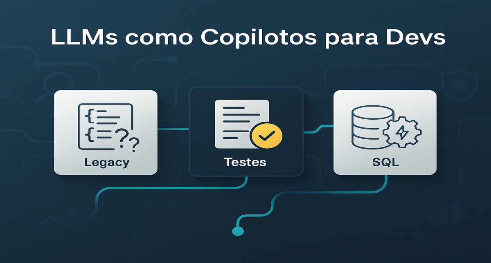

# LLMs como Copilotos: Casos Práticos em Times de Delivery



## 1. Contexto e Propósito (Purpose)

Em times de engenharia de alta performance, a velocidade é crucial, mas a estabilidade é inegociável. O dia a dia de um dev em uma startup de delivery não é apenas criar features verdes; é lidar com código legado ("quem escreveu isso em 2019?"), migrar monolitos para microsserviços e otimizar queries SQL que estão travando o checkout na sexta-feira à noite.

O propósito deste artigo é desmistificar o uso de LLMs no fluxo de desenvolvimento. Não estamos falando de "IA que escreve código sozinha", mas de **LLMs como copilotos estratégicos** que reduzem a carga cognitiva em tarefas de:

- **Arqueologia de código** (decifrar lógica legada)
- **Blindagem via testes unitários** (cobertura de edge cases)
- **Tradução de regras de negócio em queries complexas** (SQL otimizado)

## 2. Abordagem (Approach)

Vamos focar em três casos de uso onde a IA atua como um multiplicador de senioridade, indo além do autocomplete:

- **Arqueologia de Código:** Decifrando lógica de negócios antiga e não documentada.
- **Engenharia de Testes:** Geração de casos de borda e testes parametrizados para validação financeira.
- **SQL & Otimização:** Criação de queries complexas com consciência do schema do banco.


_Figura 1: Fluxo de trabalho com LLM como copiloto: Contexto → Geração → Revisão → Produção._

## 3. Conceitos Fundamentais

Para usar essas ferramentas profissionalmente, precisamos dominar três conceitos:

### 1. RAG de Código (Codebase Awareness)

Ferramentas modernas (como **Cursor** ou **Copilot Workspace**) não leem apenas o arquivo aberto. Elas **indexam todo o seu repositório localmente**. Isso permite perguntas como:

> "Onde essa variável de frete é alterada em todo o projeto?"

### 2. Reviewer Mindset

A mudança fundamental de postura. O desenvolvedor deixa de ser o "digitador" e passa a ser o **"Arquiteto e Revisor"**.

⚠️ **Se você aceita o código da IA sem ler, você introduziu um bug.**

### 3. Privacy & Data Tiers

A regra de ouro corporativa. **Nunca cole segredos** (API Keys, PII) em chats públicos. Entenda a diferença entre:

- **Ferramentas "Zero Data Retention"** (Enterprise) - dados não são usados para treino
- **Ferramentas de treino público** - seu código pode virar exemplo para outros


_Figura 2: Comparação entre modos de uso de LLM (Local, Enterprise, Public)._

## 4. Mão na Massa: Exemplo Prático

### Caso 1: Arqueologia de Código (Refatoração Legada)

**Cenário:** Você encontrou uma função crítica de cálculo de frete, sem tipagem e com variáveis mágicas.

```python
# Código original
def c(d, w, v):
    b = 5.0
    if d > 10: b += (d - 10) * 0.5  # Regra mágica 1
    if w > 5: b *= 1.2              # Regra mágica 2
    return b
```

**Prompt Estratégico (Chain-of-Thought):**

```
Aja como um Tech Lead Python.
1. Analise a lógica desta função passo a passo.
2. Refatore para Python moderno usando Type Hints.
3. Substitua 'números mágicos' por constantes nomeadas (ex: BASE_FEE, DISTANCE_THRESHOLD).
4. Adicione Docstrings explicando a regra de negócio inferida.
```

**Resultado:** O código volta limpo, tipado e, o mais importante, com a **intenção de negócio explicada**.

### Caso 2: Geração de Testes (Carrinho & Cupons)

**Regra:** "Pedido mínimo R$ 20, exceto VIPs."

**Prompt (Focado em Cobertura):**

```
Estou usando pytest. Gere uma função de teste usando @pytest.mark.parametrize
para a função validate_cart. Cubra os seguintes cenários (Happy Path e Edge Cases):

1. Valor exato do limite (19.99 vs 20.00).
2. Usuário VIP com valor baixo.
3. Valores negativos (sanity check).
4. Tipos incorretos (string ao invés de float).
```

**Resultado:** A IA gera uma **matriz de testes robusta** que cobriria bugs que um humano cansado deixaria passar.

### Caso 3: SQL Analytics

**Cenário:** O PM pede: _"Quais usuários pediram Pizza e Hambúrguer na mesma semana?"_

**A Técnica do Schema Dump:** Para o LLM não alucinar nomes de colunas, passe o DDL (Definição da tabela).

**Prompt:**

```
Aqui estão os schemas das minhas tabelas orders e order_items [colar CREATE TABLE...].
Escreva uma query PostgreSQL otimizada (use CTEs se necessário) para encontrar
usuários que compraram itens com 'Pizza' E 'Hambúrguer' num intervalo de 7 dias.
```

**Resultado:** O LLM entende as chaves estrangeiras (`user_id`, `order_id`) e monta os JOINs corretamente na primeira tentativa.


_Figura 3: Três casos práticos de LLM como copiloto: Refatoração, Testes e SQL._

## 5. Métricas, Riscos e Boas Práticas

### Riscos Reais

#### 🚨 Alucinação de Pacotes (Supply Chain Attack)

O LLM pode sugerir `import fast-json-parser` — um pacote que parece real, mas **não existe** (ou pior, é um malware registrado por hackers).

✅ **Sempre verifique se a lib existe** em repositórios oficiais (PyPI, npm, etc.).

#### 🤖 Viés de Automação

O dev tende a **confiar mais no código gerado pela IA** do que no de um colega, reduzindo a atenção na revisão.

### Boas Práticas

#### 1. Use Contexto `@`

Em ferramentas como Cursor/Copilot, use `@File` ou `@Folder` para dar contexto explícito antes de pedir a solução.

```
@config/database.py Como conectar ao banco usando as configs deste arquivo?
```

#### 2. Iteração

O primeiro output raramente é o perfeito. Peça para a IA:

- "Otimizar para legibilidade"
- "Tratar exceções de conexão"
- "Adicionar logs de debug"


_Figura 4: Ciclo iterativo de refinamento com LLM._

## 6. Evidence & Exploration

Um experimento para rodar no seu time (**Pair Programming AI**):

### Experimento Proposto

1. **Pegue uma tarefa de complexidade média** (ex: criar um endpoint de API com validação).
2. **Peça para um Dev Pleno fazer com Copilot** e um **Sênior sem Copilot**.
3. **Avalie:**

**Métricas a Observar:**

- **Velocidade:** O Pleno chegou perto do tempo do Sênior?
- **Qualidade:** O código do Pleno tratou erros de conexão de banco? (Geralmente a IA esquece isso se não for pedida)
- **Revisões:** Quantas rodadas de code review foram necessárias?

### Evidência de Mercado

A evidência de mercado mostra que a IA **nivela a velocidade técnica**, permitindo que Seniors foquem puramente em:

- Arquitetura de sistemas
- Regras de negócio complexas
- Revisão e mentoria de código
- Design de APIs e contratos

## 7. Reflexões Pessoais & Próximos Passos

O uso de LLMs **não substitui a necessidade de saber programar**; na verdade, **aumenta a necessidade de saber ler código**.

A habilidade do futuro não é sintaxe, é:

- **Revisão técnica** (detectar bugs em código gerado)
- **Design de sistemas** (arquitetura antes da implementação)
- **Orquestração** (combinar múltiplos componentes gerados)

O dev vira um **orquestrador de código gerado**, não um digitador.

### Próximos Passos

- **Explorar ferramentas de Codebase RAG:** Como Cursor, Copilot Workspace e Cody funcionam por baixo dos panos.
- **Aprender Prompt Engineering para Código:** Técnicas como Chain-of-Thought, Few-Shot Examples e Schema Injection.
- **Estudar Security Scanning:** Ferramentas como Semgrep e Snyk para detectar vulnerabilidades em código gerado por IA.
- **Implementar Code Review Assistido:** Como usar IA para revisar PRs antes de humanos (ver **artigo 10**).

---

**Artigos Relacionados:**

- [02 - Prompt Engineering com PACE](./02-prompt-engineering-pace.md)
- [10 - Testes Automatizados em Sistemas com IA](./10-testes-automatizados-sistemas-ia.md)
- [06 - Versionamento de Prompts, Dados e Modelos](./06-versionamento-prompts-dados-modelos.md)
