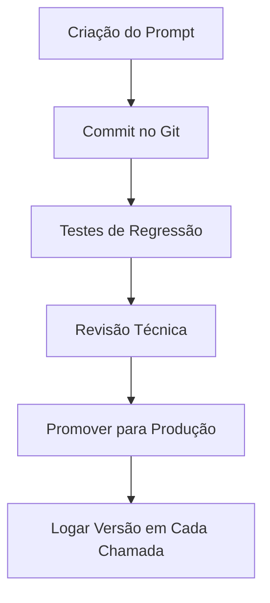

# Versionamento de Prompts, Dados e Modelos: O "Git" da Engenharia de IA

<div align="center">
  
</div>

## 1. Contexto e Propósito (Purpose)

Em engenharia de software tradicional, se o código não mudou, o comportamento do software geralmente não muda. Em GenAI, isso é mentira.
Você pode ter o mesmo código Python rodando, mas se a OpenAI atualizar o modelo, ou se o seu prompt mudar uma vírgula, ou se os dados do seu VectorDB forem atualizados, a resposta final muda.

O propósito deste artigo é abordar o **caos da não-reprodutibilidade**. Em um app de delivery, se um cliente reclama que o chatbot foi rude ontem, você precisa ser capaz de "voltar no tempo" e ver exatamente:

1. Qual versão do prompt estava rodando?
2. Qual modelo (e versão) foi usado?
3. Quais dados de contexto (RAG) foram injetados?

## 2. Abordagem (Approach)

O versionamento em GenAI exige disciplina e ferramentas inspiradas no ciclo de vida tradicional de software, mas adaptadas à natureza dinâmica de modelos e dados. Vamos detalhar os três pilares com exemplos práticos e fluxos reais:

### 1. **Prompts as Code**

**Por que versionar prompts no Git?**

- Permite rastrear cada alteração, autor e motivo.
- Facilita rollback imediato em caso de regressão.
- Garante que o prompt em produção é auditável e reproduzível.

**Fluxo sugerido:**

1. Escreva o prompt em um arquivo YAML versionado.
2. Faça pull request para revisão técnica e de negócio.
3. Rode testes de regressão automatizados (ver artigo 10).
4. Só promova para `latest` após aprovação e testes.

**Exemplo de workflow (GitHub Actions):**

```yaml
name: Teste de Prompts
on: [push]
jobs:
  test:
    runs-on: ubuntu-latest
    steps:
      - uses: actions/checkout@v2
      - name: Rodar testes de regressão
        run: python scripts/test_prompts.py
```

### 2. **Model Registry**

Gerenciar modelos externos (OpenAI, Azure, HuggingFace) exige registrar:

- Nome do modelo
- Versão
- Data de atualização
- Parâmetros customizados (ex: temperature, top_p)

**Ferramentas comuns:** MLflow, Weights & Biases, Azure ML.

**Exemplo de registro:**

| Modelo        | Versão | Data       | Parâmetros           |
| ------------- | ------ | ---------- | -------------------- |
| gpt-4-turbo   | 0613   | 2025-01-15 | temp=0.2, top_p=1.0  |
| gpt-3.5-turbo | 1106   | 2024-11-10 | temp=0.7, top_p=0.95 |

### 3. **Data Lineage**

Rastrear a origem dos dados usados no RAG é essencial para auditoria e debugging.

**Fluxo típico:**

1. Cada documento indexado recebe um ID único e metadados (data, fonte, autor).
2. Ao montar o contexto para o LLM, logue os IDs dos documentos usados.
3. Em caso de erro ou reclamação, é possível reconstruir exatamente o contexto apresentado ao modelo.

**Checklist de versionamento completo:**

- [x] Prompt versionado no Git
- [x] Modelo registrado com versão e parâmetros
- [x] Dados de contexto com IDs e metadados logados

Essa abordagem integrada permite rastreabilidade ponta a ponta, facilitando auditoria, debugging e evolução segura dos sistemas de IA.

## 3. Conceitos Fundamentais

### Determinismo vs. Estocasticidade

| Característica    | Software Tradicional | LLMs/GenAI            |
| ----------------- | -------------------- | --------------------- |
| Determinismo      | Sim                  | Não                   |
| Reprodutibilidade | Alta                 | Baixa (sem controle)  |
| Fonte de Mudança  | Código               | Modelo, prompt, dados |

**Exemplo prático:**
No software tradicional, rodar o mesmo input sempre gera o mesmo output. Em GenAI, pequenas mudanças no prompt, modelo ou dados mudam o resultado.

```python
# Exemplo: Mudança sutil no prompt
prompt_v1 = "Responda de forma educada."
prompt_v2 = "Responda de forma extremamente educada."
# O output pode ser radicalmente diferente!
```

### Prompt Registry

Um Prompt Registry é um sistema (ou padrão) para buscar prompts por nome e versão, garantindo rastreabilidade e rollback.

**Exemplo de uso:**

```python
prompt = get_prompt("refund_policy", version="v2.1")
```

### Drift

Mesmo mantendo a versão "congelada" do modelo, provedores podem atualizar silenciosamente o backend, causando drift de comportamento.

**Como mitigar:**

- Logar sempre a versão do modelo e do prompt em cada interação.
- Monitorar métricas de satisfação e qualidade periodicamente.

### Outros Conceitos-Chave

- **Data Lineage**: Rastreabilidade completa dos dados usados em cada resposta.
- **Imutabilidade**: Nunca sobrescreva versões antigas; sempre crie uma nova.
- **Auditoria**: Capacidade de reconstruir qualquer resposta do passado com base nos logs e versões salvas.

## 4. Mão na Massa: Exemplo Prático

### Estrutura de Pastas para "Prompt as Code"

Ao invés de strings soltas no código, trate prompts como arquivos versionados:

```text
/prompts
  /customer-support
    refund-policy.v1.yaml
    refund-policy.v2.yaml
    refund-policy.latest.yaml -> symlink para v2
  /menu-recommendation
    dinner-suggestions.v1.yaml
```

### Exemplo de Arquivo de Prompt (YAML)

```yaml
# refund-policy.v2.yaml
meta:
  id: refund-policy
  version: 2.0
  author: "maria.silva"
  model_config:
    provider: "openai"
    model: "gpt-4-turbo"
    temperature: 0.2
template: |
  Você é um assistente de suporte do iFood.
  Regra de reembolso: Apenas para pedidos com atraso > {{delay_threshold}} minutos.
  Contexto do pedido: {{order_context}}
  Responda ao cliente: {{user_message}}
```

### Passo a Passo para Versionar Prompts

1. Crie o prompt em YAML e salve na pasta correta.
2. Faça commit no Git e abra um pull request.
3. Execute testes de regressão automatizados:
   - Compare outputs do prompt antigo vs novo em um conjunto de exemplos reais.
   - Gere métricas de similaridade e satisfação.
4. Só promova para produção após aprovação e logs de testes.

### Checklist de Versionamento

- [x] Prompt salvo em arquivo YAML
- [x] Commit no Git com mensagem clara
- [x] Testes de regressão executados
- [x] Aprovação de revisão técnica
- [x] Log de versão e parâmetros em cada chamada

### Exemplo de Loader Automatizado

```python
import yaml
import logging

class PromptLoader:
    def load(self, prompt_id, version="latest"):
        path = f"prompts/{prompt_id}.{version}.yaml"
        with open(path) as f:
            data = yaml.safe_load(f)
        return data

def log_interaction(prompt_id, prompt_version, model, input, output):
    logging.info({
        "prompt_id": prompt_id,
        "prompt_version": prompt_version,
        "model": model,
        "input": input,
        "output": output
    })

# Uso no código da aplicação
loader = PromptLoader()
prompt_data = loader.load("refund-policy", version="v2")
log_interaction(
    prompt_id=prompt_data['meta']['id'],
    prompt_version=prompt_data['meta']['version'],
    model=prompt_data['meta']['model_config']['model'],
    input=user_input,
    output=llm_response
)
```

### Fluxo Visual de Versionamento



Esse fluxo garante rastreabilidade, rollback rápido e qualidade consistente dos prompts em produção.

## 5. Métricas, Riscos e Boas Práticas

### Principais Riscos

| Risco                 | Impacto                                | Mitigação                                 |
| --------------------- | -------------------------------------- | ----------------------------------------- |
| Shadow Prompts        | Perda de rastreabilidade, bugs em prod | Automatizar sync Git <-> painel, alertas  |
| Quebra de Contrato    | Falha em produção, erros de integração | Testes automatizados, validação de schema |
| Drift de Modelo       | Mudança de comportamento sem aviso     | Logar versão/modelo, monitorar métricas   |
| Dados não versionados | Respostas inconsistentes, bugs ocultos | Data lineage, versionamento de datasets   |

### Boas Práticas

- **Imutabilidade**: Nunca edite a `v1`. Sempre crie uma nova versão (`v2`, `v3`...).
- **Testes de Regressão Automatizados**: Antes de promover uma nova versão, rode testes comparando outputs antigos e novos. Exemplo de métrica:

```python
from sklearn.metrics import accuracy_score
old_outputs = ["Sim", "Não", "Sim"]
new_outputs = ["Sim", "Não", "Talvez"]
print("Acurácia regressão:", accuracy_score(old_outputs, new_outputs))
```

- **Logs Estruturados**: Sempre registre `prompt_version`, `model_version`, `timestamp`, input e output. Exemplo:

```json
{
  "timestamp": "2025-01-15T10:30:00Z",
  "prompt_version": "v2",
  "model": "gpt-4-turbo",
  "user_message": "Posso devolver meu pedido?",
  "llm_response": "Sim, em até 24 horas para pedidos com atraso.",
  "customer_satisfaction": true
}
```

- **Validação de Schema**: Use scripts para garantir que todas as variáveis esperadas estão presentes no prompt e no código.

### Métricas de Versionamento

| Métrica                    | Como medir                                |
| -------------------------- | ----------------------------------------- |
| Cobertura de versionamento | % de prompts/modelos/dados versionados    |
| Tempo de rollback          | Tempo entre bug report e rollback efetivo |
| Frequência de regressão    | Quantas vezes uma nova versão causa bug   |
| Satisfação do cliente      | NPS, CSAT após mudanças de prompt/modelo  |

Adotar essas práticas reduz drasticamente bugs, aumenta a confiança do time e permite evolução rápida sem perder controle.

## 6. Evidence & Exploration

### Teste Prático: Reprodutibilidade

Ferramentas como **MLflow**, **LangSmith** e **DVC** já oferecem registries prontos, mas Git + YAML estruturado resolve 90% dos problemas para times pequenos e médios.

#### Checklist de Evidências

- [x] Logs de cada interação com `prompt_version`, `model_version`, `timestamp`
- [x] Scripts de comparação de outputs entre versões
- [x] Relatórios de satisfação do cliente antes/depois de mudanças
- [x] Auditoria de contexto (dados usados em cada resposta)

#### Exemplo de Log Estruturado

```json
{
  "timestamp": "2025-01-15T10:30:00Z",
  "prompt_version": "v2",
  "model": "gpt-4-turbo",
  "user_message": "Posso devolver meu pedido?",
  "llm_response": "Sim, em até 24 horas para pedidos com atraso.",
  "context_docs": ["doc_123", "doc_456"],
  "customer_satisfaction": true
}
```

#### Experimento 1: Reprodutibilidade de Prompt

Imagine que um cliente reclama:

> _"Ontem seu chatbot disse que reembolsos eram automáticos. Hoje ele disse que não. O que mudou?"_

Se você tem versionamento:

```bash
git log --oneline prompts/refund-policy.yaml
# c3d4e5f (2 dias atrás): refund-policy.v2 - alterou threshold de 60 para 30 minutos
# a1b2c3d (5 dias atrás): refund-policy.v1 - versão inicial
```

Você pode imediatamente identificar qual versão estava em produção quando o cliente viu a resposta. Sem versionamento? Nenhuma ideia.

**Experimento 2: Drift de Modelo**

Suponha que em `2025-01-15` você promoveu `refund-policy.v2` para produção. Você faz logs com timestamp + prompt_version:

```json
{
  "timestamp": "2025-01-15T10:30:00Z",
  "prompt_version": "v2",
  "model": "gpt-4-turbo",
  "user_message": "Posso devolver meu pedido?",
  "llm_response": "Sim, em até 24 horas para pedidos com atraso.",
  "customer_satisfaction": true
}
```

Três meses depois, a OpenAI atualiza silenciosamente o `gpt-4-turbo`. De repente, a satisfação do cliente cai. Você consegue correlacionar? Sim, porque tem dados estruturados.

### Ferramentas de Verdade

- **Git**: Controle de versão de prompts e configurações.
- **MLflow**: Registry centralizado para modelos e experimentos.
- **LangSmith**: Observabilidade específica para chains de LLMs.
- **DVC (Data Version Control)**: Versionamento de datasets para RAG.

A combinação dessas ferramentas forma a coluna vertebral de um pipeline reprodutível.

## 7. Reflexões Pessoais & Próximos Passos

### A Lição: Ciência vs Alquimia

Versionamento é a base da sanidade. Sem ele, você não faz ciência, faz **alquimia**: misturas mágicas que às vezes funcionam, às vezes não, e ninguém sabe por quê.

Em empresas que construíram IA de verdade (DeepMind, Anthropic, OpenAI), o versionamento é não-negociável. Eles medem tudo, rastreiam tudo, reproduzem tudo. É por isso que conseguem iterar rápido sem quebrar produção.

### Conectando com a Série

Agora que temos **controle sobre O QUE estamos enviando para o modelo** (prompts, dados, versão do modelo), precisamos falar sobre **como desenhar a interface de comunicação** entre nossos sistemas e esses modelos.

A realidade é cruel: uma chamada para o GPT-4 pode levar 60 segundos. Seu frontend não pode ficar preso esperando. Como lidar com isso?

### Próximos Passos

1. **Comece hoje**: Configure um repositório de prompts no seu projeto. Não precisa de ferramenta sofisticada—Git + YAML é suficiente.
2. **Implemente logging**: Toda chamada ao LLM deve registrar `prompt_version`, `model_version`, `timestamp`. Isso te salvará no futuro.
3. **Leia o Artigo 07**: Vamos falar sobre **Design de APIs para GenAI** (streaming, async, webhooks). Porque de nada adianta ter prompts versionados se a API que os chama é uma merda.
