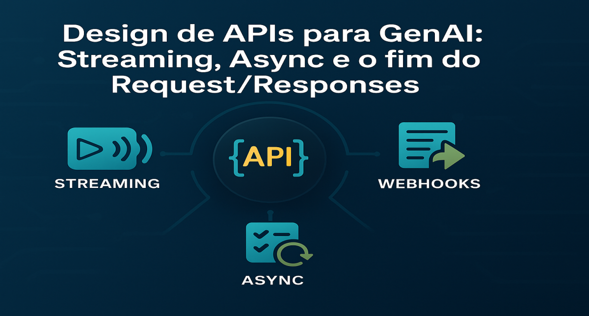

# Design de APIs para GenAI: Streaming, Async e a morte do Request/Response simples

<div align="center">
  
</div>

## 1. Contexto e Propósito (Purpose)

No mundo tradicional de microserviços, estamos acostumados com requisições rápidas: o app chama o backend, o backend consulta o banco e devolve o JSON em 50ms.
Com GenAI, esse paradigma quebra. Uma chamada para o GPT-4 pode levar 10, 30, até 60 segundos. Se você mantiver uma conexão HTTP síncrona aberta por tanto tempo, vai estourar timeouts em load balancers, travar a thread do cliente e frustrar o usuário que fica olhando para uma tela branca.

O propósito deste artigo é explorar padrões de design de API robustos para lidar com a **latência inerente** e a **imprevisibilidade** dos LLMs em produtos de escala.

## 2. Abordagem (Approach)

Vamos focar em três padrões arquiteturais essenciais:

1.  **Streaming (SSE)**: Para feedback visual imediato.
2.  **Async + Polling/Webhooks**: Para tarefas pesadas em background.
3.  **Circuit Breakers & Fallbacks**: Para quando a API do modelo falhar (e ela vai).

## 3. Conceitos Fundamentais

- **Server-Sent Events (SSE)**: Um padrão onde o servidor mantém a conexão aberta e empurra "chunks" de texto assim que são gerados. É o que faz o "efeito máquina de escrever" do ChatGPT.
- **Time-to-First-Token (TTFT)**: A métrica de latência que mais importa em streaming. Quanto tempo até o usuário ver a primeira letra?
- **Backpressure**: A capacidade do sistema de lidar com picos de requisições sem derrubar o modelo (que tem rate limits estritos).

## 4. Mão na Massa: Exemplo Prático

### Cenário: Chatbot de Ajuda no App de Delivery

O usuário pergunta: _"Onde está meu pedido?"_. O LLM precisa consultar o status no banco, raciocinar e responder. Isso demora.

#### A Abordagem Errada (Síncrona)

```python
@app.post("/chat")
def chat(message: str):
    # O usuário fica esperando 15s aqui...
    response = llm.generate(message)
    return {"response": response}
```

#### A Abordagem Certa (Streaming com FastAPI)

```python
from fastapi import FastAPI
from fastapi.responses import StreamingResponse
import time

app = FastAPI()

def generate_stream(message: str):
    # Simula processamento inicial (RAG, busca no banco)
    yield "🔍 Verificando seu pedido...\n"
    time.sleep(1)

    # Simula geração de tokens do LLM
    full_response = "Seu pedido saiu para entrega há 5 minutos!"
    for word in full_response.split():
        yield f"{word} "
        time.sleep(0.2) # Simula latência de geração

@app.post("/chat/stream")
async def stream_chat(message: str):
    return StreamingResponse(generate_stream(message), media_type="text/event-stream")
```

### Cenário: Geração de Relatório Mensal (Async)

O usuário pede: _"Analise todos os meus pedidos do ano e me diga onde economizar."_. Isso leva minutos. Streaming não serve aqui.

**Fluxo Async:**

1.  `POST /reports` -> Retorna `202 Accepted` e um `job_id`.
2.  Backend coloca a tarefa numa fila (RabbitMQ/SQS).
3.  Worker processa o LLM.
4.  Frontend faz polling em `GET /reports/{job_id}` ou espera um Webhook.

## 5. Métricas, Riscos e Boas Práticas

### Riscos

- **Timeouts de Infra**: Load Balancers (AWS ALB, Nginx) costumam matar conexões ociosas após 60s. Configure _keep-alives_ corretamente para SSE.
- **Custo de Conexão**: Manter milhares de conexões abertas consome memória do servidor.

### Boas Práticas

- **Rate Limiting Granular**: Limite por usuário, não apenas por IP, para evitar que um usuário queime sua cota da OpenAI.
- **Cache Semântico**: Antes de chamar o LLM, verifique se essa pergunta já foi respondida (veremos mais sobre isso em RAG).

## 6. Evidence & Exploration

Implemente um endpoint de streaming simples e meça a diferença de percepção.

- **Sem Streaming**: 10s de tela branca -> Usuário acha que travou.
- **Com Streaming**: 1s para aparecer "Analisando...", 2s para o texto começar -> Usuário sente que é instantâneo.

A latência total é a mesma, mas a **latência percebida** cai drasticamente.

## 7. Reflexões Pessoais & Próximos Passos

Desenhar APIs para IA me fez reaprender HTTP. Coisas que eu ignorava (como _chunks_, _buffers_ e _event-streams_) viraram o dia a dia.
Mas mesmo com a melhor API, as coisas dão errado. O modelo alucina, a API da OpenAI cai, o usuário manda input malicioso.

No próximo artigo, vamos falar sobre **Tratamento de Erros e Timeouts**: como lidar com a fragilidade dos LLMs de forma graciosa.
