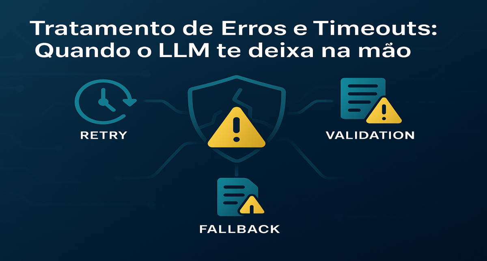

# Tratamento de Erros e Timeouts: Quando o LLM te deixa na mão (e como sobreviver)

<div align="center">
  
</div>

## 1. Contexto e Propósito (Purpose)

Em um app de delivery, se o serviço de pagamento cai, você não deixa o usuário tentar pagar infinitamente; você avisa que deu erro. Com LLMs, a instabilidade é a regra, não a exceção.
APIs de IA sofrem de _Rate Limits_ agressivos, latência variável e sobrecarga frequente. Se o seu código não estiver preparado para falhar, seu produto vai parecer amador.

O propósito deste artigo é ensinar como construir uma camada de **resiliência** em volta das chamadas de LLM, garantindo que o usuário final tenha uma experiência decente mesmo quando a OpenAI (ou qualquer outro provider) estiver pegando fogo.

## 2. Abordagem (Approach)

Vamos categorizar os erros mais comuns e implementar padrões de defesa:

1.  **Erros Transientes (429, 500, Timeouts)**: Resolvidos com Retries inteligentes.
2.  **Erros Lógicos (Context Window, Bad Request)**: Resolvidos com Truncamento e Validação.
3.  **Falha Total**: Resolvida com Fallbacks e Degradação Graciosa.

## 3. Conceitos Fundamentais

- **Exponential Backoff**: Não tente de novo imediatamente. Espere 1s, depois 2s, depois 4s. Isso evita derrubar ainda mais um serviço que já está instável.
- **Jitter**: Adicionar um tempo aleatório ao backoff para evitar que todos os seus servidores tentem reconectar no exato mesmo milissegundo.
- **Circuit Breaker**: Se o serviço falhou 10 vezes seguidas, pare de tentar por um tempo e retorne erro imediatamente.

## 4. Mão na Massa: Exemplo Prático

### Implementando um Decorator de Resiliência em Python

Vamos usar a biblioteca `tenacity` para criar uma chamada robusta.

```python
import openai
from tenacity import (
    retry,
    stop_after_attempt,
    wait_random_exponential,
    retry_if_exception_type
)

# Configuração: Tentar até 3 vezes, esperando entre 1s e 10s (exponencial + jitter)
@retry(
    retry=retry_if_exception_type((openai.APIConnectionError, openai.RateLimitError, openai.APITimeoutError)),
    wait=wait_random_exponential(multiplier=1, max=10),
    stop=stop_after_attempt(3)
)
def call_llm_robust(prompt):
    print("Tentando chamar API...")
    return openai.chat.completions.create(
        model="gpt-4",
        messages=[{"role": "user", "content": prompt}],
        timeout=15 # Timeout curto no client-side para não travar a thread
    )

def get_restaurant_summary(restaurant_id):
    try:
        response = call_llm_robust(f"Resuma as reviews do restaurante {restaurant_id}")
        return response.choices[0].message.content
    except Exception as e:
        # FALLBACK: Se tudo der errado, não quebre a tela do usuário.
        print(f"Erro fatal após retries: {e}")
        return "Desculpe, não conseguimos gerar o resumo agora. Mas o restaurante tem nota 4.8!"
```

### Lidando com Context Window Exceeded

Se o erro for "prompt too long", retry não adianta. Você precisa cortar o texto.

```python
import tiktoken

def truncate_text(text, max_tokens=3000):
    encoder = tiktoken.encoding_for_model("gpt-4")
    tokens = encoder.encode(text)
    if len(tokens) > max_tokens:
        # Corta o excesso e decodifica de volta
        return encoder.decode(tokens[:max_tokens])
    return text
```

## 5. Métricas, Riscos e Boas Práticas

### Riscos

- **Custo de Retry**: Se você paga por token de entrada, e a API falha no final da geração, o retry vai te cobrar a entrada de novo.
- **Cascading Failure**: Se seu retry for muito agressivo, você pode derrubar seus próprios sistemas internos que dependem dessa resposta.

### Boas Práticas

- **Timeouts Client-Side**: Nunca confie no timeout padrão da biblioteca. Defina explicitamente (ex: 30s).
- **Fallback Estático**: Tenha sempre uma resposta "burra" pronta. É melhor mostrar "Descrição indisponível" do que "Error 500: Internal Server Error".

## 6. Evidence & Exploration

Simule erros em ambiente de staging.

- Bloqueie a URL da OpenAI no firewall e veja se o app trava ou mostra a mensagem de fallback.
- Force um erro de Rate Limit e verifique nos logs se o _backoff_ está funcionando (os timestamps das tentativas devem estar espaçados).

## 7. Reflexões Pessoais & Próximos Passos

Resiliência é o que separa demos de produtos. Em demos, se der erro, você dá F5. Em produtos, se der erro, o usuário vai para o concorrente.
Agora que nossa aplicação é robusta, precisamos garantir que ela seja escalável e reativa.

No próximo artigo, vamos explorar **Arquiteturas Event-Driven para IA**: como desacoplar completamente a geração de texto do fluxo principal do usuário.
