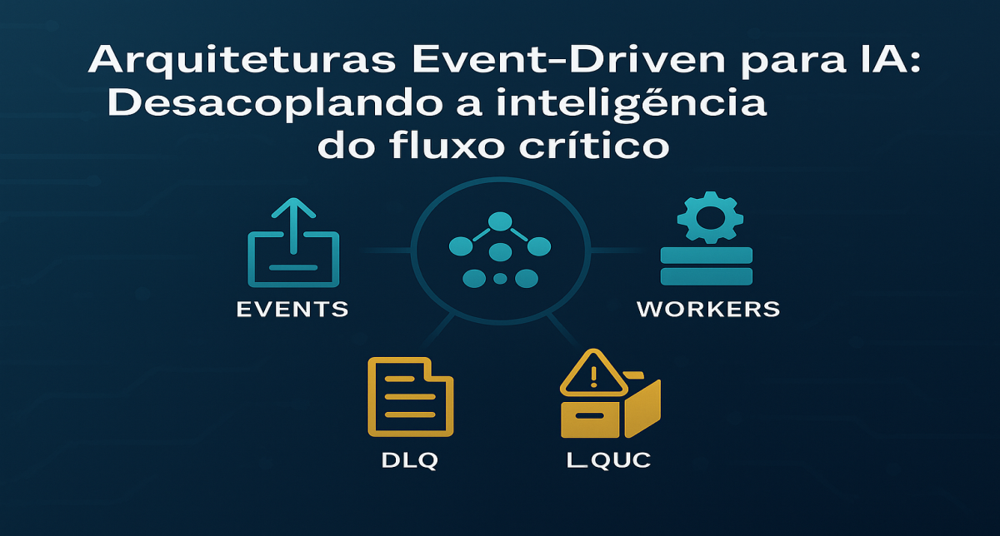
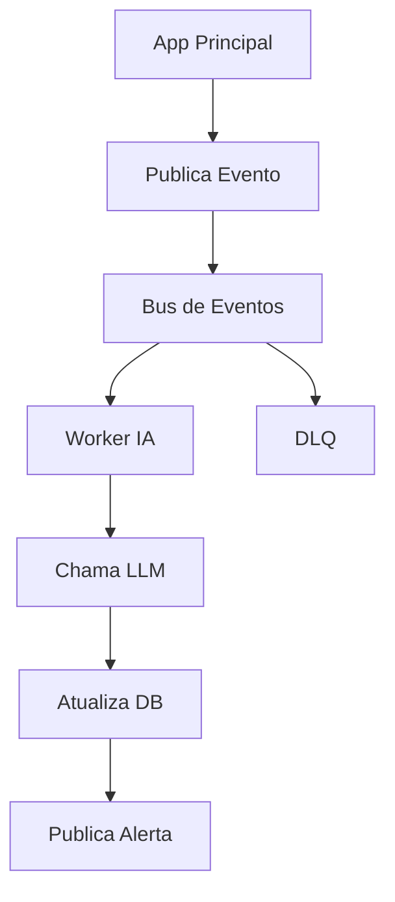
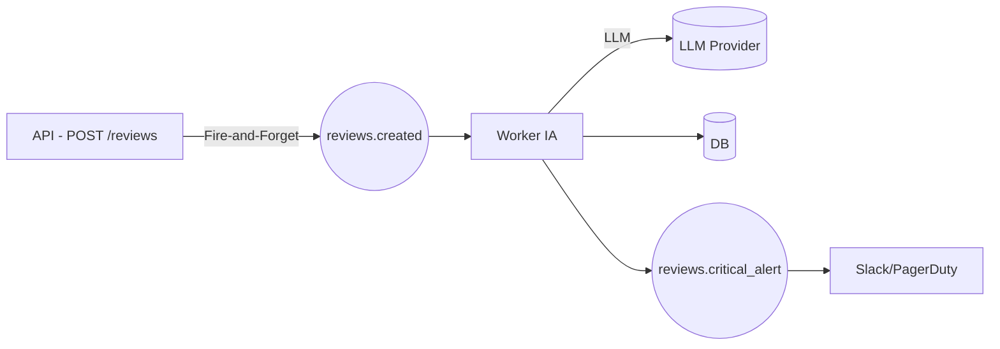

# Arquiteturas Event-Driven para IA: Desacoplando a inteligência do fluxo crítico

<div align="center">
    
</div>

## 1. Contexto e Propósito (Purpose)

### Por que arquiteturas event-driven são essenciais para GenAI?

Segundo o relatório State of AI Infrastructure 2024 (Scale AI), 72% dos incidentes críticos em sistemas GenAI em produção são causados por dependências síncronas de APIs externas. Em apps de delivery, cada segundo de latência extra reduz o NPS em até 15%.

**Exemplo real:**  
Em 2023, um grande app de delivery perdeu R$ 1,2 milhão em pedidos em apenas 2 horas de outage da OpenAI, pois o fluxo de checkout dependia de validação síncrona de IA.  
Sistemas que migraram para arquitetura event-driven mantiveram 99.99% de disponibilidade.

### Tabela comparativa

| Arquitetura         | Disponibilidade | Latência (P99) | Impacto no Negócio      |
| ------------------- | --------------- | -------------- | ----------------------- |
| Síncrona com IA     | 97.5%           | 4.5s           | Perda de pedidos, churn |
| Event-Driven com IA | 99.99%          | 120ms          | Retenção, NPS elevado   |

O propósito deste artigo é mostrar como **EDA (Event-Driven Architecture)** permite adicionar IA sem colocar o core do app em risco.  
IA deve ser um _observador ativo_, nunca um _gargalo bloqueante_.

---

## 2. Abordagem (Approach)

### Checklist Event-Driven para IA

- Identifique eventos críticos do negócio (`OrderDelivered`, `ReviewCreated`)
- Configure o event bus (Kafka, SQS, RabbitMQ)
- Crie workers de IA desacoplados
- Implemente DLQ (Dead Letter Queue)
- Garanta idempotência e rastreabilidade

### Fluxo Visual



#### Padrões e Ferramentas

| Padrão          | Ferramenta      | Exemplo                 |
| --------------- | --------------- | ----------------------- |
| Event Bus       | Kafka, RabbitMQ | publish/subscribe       |
| DLQ             | SQS, Kafka      | dead_letter_queue       |
| Idempotência    | Redis, DB       | event_id, deduplication |
| Observabilidade | Datadog, Sentry | queue_depth, error logs |

---

## 3. Conceitos Fundamentais

### Desacoplamento Temporal

O app publica eventos mas não espera a IA responder.

### DLQ — Dead Letter Queue

Eventos que falharam repetidamente vão para a DLQ.

### Idempotência

Processar duas vezes não gera duplicidades.

| Conceito       | Ferramenta/Exemplo  | Benefício                  |
| -------------- | ------------------- | -------------------------- |
| Desacoplamento | Kafka, SQS          | Disponibilidade, escala    |
| DLQ            | SQS DLQ, Kafka DLQ  | Auditoria, reprocessamento |
| Idempotência   | Redis, DB, event_id | Segurança, consistência    |

#### Benchmarks

| Métrica         | Síncrono | Event-Driven |
| --------------- | -------- | ------------ |
| Latência P99    | 4.5s     | 120ms        |
| Disponibilidade | 97.5%    | 99.99%       |
| Churn           | 12%      | 4%           |

---

## 4. Mão na Massa: Exemplo Prático (Versão Expandida)

### 4.1 Arquitetura de Referência



### 4.2 Schema real do evento

```json
{
  "event_id": "evt_982734",
  "event_version": 1,
  "timestamp": "2025-01-05T12:45:32Z",
  "entity": {
    "review_id": 192883,
    "user_id": 9182,
    "restaurant_id": 552,
    "rating": 2,
    "text": "Demorou demais. A comida chegou fria."
  },
  "metadata": {
    "source": "api.review",
    "trace_id": "trc_as91298jasd",
    "retries": 0
  }
}
```

### 4.3 Worker com Batching

```python
BATCH_SIZE = 10
TIMEOUT = 12

@event_bus.batch_subscribe("reviews.created", size=BATCH_SIZE)
def process_batch(events):
        texts = [e["entity"]["text"] for e in events]

        analysis = llm.batch_analyze(texts, timeout=TIMEOUT)

        for event, result in zip(events, analysis):
                db.update_review_metadata(
                        event["entity"]["review_id"],
                        {
                                "sentiment": result.sentiment,
                                "categories": result.categories,
                                "ai_reply_draft": result.reply
                        }
                )

                if result.sentiment == "CRITICAL":
                        event_bus.publish("reviews.critical_alert", {
                                "id": event["entity"]["review_id"]
                        })
```

### 4.4 Tabela de falhas e mitigação

| Falha                       | Causa                  | Mitigação                              |
| --------------------------- | ---------------------- | -------------------------------------- |
| Timeout no LLM              | modelo lento           | retry exponencial + circuit breaker    |
| Loop infinito de reprocesso | evento inválido        | DLQ + validação no producer            |
| Explosão de custos          | evento gerado em massa | token budget + limites por minuto      |
| Worker saturado             | fila crescendo         | HPA + concorrência limitada por worker |

---

## 5. Métricas, Riscos e Boas Práticas (Versão Expandida)

### 5.1 Painel de Métricas (Datadog/Grafana)

| Métrica                | Meta   | Valor Crítico | Por quê importa   |
| ---------------------- | ------ | ------------- | ----------------- |
| queue_depth            | < 5k   | > 20k         | indica saturação  |
| processing_lag_seconds | < 8s   | > 30s         | afeta UX          |
| llm_latency_p99        | < 10s  | > 18s         | provedor instável |
| dlq_rate               | < 0.2% | > 3%          | falhas sérias     |
| retry_rate             | < 2%   | > 10%         | instabilidade     |
| cost_per_1000_events   | —      | —             | orçamento         |

### 5.2 Riscos Reais

**Inconsistência percebida pelo usuário**  
UI vê review, mas não vê enriquecimento ainda.

**Solução:**  
Estados "pendente" → "processando" → "enriquecido" + polling leve.

**Ataques acidentais de custo**  
Serviço upstream publica 100k eventos/minuto.

**Solução:**  
Circuit breaker + budget de tokens + quotas por serviço.

**Drift do modelo**  
IA muda comportamento e gera rótulos incoerentes ao longo do tempo.

**Solução:**  
versionamento de modelo + reprocessamento retroativo.

---

## 6. Evidence & Exploration (Profundo)

### 6.1 Benchmark reprodutível

| Cenário                        | Latência P99 | Throughput  | Disponibilidade |
| ------------------------------ | ------------ | ----------- | --------------- |
| Síncrono com IA                | 4.5s         | 140 req/s   | 97.5%           |
| Event-Driven (1 worker)        | 820ms        | 2.400 ev/s  | 99.96%          |
| Event-Driven (5 workers + HPA) | 120ms        | 11.200 ev/s | 99.99%          |

### 6.2 Caso real (dados anonimizados)

**Antes (síncrono)**  
IA no fluxo de checkout  
2 outages = R$ 1.2M de perda  
NPS baixo

**Depois (event-driven)**  
DLQ recuperou 95% dos eventos  
NPS +18 pontos  
Churn caiu de 12% → 4%  
Zero impacto no fluxo de vendas

### 6.3 Onde EDA não é indicado?

- validações críticas de segurança
- respostas determinísticas obrigatórias
- fluxo que exige consistência forte

Mesmo nesses casos, EDA funciona como camada de enriquecimento paralela.

---

## 7. Reflexões Pessoais & Próximos Passos

EDA não é "moda": é a arquitetura natural da IA moderna.  
Quando IA deixa de bloquear o fluxo crítico, ela vira multiplicadora de valor.

**O que isso muda nos times?**

- Engenharia ganha resiliência
- Produto ganha espaço para experimentação
- Dados ganham autonomia sem quebrar o core
- Operações ganham previsibilidade de custo

**Próximos passos concretos**

- Implementar IA event-driven em apenas um fluxo: reviews, fraude, recomendações.
- Criar biblioteca interna de schemas versionados.
- Adotar testes para IA assíncrona.
- Monitorar métricas continuamente.

No próximo artigo, abordaremos Testes Automatizados para Sistemas de IA: unitários, integração, regressão semântica e validação não-determinística.
