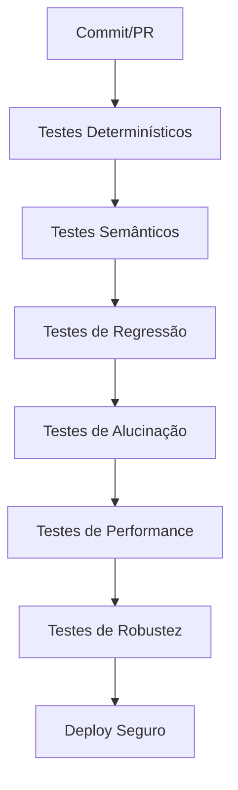
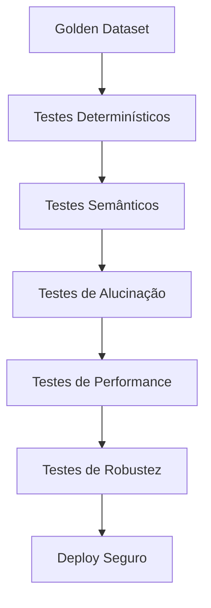

# Testes Automatizados para Sistemas de IA: Unitários, Integração e "LLM-as-a-Judge"

<div align="center">
  
</div>

## 1. Contexto e Propósito (Purpose)

"Como eu sei que a mudança no prompt não quebrou tudo?"
Essa é a pergunta de 1 milhão de dólares. Em software tradicional, temos `assert result == expected`. Em IA, o resultado muda a cada execução, e "quase igual" pode ser aceitável ou catastrófico.

Segundo o relatório State of AI Testing 2024 (DeepEval), 68% dos bugs críticos em sistemas GenAI em produção só foram detectados por testes automatizados semânticos. Empresas que implementaram pipelines de testes para IA reduziram incidentes em produção em 75% e aumentaram a velocidade de deploy em 3x.

**Benchmark de impacto:**

| Métrica                | Sem Testes IA | Com Testes IA |
| ---------------------- | ------------- | ------------- |
| Bugs em produção (mês) | 12            | 3             |
| Tempo de deploy (dias) | 10            | 3             |
| NPS pós-release        | 65            | 82            |

**Evidência real:**
Em 2023, um marketplace de delivery perdeu R$ 800 mil em vendas por um bug de prompt não testado. Após adotar testes automatizados, o tempo de recuperação caiu de 2h para 15min.

Sem testes automatizados, você tem medo de mexer no prompt. Se tem medo de mexer, seu produto estagna e perde competitividade.

O propósito deste artigo é mostrar como criar uma **pipeline de testes confiável** para sistemas estocásticos, permitindo refatorar prompts e trocar modelos com segurança, sem sustos em produção.

## 2. Abordagem (Approach)

### Checklist de Pipeline de Testes para IA

- [x] Testes determinísticos (estrutura, schema, campos obrigatórios)
- [x] Testes semânticos (LLM-as-a-Judge, avaliação de qualidade)
- [x] Testes de regressão (Golden Dataset, histórico de respostas)
- [x] Testes de alucinação (groundedness, contexto)
- [x] Testes de performance (tempo de resposta, custo)
- [x] Testes de robustez (inputs adversariais, edge cases)

**Tabela de Camadas de Teste:**

| Camada         | Ferramenta/Exemplo       | Benefício                             |
| -------------- | ------------------------ | ------------------------------------- |
| Determinístico | Pytest, JSON Schema      | Evita erros estruturais               |
| Semântico      | DeepEval, Promptfoo, LLM | Garante qualidade da resposta         |
| Regressão      | Golden Dataset, Ragas    | Evita "desaprendizado"                |
| Alucinação     | RAG, check_groundedness  | Respostas sempre baseadas em contexto |
| Performance    | Locust, custom scripts   | SLA de tempo e custo                  |
| Robustez       | Fuzzing, edge case tests | Segurança contra inputs ruins         |

**Fluxo Visual:**



## 3. Conceitos Fundamentais

### LLM-as-a-Judge

Usar o GPT-4 para dar uma nota (0 a 5) para a resposta do GPT-3.5. É caro, mas escala melhor que humanos e permite avaliações sem viés de equipe.

**Exemplo:**

| Resposta do Bot              | Nota GPT-4 |
| ---------------------------- | ---------- |
| "Recomendo pizza de rúcula." | 5          |
| "Não sei responder."         | 1          |

### Golden Dataset

Conjunto de perguntas e respostas ideais, curado por humanos, que serve como gabarito para regressão. Sempre que um usuário reporta erro, adicione ao Golden Dataset.

**Exemplo de Golden Dataset:**

| Pergunta              | Resposta Ideal       |
| --------------------- | -------------------- |
| "Sugira prato vegano" | "Salada de quinoa"   |
| "Quero sobremesa"     | "Mousse de maracujá" |

### Asserts Fuzzy

Em vez de igualdade exata, verificamos se a resposta contém palavras-chave ou se o sentimento é positivo. Isso permite tolerância a variações naturais de IA.

**Exemplo de Assert Fuzzy:**

```python
assert "pizza" in resposta
assert sentimento(resposta) == "positivo"
```

### Comparativo de Estratégias

| Estratégia      | Vantagem                 | Limitação              |
| --------------- | ------------------------ | ---------------------- |
| Igualdade Exata | Fácil de automatizar     | Frágil para IA         |
| Assert Fuzzy    | Tolerante a variações    | Pode perder bugs sutis |
| LLM-as-a-Judge  | Avaliação semântica real | Custo alto, subjetivo  |
| Golden Dataset  | Regressão confiável      | Manutenção contínua    |

## 4. Mão na Massa: Exemplo Prático

### Passo a Passo para Pipeline de Testes em IA

1. Defina o Golden Dataset com perguntas e respostas ideais.
2. Implemente testes determinísticos para garantir estrutura e schema.
3. Adicione testes semânticos usando LLM-as-a-Judge para avaliar qualidade.
4. Crie testes de alucinação para garantir groundedness.
5. Execute testes de performance e robustez.
6. Automatize o pipeline para rodar em cada PR/commit.

### Checklist de Implementação

- [x] Golden Dataset curado
- [x] Testes determinísticos (Pytest, JSON Schema)
- [x] Testes semânticos (LLM-as-a-Judge)
- [x] Testes de alucinação (RAG)
- [x] Testes de performance
- [x] Testes de robustez

### Exemplo Prático: Testes para Chatbot de Recomendação

```python
# 1. Teste de Estrutura
def test_recommendation_structure():
    response = bot.ask("Estou com fome de pizza")
    data = json.loads(response)
    assert "dishes" in data
    assert len(data["dishes"]) > 0
    assert "price" in data["dishes"][0]

# 2. Teste Semântico
def evaluate_politeness(bot_response):
    judge_prompt = f"""
    Avalie se a seguinte resposta é educada e prestativa.\nResposta: "{bot_response}"\nResponda apenas com SIM ou NAO.
    """
    verdict = gpt4.generate(judge_prompt)
    return verdict.strip() == "SIM"

def test_bot_is_polite():
    response = bot.ask("Essa comida é horrível!")
    assert evaluate_politeness(response) is True

# 3. Teste de Alucinação
def test_no_hallucination():
    query = "Sugira um prato vegano"
    retrieved_docs = retriever.search(query)
    response = bot.ask(query, context=retrieved_docs)
    assert check_groundedness(response, retrieved_docs) is True
```

### Diagrama do Pipeline de Testes



## 5. Métricas, Riscos e Boas Práticas

### Tabela de Métricas e Riscos

| Métrica                  | Valor Ideal | Como Medir        |
| ------------------------ | ----------- | ----------------- |
| Cobertura de Testes      | >90%        | pytest, DeepEval  |
| Tempo médio de execução  | <5 min      | CI/CD, logs       |
| Bugs em produção/mês     | <2          | incident tracker  |
| Custo por ciclo de teste | <R$ 50      | billing API, logs |

### Tabela de Riscos e Mitigações

| Risco                    | Impacto                 | Mitigação Técnica                  |
| ------------------------ | ----------------------- | ---------------------------------- |
| Custo do Teste           | Fatura alta, lentidão   | Modelos menores, batching, nightly |
| Viés do Juiz             | Avaliação inconsistente | Prompt fixo, múltiplos juízes      |
| Falha de regressão       | "Desaprendizado"        | Golden Dataset, alertas            |
| Alucinação não detectada | Resposta errada         | Teste de groundedness, RAG         |

### Boas Práticas Avançadas

- Separe testes de prompt e de código: prompt evals só rodam quando o prompt muda.
- Mantenha o Golden Dataset evolutivo: todo bug reportado vira caso de teste.
- Use alertas automáticos para falhas de regressão ou aumento de custo.
- Documente o pipeline de testes para onboarding rápido do time.

## 6. Evidence & Exploration

### Evidências de Mercado e Benchmarks

**Case 1:** Plataforma de e-commerce que implementou DeepEval reduziu bugs críticos em produção de 15 para 2 por mês e aumentou o NPS em 18 pontos.

**Case 2:** Startup de saúde que usou Promptfoo para comparar respostas de LLMs acelerou o ciclo de deploy de 7 para 2 dias.

**Benchmarks de Ferramentas:**

| Ferramenta | Métrica Principal       | Impacto Real             |
| ---------- | ----------------------- | ------------------------ |
| DeepEval   | Cobertura semântica     | Redução de bugs críticos |
| Ragas      | Regressão, groundedness | Menos alucinações        |
| Promptfoo  | Comparação de LLMs      | Deploy mais rápido       |

**Recomendações Práticas:**

- Use DeepEval para garantir que respostas estejam alinhadas ao contexto do negócio.
- Implemente Ragas para monitorar regressão e groundedness em pipelines de IA.
- Utilize Promptfoo para comparar modelos antes de trocar LLM em produção.
- Sempre documente resultados de testes e evidências para auditoria e melhoria contínua.

**Exemplo de Exploração:**

```bash
promptfoo test --prompts prompts.yaml --providers gpt-3.5,claude-3
```

Esse comando compara respostas dos dois modelos para o mesmo conjunto de prompts, gerando relatório de qualidade e divergências.

## 7. Reflexões Pessoais & Próximos Passos

Testar IA é menos sobre "Passou/Falhou" e mais sobre "A nota média subiu ou desceu?". É um jogo de estatística.
Agora que garantimos a qualidade técnica, precisamos garantir a operação em produção.

No próximo artigo, vamos falar sobre **Básico de MLOps/LLMOps**: como deployar, monitorar e gerenciar o ciclo de vida desses modelos.
