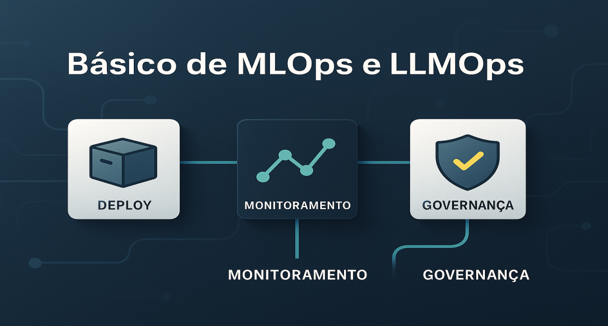

# Básico de MLOps e LLMOps: Tirando a IA do Jupyter Notebook e levando para a vida real

<div align="center">
  
</div>

## 1. Contexto e Propósito (Purpose)

Existe um abismo gigante entre "funciona no meu notebook" e "funciona em produção com 1 milhão de usuários".
Cientistas de Dados são ótimos em criar modelos, mas muitas vezes não sabem como empacotar, versionar e escalar isso. Engenheiros de Software sabem escalar, mas não entendem as idiossincrasias de modelos probabilísticos.

O propósito deste artigo é apresentar o **LLMOps** (Large Language Model Operations) como a ponte necessária para operacionalizar GenAI em apps de delivery, garantindo que atualizações de modelo não quebrem o checkout.

## 2. Abordagem (Approach)

Vamos focar no ciclo de vida operacional:

1.  **Deploy**: Como servir o modelo (API Gateway, Containers).
2.  **Monitoramento**: O que olhar além de CPU e Memória.
3.  **Governança**: Quem aprovou esse prompt que está xingando o cliente?

## 3. Conceitos Fundamentais

- **Model Registry**: O "Docker Hub" dos modelos. Onde você guarda a versão `v1.2` do seu Fine-Tuning.
- **Training-Serving Skew**: Quando o ambiente de treino é diferente do de produção (ex: dados limpos no treino, dados sujos na produção), causando performance ruim.
- **Feedback Loop**: O mecanismo para pegar o que o usuário fez com a resposta da IA e usar isso para melhorar a próxima versão.

## 4. Mão na Massa: Exemplo Prático

### Pipeline de CI/CD para Prompts (GitOps)

Não precisamos de ferramentas complexas como Kubeflow para começar. O GitHub Actions já resolve 80%.

#### 1. O Repositório

```text
/prompts
  recommendation.yaml
/tests
  test_recommendation.py
```

#### 2. O Workflow (GitHub Actions)

```yaml
name: LLMOps Pipeline

on:
  push:
    paths:
      - "prompts/**"

jobs:
  evaluate:
    runs-on: ubuntu-latest
    steps:
      - uses: actions/checkout@v3

      - name: Install Dependencies
        run: pip install pytest openai

      - name: Run Semantic Tests (LLM-as-a-Judge)
        run: pytest tests/ --junitxml=report.xml
        env:
          OPENAI_API_KEY: ${{ secrets.OPENAI_API_KEY }}

      - name: Deploy to Staging
        if: success()
        run: python scripts/deploy_prompt.py --env staging
```

### Deploy Blue/Green para Modelos

Se você fez um Fine-Tuning do Llama-3, não troque o modelo de uma vez.

1.  Suba o **Modelo B (Green)** ao lado do **Modelo A (Blue)**.
2.  Mande 1% do tráfego para o B.
3.  Monitore erros e latência.
4.  Se ok, aumente para 10%, 50%, 100%.
5.  Desligue o A.

## 5. Métricas, Riscos e Boas Práticas

### Riscos

- **Drift de Conceito**: O comportamento do usuário muda (ex: na pandemia, o padrão de pedidos mudou totalmente). Seu modelo antigo vai errar tudo.
- **Custo de Infra**: GPUs são caras. Deixar instâncias ociosas é queimar dinheiro. Use **Auto-scaling** baseado em fila, não em CPU.

### Boas Práticas

- **Tags e Metadados**: Todo deploy deve ter tags: `commit_sha`, `author`, `model_version`.
- **Rollback Automático**: Se a taxa de erro subir > 1% após o deploy, o sistema deve voltar para a versão anterior sozinho.

## 6. Evidence & Exploration

Ferramentas como **MLflow** (open source) ou **Weights & Biases** são excelentes para rastrear experimentos.
Para serving, **vLLM** ou **TGI (Text Generation Inference)** são o estado da arte para rodar modelos open source com alta performance.

## 7. Reflexões Pessoais & Próximos Passos

LLMOps é a disciplina que transforma "mágica" em "engenharia confiável". Sem isso, você tem um brinquedo, não um produto.
Mas monitorar infraestrutura não é suficiente. Precisamos monitorar a **qualidade do texto** gerado.

No próximo artigo, vamos aprofundar em **Monitorando a Qualidade das Respostas**: como saber se o bot está falando bobagem sem ler 1 milhão de mensagens.
