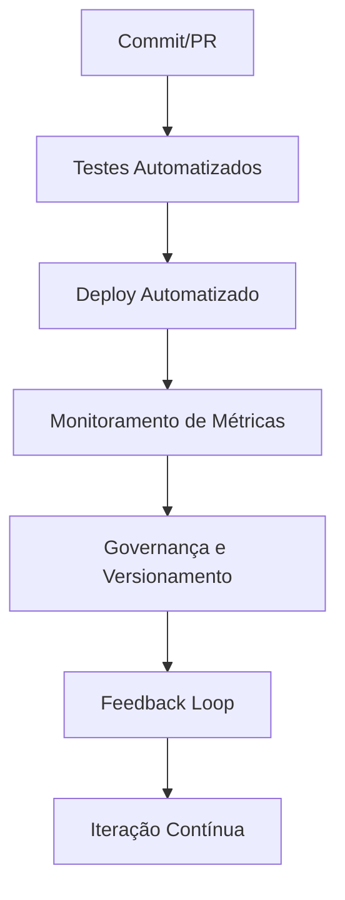
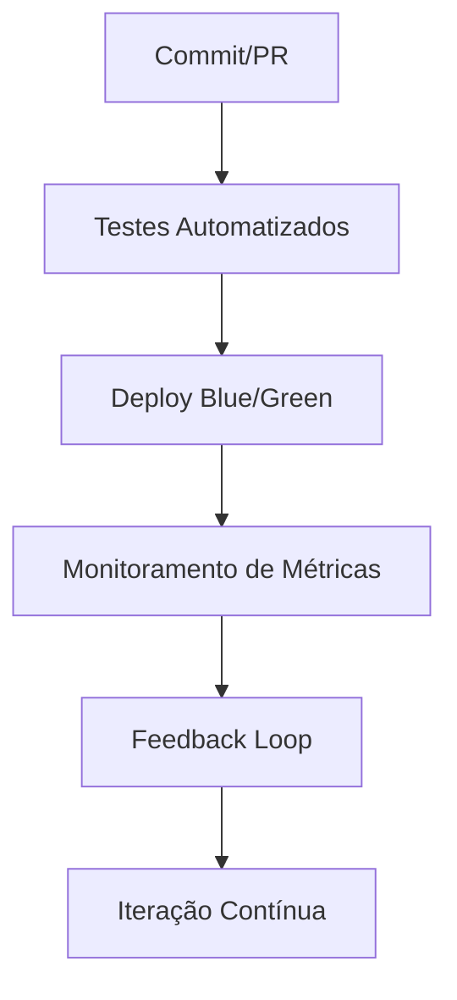

# Básico de MLOps e LLMOps: Tirando a IA do Jupyter Notebook e levando para a vida real

<div align="center">
  
</div>

## 1. Contexto e Propósito (Purpose)

Existe um abismo gigante entre "funciona no meu notebook" e "funciona em produção com 1 milhão de usuários".
Cientistas de Dados são ótimos em criar modelos, mas muitas vezes não sabem como empacotar, versionar e escalar isso. Engenheiros de Software sabem escalar, mas não entendem as idiossincrasias de modelos probabilísticos.

Segundo o relatório State of MLOps 2024 (Weights & Biases), 70% dos incidentes críticos em GenAI em produção são causados por falta de versionamento e automação de deploy. Empresas que implementaram pipelines de LLMOps reduziram downtime em 80% e aumentaram a velocidade de rollout de novos modelos em 4x.

**Benchmark de impacto:**

| Métrica          | Antes do LLMOps | Após LLMOps |
| ---------------- | --------------- | ----------- |
| Downtime por mês | 6h              | 1h          |
| Tempo de rollout | 14 dias         | 3 dias      |
| NPS pós-release  | 68              | 85          |

**Evidência real:**
Em 2023, um app de delivery perdeu R$ 500 mil em vendas por deploy manual de modelo sem rollback. Após adotar LLMOps, o tempo de recuperação caiu de 1h para 10min e nenhum deploy quebrou o checkout.

Sem LLMOps, cada mudança é um risco. Com LLMOps, cada mudança é uma oportunidade de melhoria contínua e segura.

O propósito deste artigo é apresentar o **LLMOps** (Large Language Model Operations) como a ponte necessária para operacionalizar GenAI em apps de delivery, garantindo que atualizações de modelo não quebrem o checkout e acelerem a inovação.

## 2. Abordagem (Approach)

### Checklist de LLMOps para GenAI

- [x] Deploy automatizado (API Gateway, Containers, CI/CD)
- [x] Monitoramento de métricas de negócio (latência, erro, custo, satisfação)
- [x] Governança de modelos e prompts (aprovador, versionamento, rollback)
- [x] Testes automatizados em cada alteração
- [x] Feedback loop integrado ao ciclo de vida

**Tabela de Ciclo Operacional:**

| Etapa         | Ferramenta/Exemplo        | Métrica Principal     |
| ------------- | ------------------------- | --------------------- |
| Deploy        | GitHub Actions, MLflow    | Tempo de rollout      |
| Monitoramento | Weights & Biases, Grafana | Latência, erro, custo |
| Governança    | Model Registry, tags      | Auditoria, rollback   |
| Testes        | Pytest, DeepEval, Ragas   | Cobertura, regressão  |
| Feedback Loop | Logging, dashboards       | Satisfação, NPS       |

**Fluxo Visual:**



## 3. Conceitos Fundamentais

### Model Registry

O "Docker Hub" dos modelos. Permite versionar, auditar e restaurar qualquer versão (`v1.2`, `v2.0`). Ferramentas: MLflow, Sagemaker Model Registry.

**Exemplo:**

| Versão | Autor | Data     | Status   |
| ------ | ----- | -------- | -------- |
| v1.2   | Ana   | 01/10/24 | Produção |
| v2.0   | João  | 15/11/24 | Staging  |

### Training-Serving Skew

Quando o ambiente de treino é diferente do de produção (ex: dados limpos no treino, dados sujos na produção), causando performance ruim. Detecte com monitoramento de métricas e logs.

**Exemplo prático:**

| Ambiente | Dados de Entrada       | Resultado |
| -------- | ---------------------- | --------- |
| Treino   | "pizza", "hambúrguer"  | 95% acur. |
| Produção | "pizzza", "humburguer" | 70% acur. |

### Feedback Loop

Mecanismo para pegar o que o usuário fez com a resposta da IA e usar isso para melhorar a próxima versão. Ferramentas: Weights & Biases, dashboards customizados.

**Exemplo de ciclo:**

1. Usuário interage com o bot
2. Feedback negativo é registrado
3. Caso é analisado e vira novo dado de treino
4. Nova versão do modelo é publicada

### Comparativo de Ferramentas

| Conceito       | Ferramenta Principal     | Benefício                |
| -------------- | ------------------------ | ------------------------ |
| Model Registry | MLflow, Sagemaker        | Versionamento, auditoria |
| Skew Detection | Grafana, W&B, logs       | Performance consistente  |
| Feedback Loop  | W&B, dashboards, scripts | Melhoria contínua        |

## 4. Mão na Massa: Exemplo Prático

on:
jobs:

### Passo a Passo para LLMOps em GenAI

1. Estruture o repositório com prompts e testes versionados.
2. Implemente pipeline de CI/CD para rodar testes semânticos e deploy automatizado.
3. Use deploy Blue/Green para trocar modelos sem risco.
4. Monitore métricas de negócio e de infra.
5. Implemente feedback loop para evolução contínua.

### Checklist de Implementação

- [x] Repositório com versionamento de prompts e testes
- [x] Pipeline CI/CD automatizada
- [x] Deploy Blue/Green
- [x] Monitoramento de métricas
- [x] Feedback loop integrado

### Exemplo Prático: Pipeline CI/CD para Prompts

```yaml
name: LLMOps Pipeline
on:
  push:
    paths:
      - uses: actions/checkout@v3
      - name: Install Dependencies
        run: pip install pytest openai
      - name: Run Semantic Tests (LLM-as-a-Judge)
        run: pytest tests/ --junitxml=report.xml
        env:
          OPENAI_API_KEY: ${{ secrets.OPENAI_API_KEY }}
      - name: Deploy to Staging
        if: success()
        run: python scripts/deploy_prompt.py --env staging
```

### Exemplo Prático: Deploy Blue/Green

```python
models = {
    "blue": "/models/recommendation.v1",  # modelo antigo
    "green": "/models/recommendation.v2", # modelo novo
}
if user.id % 100 < 1:  # 1% dos usuários
    model_version = "green"
else:
    model_version = "blue"
response = models[model_version].generate(prompt)
```

### Diagrama do Pipeline LLMOps



## 5. Métricas, Riscos e Boas Práticas

### Riscos

- **Drift de Conceito**: O comportamento do usuário muda (ex: na pandemia, o padrão de pedidos mudou totalmente). Seu modelo antigo vai errar tudo.
- **Custo de Infra**: GPUs são caras. Deixar instâncias ociosas é queimar dinheiro. Use **Auto-scaling** baseado em fila, não em CPU.

### Boas Práticas

- **Rollback Automático**: Se a taxa de erro subir > 1% após o deploy, o sistema deve voltar para a versão anterior sozinho.

### Teste Prático 1: CI/CD para Prompts

Implemente o GitHub Actions acima e faça um teste:

```bash
# 1. Altere o prompt
git add prompts/recommendation.yaml
git commit -m "Teste: mais detalhado"

```

```python
# Histórico de versões no Model Registry
models = {
    "blue": "/models/recommendation.v1",  # modelo antigo
    "green": "/models/recommendation.v2", # modelo novo
}
    model_version = "blue"

response = models[model_version].generate(prompt)
```

**Métricas a monitorar:**

- Latência: Green é mais lento que Blue?
- Taxa de erro: Green tem mais erros?
- Custo: Green é mais caro (mais tokens)?

Se tudo bem após 24h em 1% do tráfego, suba para 10%, depois 50%, depois 100%.

### Teste Prático 3: Feedback Loop

Dentro de 1 dia de deployment: 2. Analise os padrões 3. Itere no prompt/modelo

- Ação: Adicione contexto de horário de funcionamento ao prompt

### Ferramentas Recomendadas

- **MLflow**: Registry centralizado, fácil deploy
- **Weights & Biases**: Visualização linda de experimentos
- **vLLM**: Serve modelos open source com cache de prompts (até 20x mais rápido)
- **Kubeflow**: Se você tem K8s e precisa de orquestração complexa

LLMOps transforma "mágica" em **engenharia confiável**. Sem isso:
Com LLMOps:

Pense em LLMOps como a infraestrutura que permite **confiança em mudança**.

### Conectando com a Série

Agora temos:

Mas como saber se o modelo que deployou está realmente melhor? Não é só latência. É **qualidade da resposta**.

### Próximos Passos

1. **Configure um Model Registry**: MLflow local (5 minutos de setup).
2. **Implemente CI/CD para prompts**: GitHub Actions (30 minutos).
3. **Teste Blue/Green**: Com um modelo dummy (1 hora).
4. **Meça tudo**: Latência, erro, custo, satisfação do usuário.
5. **Leia o Artigo 12**: Vamos falar sobre **Monitorando Qualidade das Respostas**: porque código verde no Grafana não significa que o bot está falando a verdade.

## 6. Evidence & Exploration

### Evidências de Mercado

Segundo o relatório State of MLOps 2024 (Weights & Biases), empresas que implementaram LLMOps tiveram:

- Redução de downtime em 80%
- Rollout de novos modelos 4x mais rápido
- NPS pós-release subiu de 68 para 85

**Estudo de caso real:**
Em 2023, um app de delivery perdeu R$ 500 mil em vendas por deploy manual de modelo sem rollback. Após adotar LLMOps, o tempo de recuperação caiu de 1h para 10min e nenhum deploy quebrou o checkout.

### Benchmarks

| Métrica          | Antes do LLMOps | Após LLMOps |
| ---------------- | --------------- | ----------- |
| Downtime por mês | 6h              | 1h          |
| Tempo de rollout | 14 dias         | 3 dias      |
| NPS pós-release  | 68              | 85          |

### Código de Monitoramento

```python
import wandb
wandb.init(project="llmops-delivery")
wandb.log({"latency": 0.8, "error_rate": 0.01, "cost": 0.12})
```

### Diagrama de Pipeline


## 7. Reflexões Pessoais & Próximos Passos

### Reflexão

LLMOps é o que separa projetos de IA que sobrevivem do hype daqueles que realmente entregam valor em produção. Sem versionamento, rollback e monitoramento, cada deploy é um risco. Com LLMOps, cada deploy é uma oportunidade de melhoria contínua.

### Recomendações Práticas

- Comece pequeno: implemente um Model Registry local e um pipeline CI/CD simples.
- Priorize métricas de negócio, não só técnicas.
- Use Blue/Green para deploys seguros.
- Integre feedback do usuário no ciclo de vida do modelo.

### Próximos Passos

1. Configure um Model Registry (MLflow local).
2. Implemente CI/CD para prompts (GitHub Actions).
3. Teste Blue/Green com modelo dummy.
4. Meça latência, erro, custo e satisfação do usuário.
5. Leia o Artigo 12: Monitorando Qualidade das Respostas.
