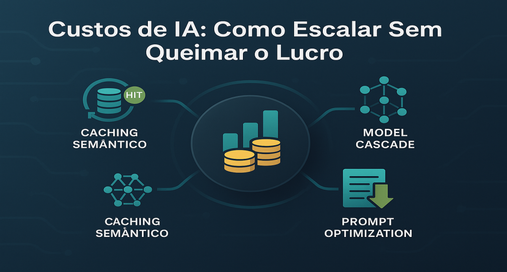

# Custos de IA: Como escalar sem queimar todo o lucro do delivery



## 1. Contexto e Propósito (Purpose)

A margem de lucro em delivery é apertada. Se cada pedido custar $0.05 em chamadas de IA para ser processado, você acabou de destruir o unit economics da empresa.
Muitos projetos de GenAI morrem na fase de "Pilot to Production" porque o custo, que era irrelevante com 10 usuários, torna-se proibitivo com 1 milhão.

O propósito deste artigo é apresentar estratégias de **FinOps para IA**: como otimizar prompts, usar cache e escolher modelos menores para reduzir a fatura em até 90%.

## 2. Abordagem (Approach)

Vamos atacar o custo em três frentes:

1.  **Caching Semântico**: A chamada mais barata é a que você não faz.
2.  **Model Cascade**: Não use um canhão (GPT-4) para matar uma mosca (classificar sentimento).
3.  **Prompt Optimization**: Reduzir o tamanho do contexto sem perder qualidade.

## 3. Conceitos Fundamentais

- **Semantic Cache**: Diferente de um cache exato (Redis key-value), o cache semântico usa vetores para entender que "Quero pizza" e "Tô com fome de pizza" são a mesma pergunta e retorna a mesma resposta salva.
- **Distillation**: Usar um modelo grande (Teacher) para treinar um modelo pequeno (Student) que é mais barato e rápido.
- **Token Packing**: Técnicas para enviar menos tokens (ex: remover espaços extras, usar JSON minificado).

## 4. Mão na Massa: Exemplo Prático

### 1. Implementando Cache Semântico com Redis e Embeddings

```python
import redis
from sentence_transformers import SentenceTransformer

# Conecta ao Redis com módulo Vector (RediSearch)
r = redis.Redis(host='localhost', port=6379)
model = SentenceTransformer('all-MiniLM-L6-v2')

def get_cached_response(user_query, threshold=0.9):
    query_vector = model.encode(user_query).tobytes()

    # Busca vetorial no Redis
    result = r.ft("idx:responses").search(
        Query("*=>[KNN 1 @vector $vec AS score]")
        .return_field("response")
        .return_field("score")
        .dialect(2),
        {"vec": query_vector}
    )

    if result.docs:
        doc = result.docs[0]
        similarity = 1 - float(doc.score) # Redis retorna distância, queremos similaridade
        if similarity > threshold:
            print("Cache Hit! 💰")
            return doc.response

    return None

def chat(user_query):
    cached = get_cached_response(user_query)
    if cached:
        return cached

    # Se não tiver no cache, chama a API cara
    response = openai.ChatCompletion.create(...)

    # Salva no cache para o próximo
    save_to_cache(user_query, response)
    return response
```

### 2. Estratégia de Cascata (Model Router)

```python
def smart_router(prompt):
    # Tenta classificar a complexidade com um modelo ultra-rápido (ex: RegEx ou BERT)
    complexity = classify_complexity(prompt)

    if complexity == "SIMPLE":
        # "Oi", "Bom dia", "Quero cancelar"
        return call_llm(model="gpt-3.5-turbo")
    elif complexity == "MEDIUM":
        # Resumo de pedido, extração de entidades
        return call_llm(model="claude-3-haiku")
    else:
        # Raciocínio complexo, análise jurídica
        return call_llm(model="gpt-4-turbo")
```

## 5. Métricas, Riscos e Boas Práticas

### Riscos

- **Cache Stale**: O usuário pergunta "Qual o status do meu pedido?". Se você cachear isso, vai responder "Saiu para entrega" para sempre, mesmo depois que já chegou. **Nunca cacheie dados transacionais**, apenas conhecimentos gerais ou FAQs.
- **Qualidade do Modelo Menor**: O GPT-3.5 pode ser barato, mas se ele alucinar e o suporte tiver que intervir, o custo operacional humano é muito maior que a economia de tokens.

### Boas Práticas

- **Monitore o "Miss Rate"**: Se seu cache só acerta 5% das vezes, ele está apenas adicionando latência e custo de infra (Redis). Ajuste o threshold de similaridade.
- **Limpeza de Contexto**: Antes de enviar o histórico do chat, remova mensagens muito antigas ou irrelevantes para economizar tokens de entrada.

## 6. Evidence & Exploration

Empresas como a **Helicone** oferecem proxies que fazem cache e logging automaticamente.
Faça um teste A/B: Substitua o GPT-4 pelo GPT-3.5 em 10% das chamadas de "Resumo de Avaliação". Se a taxa de reclamação não subir, você acabou de economizar 90% nessa feature.

## 7. Reflexões Pessoais & Próximos Passos

Otimizar custos não é ser mesquinho, é viabilizar o negócio. A IA só vai permear todos os produtos quando for barata o suficiente para ser invisível.
Agora que temos um modelo eficiente e barato, como saber qual versão da feature performa melhor?

No próximo artigo, vamos falar sobre **A/B Testing para Features de IA**: como comparar prompts e modelos em produção com usuários reais.
