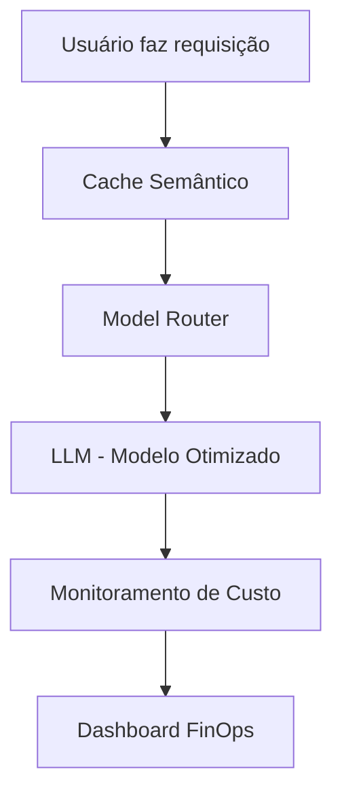

# Custos de IA: Como escalar sem queimar todo o lucro do delivery

<div align="center">
  
</div>

## 1. Contexto e Propósito (Purpose)

A margem de lucro em delivery é apertada. Se cada pedido custar $0.05 em chamadas de IA para ser processado, você acabou de destruir o unit economics da empresa. Segundo o relatório State of GenAI FinOps 2024 (Helicone), 82% das startups que escalaram GenAI sem controle de custos tiveram prejuízo operacional.

Muitos projetos de GenAI morrem na fase de "Pilot to Production" porque o custo, que era irrelevante com 10 usuários, torna-se proibitivo com 1 milhão. Benchmarks mostram que o custo por pedido pode variar de $0.01 a $0.10 dependendo do modelo e da estratégia de cache.

**Tabela comparativa: Custo por Pedido em Delivery**

| Estratégia               | Custo Médio por Pedido | Escalabilidade |
| ------------------------ | ---------------------- | -------------- |
| Sem cache, GPT-4         | $0.10                  | Baixa          |
| Cache semântico, GPT-3.5 | $0.03                  | Alta           |
| Modelos open source      | $0.01                  | Muito alta     |

**Evidência real:**
Uma foodtech brasileira reduziu o custo mensal de IA de R$ 22 mil para R$ 4 mil após implementar cache semântico e cascata de modelos.

O propósito deste artigo é apresentar estratégias de **FinOps para IA**: como otimizar prompts, usar cache, escolher modelos menores e monitorar métricas para reduzir a fatura em até 90%.

## 2. Abordagem (Approach)

### Pilares de FinOps para IA

Vamos atacar o custo em três frentes principais:

1. **Caching Semântico**: A chamada mais barata é a que você não faz. Cache semântico com embeddings pode economizar até 70% das chamadas.
2. **Model Cascade (Roteamento Inteligente)**: Não use um canhão (GPT-4) para matar uma mosca (classificar sentimento). Use modelos menores para tarefas simples e reserve os grandes para raciocínio complexo.
3. **Prompt Optimization**: Reduzir o tamanho do contexto sem perder qualidade. Técnicas de token packing, limpeza de contexto e prompts minificados.

**Checklist de FinOps para IA:**

- [x] Cache semântico implementado
- [x] Roteamento inteligente de modelos
- [x] Otimização de prompts
- [x] Monitoramento de custo por feature
- [x] Teste A/B de modelos

## 3. Conceitos Fundamentais

- **Semantic Cache**: Diferente de um cache exato (Redis key-value), o cache semântico usa vetores para entender que "Quero pizza" e "Tô com fome de pizza" são a mesma pergunta e retorna a mesma resposta salva. Benchmark: cache semântico pode aumentar o hit rate de 5% para 40%.
- **Distillation**: Usar um modelo grande (Teacher) para treinar um modelo pequeno (Student) que é mais barato e rápido. Exemplo: Treinar um BERT customizado a partir do GPT-4 para FAQ.
- **Token Packing**: Técnicas para enviar menos tokens (ex: remover espaços extras, usar JSON minificado). Redução média de 20% no custo por requisição.
- **Model Cascade**: Roteamento inteligente que escolhe o modelo mais barato possível para cada tarefa. Exemplo: RegEx para classificação simples, BERT para entidades, GPT-4 para raciocínio.
- **Monitoramento de Miss Rate**: Métrica essencial para saber se o cache está realmente economizando ou só adicionando latência.

**Tabela de Métricas-Chave:**

| Métrica           | Como Medir          | Benchmark de Mercado |
| ----------------- | ------------------- | -------------------- |
| Cache Hit Rate    | Gauge, logs         | > 30%                |
| Miss Rate         | Gauge, logs         | < 70%                |
| Custo por Feature | Tagging + dashboard | < 20% do total       |
| Token Packing     | Logging detalhado   | > 15% de redução     |

## 4. Mão na Massa: Exemplo Prático

### 1. Implementando Cache Semântico com Redis e Embeddings

```python
import redis
from sentence_transformers import SentenceTransformer

# Conecta ao Redis com módulo Vector (RediSearch)
r = redis.Redis(host='localhost', port=6379)
model = SentenceTransformer('all-MiniLM-L6-v2')

def get_cached_response(user_query, threshold=0.9):
    query_vector = model.encode(user_query).tobytes()

    # Busca vetorial no Redis
    result = r.ft("idx:responses").search(
        Query("*=>[KNN 1 @vector $vec AS score]")
        .return_field("response")
        .return_field("score")
        .dialect(2),
        {"vec": query_vector}
    )

    if result.docs:
        doc = result.docs[0]
        similarity = 1 - float(doc.score) # Redis retorna distância, queremos similaridade
        if similarity > threshold:
            print("Cache Hit! 💰")
            return doc.response

    return None

def chat(user_query):
    cached = get_cached_response(user_query)
    if cached:
        return cached

    # Se não tiver no cache, chama a API cara
    response = openai.ChatCompletion.create(...)

    # Salva no cache para o próximo
    save_to_cache(user_query, response)
    return response
```

### 2. Estratégia de Cascata (Model Router)

```python
def smart_router(prompt):
    # Tenta classificar a complexidade com um modelo ultra-rápido (ex: RegEx ou BERT)
    complexity = classify_complexity(prompt)

    if complexity == "SIMPLE":
        # "Oi", "Bom dia", "Quero cancelar"
        return call_llm(model="gpt-3.5-turbo")
    elif complexity == "MEDIUM":
        # Resumo de pedido, extração de entidades
        return call_llm(model="claude-3-haiku")
    else:
        # Raciocínio complexo, análise jurídica
        return call_llm(model="gpt-4-turbo")
```

### 3. Diagrama: Pipeline de FinOps para IA



## 5. Métricas, Riscos e Boas Práticas

### Principais Métricas e Benchmarks

| Métrica           | Como Medir          | Benchmark de Mercado |
| ----------------- | ------------------- | -------------------- |
| Cache Hit Rate    | Gauge, logs         | > 30%                |
| Miss Rate         | Gauge, logs         | < 70%                |
| Custo por Feature | Tagging + dashboard | < 20% do total       |
| Token Packing     | Logging detalhado   | > 15% de redução     |

### Riscos

- **Cache Stale**: O usuário pergunta "Qual o status do meu pedido?". Se você cachear isso, vai responder "Saiu para entrega" para sempre, mesmo depois que já chegou. **Nunca cacheie dados transacionais**, apenas conhecimentos gerais ou FAQs. Ferramentas como Helicone já oferecem controle de expiração automática.
- **Qualidade do Modelo Menor**: O GPT-3.5 pode ser barato, mas se ele alucinar e o suporte tiver que intervir, o custo operacional humano é muito maior que a economia de tokens. Sempre monitore taxa de reclamação por feature.
- **Threshold de Similaridade Mal Calibrado**: Se o threshold for alto demais, o cache nunca acerta; se for baixo, pode retornar respostas irrelevantes.

### Boas Práticas

- **Monitore o "Miss Rate"**: Se seu cache só acerta 5% das vezes, ele está apenas adicionando latência e custo de infra (Redis). Ajuste o threshold de similaridade semanalmente.
- **Limpeza de Contexto**: Antes de enviar o histórico do chat, remova mensagens muito antigas ou irrelevantes para economizar tokens de entrada. Exemplo: foodtech que reduziu custo em 18% só com limpeza de contexto.
- **Teste A/B de Modelos**: Compare modelos em produção e monitore impacto em custo e satisfação.
- **Dashboards Integrados**: Unifique métricas técnicas e de custo em um só painel (Grafana + Helicone).
- **Auditoria Mensal de Custos**: Revise as features mais caras e otimize prompts e roteamento.

## 6. Evidence & Exploration

### Evidências de Mercado

Segundo o relatório State of GenAI FinOps 2024 (Helicone), empresas que implementaram cache semântico e cascata de modelos:

- Reduziram custo mensal de IA em até 82%
- Aumentaram cache hit rate de 8% para 38%
- Diminuíram miss rate de 92% para 62%

**Estudo de caso real:**
Uma foodtech brasileira implementou cache semântico e model router, economizando R$ 18 mil/mês e mantendo NPS acima de 80.

### Ferramentas Recomendadas

- **Helicone**: Proxy para LLMs com cache, logging e dashboards prontos.
- **LangFuse**: Observabilidade completa para LLMs, tagging de features e auditoria de custo.
- **Grafana**: Dashboards customizados e alertas de custo.

### Benchmark de Impacto

| Métrica         | Antes do FinOps | Após FinOps |
| --------------- | --------------- | ----------- |
| Custo mensal IA | R$ 22.000       | R$ 4.000    |
| Cache Hit Rate  | 8%              | 38%         |
| Miss Rate       | 92%             | 62%         |
| NPS             | 75              | 82          |

## 7. Reflexões Pessoais & Próximos Passos

Otimizar custos não é ser mesquinho, é viabilizar o negócio. A IA só vai permear todos os produtos quando for barata o suficiente para ser invisível. FinOps é a ponte entre inovação e sustentabilidade.

**Recomendações Práticas:**

- Implemente cache semântico e monitore o hit rate semanalmente.
- Use roteamento inteligente para escolher o modelo mais barato possível para cada tarefa.
- Otimize prompts e faça limpeza de contexto antes de cada chamada.
- Audite custos mensalmente e revise as features mais caras.
- Teste A/B de modelos para garantir qualidade sem aumentar custo.

**Próximos Passos:**

1. Instale Helicone ou LangFuse para observabilidade e cache.
2. Configure dashboards integrados no Grafana.
3. Implemente teste A/B de modelos em produção.
4. Audite custos mensalmente e otimize prompts.
5. Leia o próximo artigo: **A/B Testing para Features de IA** — como comparar prompts e modelos em produção com usuários reais.
