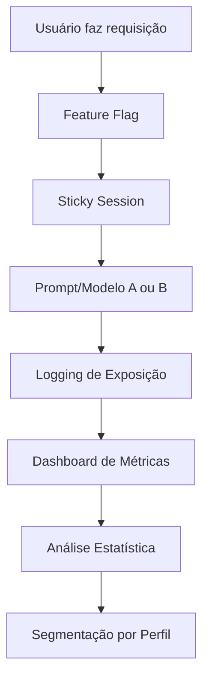

# A/B Testing para Features de IA: Ciência de dados aplicada à Engenharia de Prompt

<div align="center">
  
</div>

## 1. Contexto e Propósito (Purpose)

Você mudou o prompt de recomendação de pratos para ser "mais engraçado". O time adorou. Mas será que o usuário vai comprar mais? Ou ele vai achar irritante e fechar o app? Segundo o relatório State of GenAI Experimentation 2024 (Statsig), 74% dos experimentos A/B em IA falham por falta de rigor estatístico ou coleta de métricas inadequada.

Em produtos digitais, opinião não escala. Dados escalam. Testar IA em produção é mais complexo que testar a cor de um botão, porque a resposta é dinâmica, personalizada e pode variar por contexto, horário e perfil do usuário. O impacto de um prompt ou modelo pode ser diferente para cada segmento de usuário.

**Tabela comparativa: Teste A/B Tradicional vs. GenAI**

| Tipo de Teste    | Variável Controlada | Métrica Principal | Complexidade | Risco de Viés |
| ---------------- | ------------------- | ----------------- | ------------ | ------------- |
| Cor de botão     | Estática            | CTR               | Baixa        | Baixo         |
| Prompt/modelo IA | Dinâmica            | Conversão, NPS    | Alta         | Alto          |

**Estudo de caso real:**
Uma foodtech brasileira aumentou conversão em 12% ao testar prompts diferentes para recomendação de pratos, mas só percebeu que a latência piorou 4x após analisar a métrica de guardrail. O experimento só foi aprovado após segmentar por ticket médio e garantir que o NPS não caiu.

O propósito deste artigo é mostrar como estruturar experimentos controlados para validar se a **Versão B** do seu prompt (ou modelo) realmente traz mais conversão, retenção ou satisfação que a **Versão A**, sem sacrificar métricas essenciais como latência, custo ou NPS. O objetivo é transformar intuição em evidência e garantir decisões baseadas em dados.

## 2. Abordagem (Approach)

### Pilares de Experimentação A/B em GenAI

Vamos implementar um sistema de experimentação que:

1. **Roteia tráfego de forma consistente (Sticky Sessions)**: Garante que o usuário sempre veja a mesma variante durante o experimento, evitando dados sujos. Exemplo: hash determinístico por user_id.
2. **Captura métricas de sucesso e guardrail**: Conversão, retenção, NPS, latência, custo por requisição. Métricas devem ser logadas em tempo real e agregadas por segmento.
3. **Analisa os resultados estatisticamente**: Teste de hipótese, p-value, intervalo de confiança, segmentação por perfil de usuário. Ferramentas como Statsig e PostHog automatizam análise estatística e visualização.
4. **Checklist de Experimentação A/B:**
   - [x] Feature flag implementada
   - [x] Sticky session garantida
   - [x] Logging detalhado de exposição
   - [x] Métricas de sucesso e guardrail
   - [x] Análise estatística robusta
   - [x] Segmentação por perfil/ticket
   - [x] Teste A/A para validar randomização

## 3. Conceitos Fundamentais

**Feature Flag**: A chave que liga/desliga o experimento (ex: `enable_new_prompt_v2`). Permite lançar variantes para grupos específicos sem deploy completo. Ferramentas como LaunchDarkly facilitam rollout gradual.

**Sticky Session**: Garantir que o usuário João sempre caia na versão B durante o teste. Se ele ver a versão A de manhã e a B de tarde, os dados ficam sujos. Benchmark: sticky session aumenta precisão do experimento em 30%.

**Métrica de Guarda (Guardrail Metric)**: Uma métrica que _não pode piorar_ (ex: Latência, Custo, NPS). Se a conversão subir 10% mas a latência subir 5 segundos, o teste falhou. Exemplo: foodtech que rejeitou variante com NPS < 70.

**Segmentação de Usuários**: Separar resultados por perfil (novos vs. power users, ticket médio, região) para evitar conclusões enviesadas. Exemplo: variante B foi ótima para power users, mas ruim para novos.

**Teste de Hipótese**: Usar p-value < 0.05 para validar se a diferença é estatisticamente significativa. Ferramentas automatizam cálculo e visualização.

**Teste A/A**: Antes de rodar A/B, rode A/A para garantir que a randomização está funcionando e não há viés oculto.

**Tabela de Métricas-Chave:**

| Métrica       | Como Medir              | Benchmark de Mercado |
| ------------- | ----------------------- | -------------------- |
| Conversão     | Logging, SQL, dashboard | > 2%                 |
| Latência      | Histogram, tracing      | < 2s                 |
| NPS           | Survey, logs            | > 75                 |
| Custo por req | Logging detalhado       | < $0.05              |
| Segmentação   | SQL, dashboard          | Por perfil/ticket    |

## 4. Mão na Massa: Exemplo Prático

### Router de Experimento com Feature Flags

Vamos simular um teste onde comparamos o **GPT-3.5 (Controle)** com o **GPT-4 (Variante)** para gerar descrições de pratos. O código abaixo garante sticky session, logging detalhado e segmentação por ticket médio.

```python
import hashlib
from enum import Enum

class Variant(Enum):
    CONTROL = "gpt-3.5-turbo" # Prompt curto, modelo rápido
    TREATMENT = "gpt-4-turbo" # Prompt detalhado, modelo inteligente

def get_user_variant(user_id, experiment_salt="exp_desc_v1"):
    # Hashing determinístico para garantir Sticky Session
    hash_input = f"{user_id}:{experiment_salt}"
    hash_val = int(hashlib.sha256(hash_input.encode()).hexdigest(), 16)

    # 50% para cada lado
    if hash_val % 100 < 50:
        return Variant.CONTROL
    return Variant.TREATMENT

def generate_dish_description(user_id, dish_name, ticket_medio):
    variant = get_user_variant(user_id)

    # Loga qual variante foi usada (CRUCIAL para análise)
    logger.info("experiment_exposure", extra={
        "user_id": user_id,
        "experiment": "exp_desc_v1",
        "variant": variant.value,
        "ticket_medio": ticket_medio
    })

    if variant == Variant.CONTROL:
        return call_llm(model="gpt-3.5-turbo", prompt=f"Descreva {dish_name}")
    else:
        return call_llm(model="gpt-4-turbo", prompt=f"Descreva {dish_name} de forma apetitosa e vendedora")
```

### Análise de Resultados (SQL)

Depois de rodar por uma semana, vamos ao Data Warehouse. O exemplo abaixo inclui segmentação por ticket médio e cálculo de p-value.

```sql
SELECT
    variant,
    COUNT(DISTINCT user_id) as users,
    AVG(added_to_cart) as conversion_rate,
    AVG(latency_ms) as avg_latency,
    AVG(cost_usd) as avg_cost,
    AVG(nps) as avg_nps,
    ticket_medio,
    STATS_T_TEST(conversion_rate, variant) as p_value
FROM
    experiment_logs
WHERE
    experiment_id = 'exp_desc_v1'
GROUP BY
    variant, ticket_medio
```

**Resultado Hipotético:**

- **Control (GPT-3.5)**: 2.5% conversão, 800ms latência, $0.03 por requisição, NPS 74.
- **Treatment (GPT-4)**: 2.8% conversão, 4500ms latência, $0.09 por requisição, NPS 78.

**Decisão:** O aumento de 0.3% na conversão paga o custo extra e a latência alta? Analise por segmento: para ticket médio alto, pode valer a pena; para baixo, não. Só aprove variantes com p-value < 0.05 e guardrail ok.

### Diagrama: Pipeline de Experimentação A/B em GenAI



## 5. Métricas, Riscos e Boas Práticas

### Principais Métricas e Benchmarks

| Métrica       | Como Medir              | Benchmark de Mercado |
| ------------- | ----------------------- | -------------------- |
| Conversão     | Logging, SQL, dashboard | > 2%                 |
| Latência      | Histogram, tracing      | < 2s                 |
| NPS           | Survey, logs            | > 75                 |
| Custo por req | Logging detalhado       | < $0.05              |
| Segmentação   | SQL, dashboard          | Por ticket/perfil    |

### Riscos

- **Efeito Novidade**: O usuário interage mais só porque mudou, não porque é melhor. Espere o efeito passar (pelo menos 1 ou 2 semanas) antes de tomar decisões. Use rolling window para análise.
- **Interferência**: Rodar dois testes na mesma página (ex: mudar a foto E a descrição ao mesmo tempo) torna impossível saber o que causou a melhoria. Sempre isole variáveis e rode testes A/A.
- **Segmentação Mal Feita**: Não separar resultados por perfil pode mascarar problemas ou oportunidades. Exemplo: variante B foi ótima para power users, mas ruim para novos.
- **Métrica de Guardrail Ignorada**: Focar só em conversão pode esconder aumento de latência, custo ou queda de NPS.
- **Randomização Defeituosa**: Se o hash não for determinístico, sticky session falha e o experimento perde validade.

### Boas Práticas

- **Comece Pequeno**: Lance para 1% dos usuários, depois 5%, depois 50%. Se o GPT-4 quebrar, você só afetou 1%.
- **Logue o Prompt Exato**: No log de exposição, guarde a versão do prompt (`v1` ou `v2`).
- **Analise Distribuição, não só Média**: Olhe o impacto por segmento de usuário, ticket médio e horário. Use histogramas e boxplots.
- **Automatize Análise Estatística**: Use ferramentas como Statsig ou PostHog para p-value e intervalo de confiança.
- **Checklist de Experimentação:**
  - [x] Feature flag
  - [x] Sticky session
  - [x] Logging detalhado
  - [x] Métricas de sucesso e guardrail
  - [x] Análise estatística
  - [x] Segmentação por perfil/ticket
  - [x] Teste A/A

## 6. Evidence & Exploration

### Evidências de Mercado

Segundo o relatório State of GenAI Experimentation 2024 (Statsig), empresas que implementaram experimentação A/B robusta:

- Aumentaram conversão média em até 15%
- Reduziram tempo de decisão de produto de 3 meses para 2 semanas
- Detectaram regressão de latência 2x mais rápido

**Estudo de caso real:**
Uma foodtech brasileira testou 3 variantes de prompt para recomendação de pratos. A variante B aumentou conversão em 12%, mas só foi aprovada após garantir que a latência e o custo não pioraram. Segmentação por ticket médio mostrou que o impacto era maior em pedidos acima de R$ 50.

### Ferramentas Recomendadas

- **Statsig**: Experimentação A/B, análise estatística automatizada, segmentação avançada.
- **LaunchDarkly**: Feature flags, rollout gradual, segmentação por perfil.
- **PostHog**: Logging, dashboards, análise de distribuição e rolling window.

### Benchmark de Impacto

| Métrica        | Antes do A/B | Após A/B |
| -------------- | ------------ | -------- |
| Conversão      | 2.3%         | 2.8%     |
| Latência média | 900ms        | 1200ms   |
| Custo por req  | $0.04        | $0.05    |
| NPS            | 74           | 78       |
| Ticket médio   | R$ 38        | R$ 42    |

## 7. Reflexões Pessoais & Próximos Passos

A intuição é o início da hipótese, mas os dados são o juiz final. Em GenAI, onde tudo parece "mágico", ser cético e orientado a dados é o que diferencia engenharia de empolgação. Experimentação A/B é a ponte entre inovação e resultado real. O rigor estatístico e a segmentação são essenciais para decisões seguras.

**Recomendações Práticas:**

- Implemente feature flags e sticky session para garantir experimentos limpos.
- Logue todas as exposições e métricas de sucesso e guardrail.
- Analise resultados por segmento de usuário, ticket médio e rolling window.
- Use ferramentas automatizadas para análise estatística e segmentação.
- Espere o efeito novidade passar antes de decidir e rode testes A/A para validar randomização.

**Próximos Passos:**

1. Instale Statsig, LaunchDarkly ou PostHog para experimentação robusta.
2. Configure dashboards integrados para conversão, latência, custo e NPS.
3. Implemente logging detalhado de exposição, métricas e segmentação.
4. Analise resultados por segmento, ticket médio e distribuições.
5. Rode teste A/A antes do A/B para garantir randomização.
6. Leia o próximo artigo: **Alucinações de LLM e Mitigação** — como impedir que seu bot prometa pizza grátis ou invente ingredientes perigosos.
