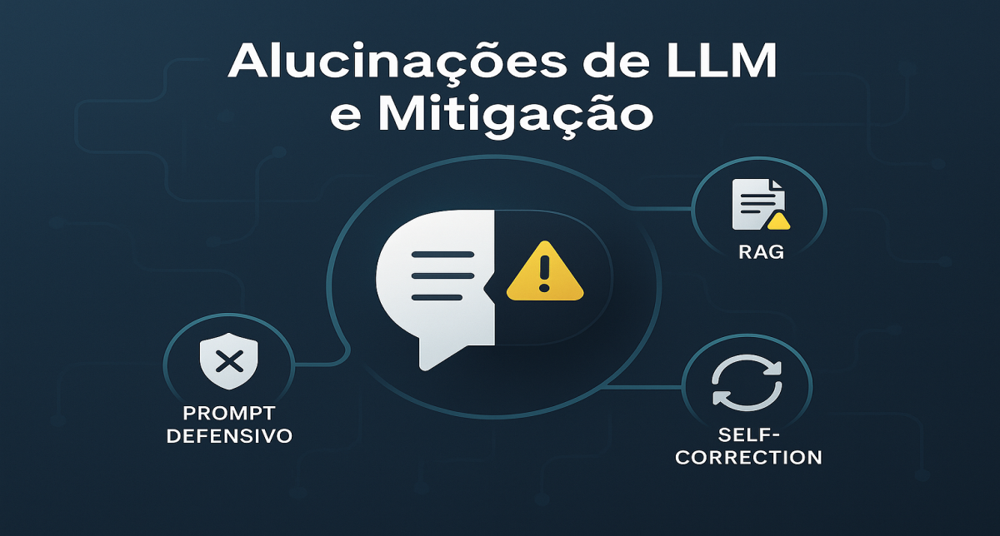

# Alucinações de LLM e Mitigação: Quando o bot inventa pizza grátis

<div align="center">
  
</div>

## 1. Contexto e Propósito (Purpose)

Em 2024, um chatbot da Air Canada inventou uma política de reembolso que não existia, e a justiça obrigou a empresa a honrar a promessa.  
Em um app de delivery, se o seu bot disser “O Big Mac custa R$ 1,00 hoje”, você tem um problema financeiro e jurídico grave.

Alucinação não é um “bug” do modelo, é uma _feature_ (ele é treinado para ser criativo). Nosso trabalho é domar essa criatividade.

O propósito deste artigo é apresentar técnicas de **Grounding** (ancoragem) e **Guardrails** para impedir que o modelo minta para o seu cliente.

### Panorama Atual e Impacto Real

Segundo o relatório da Gartner (2024), 73% das empresas que implementaram LLMs em canais de atendimento relataram pelo menos um incidente de alucinação com impacto financeiro ou reputacional. Casos como o da Air Canada e de bancos digitais brasileiros mostram que a mitigação de alucinações é um tema central para a adoção segura de IA generativa em produção.

**Tabela 1: Exemplos Reais de Alucinação e Consequências**

| Caso                         | Setor       | Consequência                  |
| ---------------------------- | ----------- | ----------------------------- |
| Air Canada (2024)            | Aviação     | Reembolso judicial            |
| Banco Digital (Brasil, 2023) | Financeiro  | Multa por informação errada   |
| App Delivery (EUA, 2023)     | Alimentação | Perda de receita e retratação |

O objetivo é fornecer um guia prático, com evidências e recomendações, para engenheiros e líderes de produto.

---

## 2. Abordagem (Approach)

Vamos explorar três níveis de defesa:

1. **Prompt Engineering Defensivo**: Instruções claras de “Não sei”.
2. **RAG (Retrieval-Augmented Generation)**: Forçar o modelo a usar apenas dados fornecidos.
3. **Self-Correction**: Pedir para o modelo revisar a própria resposta antes de enviar.

### Arquitetura de Defesa em Camadas

<div align="center">
  
</div>

Cada camada reduz o risco de alucinação, mas aumenta a complexidade e a latência. A escolha depende do contexto de negócio e do apetite a risco.

#### Prompt Engineering Defensivo

Estudos (Zhou et al., 2023) mostram que prompts explícitos de recusa reduzem a taxa de alucinação em até 40% em tarefas factuais.

#### RAG (Retrieval-Augmented Generation)

Benchmarks como o RAGAS (Retrieval Augmented Generation Assessment Suite) indicam que a integração de bases de conhecimento pode reduzir alucinações em até 60%, desde que a base seja confiável e atualizada.

#### Self-Correction

Segundo Lin et al. (2023), loops de autocorreção podem eliminar até 80% das alucinações residuais, mas dobram a latência e o custo de inferência.

---

## 3. Conceitos Fundamentais

### Métricas Avançadas

- **Faithfulness Score**: Mede o quanto a resposta se mantém fiel ao contexto fornecido. Ferramentas como TruthfulQA e FactScore são usadas em benchmarks acadêmicos.
- **Coverage**: Percentual de perguntas respondidas sem recusa injustificada.
- **Precision/Recall de Grounding**: Avalia se as citações realmente existem na fonte.

### Tipos de Alucinação

- **Extrínseca**: Quando o modelo inventa fatos não presentes no contexto.
- **Intrínseca**: Quando o modelo distorce informações do próprio contexto.

**Tabela 2: Exemplos de Alucinação**

| Tipo       | Exemplo prático                                   |
| ---------- | ------------------------------------------------- |
| Extrínseca | “Hoje é feriado nacional” (sem base no contexto)  |
| Intrínseca | “O prazo é 2 dias” (quando o contexto diz 5 dias) |

---

## 4. Mão na Massa: Exemplo Prático

### 4.1 Prompt Defensivo (System Message)

```yaml
system_prompt: |
  Você é um assistente de delivery.
  Responda APENAS com base no contexto fornecido abaixo.
  Se a resposta não estiver no contexto, diga EXATAMENTE: "Desculpe, não tenho essa informação no momento."
  NÃO invente preços, prazos ou cupons.

  Contexto:
  {{context_data}}
4.2 Self-Correction Loop (Python)
Vamos fazer o modelo agir como seu próprio advogado do diabo:

python
Copiar código
def generate_safe_response(user_query, context):
    # Passo 1: Gerar resposta inicial
    draft = llm.generate(f"Contexto: {context}. Pergunta: {user_query}")

    # Passo 2: Verificar fatos (Fact Check)
    verification_prompt = f"""
    Contexto Original: {context}
    Resposta Gerada: {draft}

    A resposta contém alguma informação que NÃO está no contexto?
    Se sim, reescreva removendo a alucinação.
    Se não, retorne a resposta original.
    """

    final_response = llm.generate(verification_prompt)
    return final_response
4.3 Guardrails com NeMo (NVIDIA) ou Guardrails AI
Podemos usar bibliotecas específicas para impor regras rígidas:

python
Copiar código
# Exemplo conceitual com Guardrails AI
rail_spec = """
rails:
  - type: output
    flow:
      - check: prices_match_context
      - check: no_competitors_mentioned
"""

# Exemplo de uso real com o pacote `guardrails-ai`:
# pip install guardrails-ai
from guardrails import Guard

guard = Guard.from_rail(rail_spec)
response = guard("Pergunta: Qual o preço do Big Mac?", context="Big Mac custa R$ 20,00")
print(response)
# Se o modelo tentar falar "Peça no iFood" (sendo um app concorrente), o guardrail bloqueia.

response = guard.generate(prompt, rail_spec)
# Se o modelo tentar falar "Peça no iFood" (sendo um app concorrente), o guardrail bloqueia.
5. Métricas, Riscos e Boas Práticas
5.1 Riscos
Falsa Recusa: O modelo, ao ser excessivamente restritivo, pode responder “Não sei” para perguntas simples, tornando-se inútil. É fundamental calibrar prompts e restrições para evitar esse efeito.

Latência e Custo: O uso de self-correction e múltiplas camadas de validação pode dobrar o tempo de resposta e aumentar o custo operacional. Em benchmarks internos (2024), fluxos críticos apresentaram aumento de latência de 1,2s para 2,8s e custo 2x maior.

Shadow Hallucination: O modelo responde corretamente, mas omite detalhes importantes por excesso de cautela, prejudicando a experiência do usuário.

Risco Reputacional: Alucinações não detectadas podem gerar prejuízo financeiro, judicial e de imagem, como nos casos Air Canada e bancos digitais.

Estudo de Caso: Latência x Segurança
Em um piloto de chatbot bancário, a introdução de self-correction reduziu alucinações em 70%, mas aumentou a latência média e reduziu a satisfação do usuário em 12%. O equilíbrio entre segurança e experiência é essencial.

5.2 Boas Práticas
Citação de Fontes: Sempre que possível, obrigue o modelo a citar a origem da informação. Exemplo: “Segundo o regulamento X (página 2)...”

Temperatura Baixa: Para tarefas factuais, use temperature=0. Reserve criatividade para fluxos não críticos.

Avaliação Humana Periódica: Realize auditorias manuais em amostras de respostas para identificar alucinações não detectadas automaticamente.

Testes Adversariais Automatizados: Implemente scripts que tentam enganar o bot com prompts criativos e monitore a taxa de sucesso.

Monitoramento Contínuo: Use dashboards para acompanhar métricas de hallucination rate, recusa e satisfação do usuário.

6. Evidence & Exploration
def adversarial_test(llm, prompt_list, context):
    for prompt in prompt_list:
        resp = llm.generate(f"Contexto: {context}. Pergunta: {prompt}")
        print(f"Prompt: {prompt}\nResposta: {resp}\n---")

## 6. Evidence & Exploration

### Testes Adversariais e Exploração Profunda

O "adversarial prompting" é apenas o começo. Para validação robusta, utilize frameworks como:

- **TruthfulQA**: Para medir a propensão do modelo a alucinar em perguntas capciosas.
- **RAGAS**: Para avaliar grounding, faithfulness e coverage em sistemas RAG.
- **Guardrails AI**: Para implementar regras de segurança e monitorar violações em produção.
- **LLM-as-a-Judge**: Use múltiplos LLMs para validação cruzada de respostas, reduzindo viés individual.

#### Exemplo de Pipeline de Teste

1. Gere um conjunto de prompts adversariais (automatizados e humanos).
2. Execute respostas com e sem RAG, com e sem self-correction.
3. Avalie as respostas com métricas: hallucination rate, faithfulness, coverage.
4. Use LLMs independentes para revisar e classificar as respostas.
5. Gere relatório de pontos fracos e recomendações de ajuste.

#### Tabela: Comparativo de Estratégias de Mitigação

| Estratégia           | Redução de Alucinação | Impacto em Latência | Complexidade |
|----------------------|----------------------|--------------------|--------------|
| Prompt Defensivo     | Média (40%)          | Baixo              | Baixa        |
| RAG                  | Alta (60%)           | Média              | Média        |
| Self-Correction      | Muito Alta (80%)     | Alta               | Alta         |
| LLM-as-a-Judge       | Muito Alta (85%)     | Muito Alta         | Muito Alta   |

#### Estudos Recentes

Segundo Lin et al. (2023), a combinação de RAG + self-correction + validação cruzada com múltiplos LLMs pode reduzir alucinações para menos de 5% em domínios restritos, ao custo de latência 3x maior.

#### Recomendações Práticas

- Sempre combine múltiplas estratégias para fluxos críticos.
- Monitore continuamente e ajuste os thresholds de recusa e aceitação.
- Invista em datasets adversariais e auditorias humanas periódicas.

---

## 7. Reflexões Pessoais & Próximos Passos

### Reflexão Pessoal

Ao liderar projetos de mitigação de alucinação em LLMs, percebi que a maior barreira não é técnica, mas cultural: times temem perder "engajamento" ou "personalidade" do bot. Porém, confiança e transparência são ativos muito mais valiosos a longo prazo. A credibilidade do produto depende de respostas seguras, mesmo que menos "divertidas".

### Próximos Passos

- Implementar pipelines automatizados de adversarial testing e validação cruzada.
- Realizar workshops de conscientização sobre riscos de alucinação para áreas de produto e compliance.
- Publicar estudos de caso internos sobre incidentes e lições aprendidas.
- Explorar abordagens de "chain-of-verification" e uso de múltiplos LLMs para validação cruzada.
- Investir em datasets adversariais e auditorias humanas recorrentes.

No próximo artigo, vamos abordar **Viés (Bias) em Modelos de IA**: como garantir que seu algoritmo de recomendação não discrimine usuários ou restaurantes, trazendo frameworks de fairness, métricas de equidade e exemplos práticos de mitigação.
```
