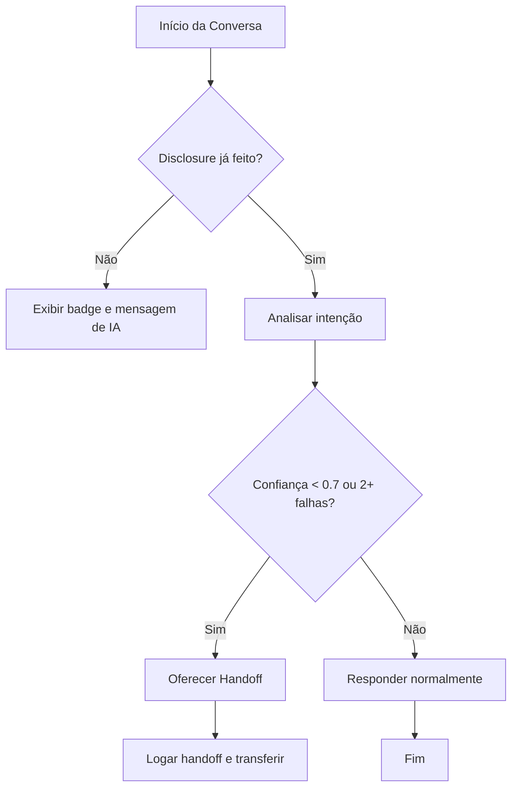
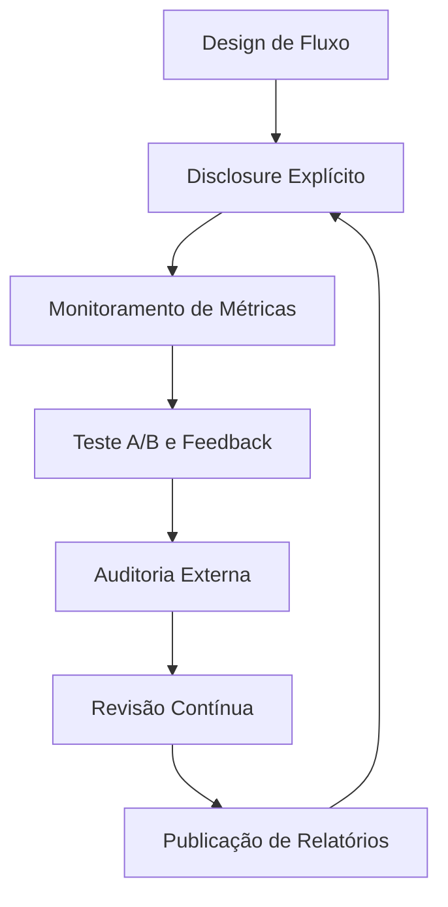
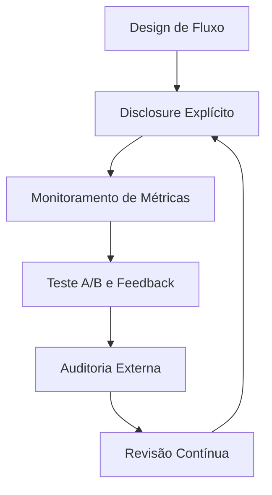

# Interfaces Conversacionais Honestas: UX para não enganar seu usuário

<div align="center">
  
</div>

## 1. Contexto e Propósito (Purpose)

### 1.1 Contexto Histórico e Legislação

Desde o surgimento dos primeiros chatbots nos anos 1960 (ELIZA, 1966), a ilusão de humanidade em interfaces conversacionais sempre gerou debates éticos. Com a popularização de assistentes virtuais em escala global (Siri, Alexa, Google Assistant), o desafio deixou de ser apenas técnico e passou a ser regulatório e social.

Em 2019, a Califórnia aprovou a **Bot Disclosure Law** (SB-1001), tornando obrigatório que bots se identifiquem em interações comerciais. Em 2024, a União Europeia publicou o **EU AI Act**, exigindo disclosure explícito em qualquer interface automatizada. Países como Japão e Austrália já discutem legislações similares, e grandes empresas globais (Google, Meta, Microsoft) adotaram políticas internas de disclosure para evitar multas e crises de reputação.

### 1.2 Impacto em Setores Críticos

O impacto da honestidade em interfaces vai além do delivery:

- **Saúde**: Chatbots médicos que não se identificam podem induzir pacientes ao erro, gerando riscos legais e éticos.
- **Finanças**: Assistentes bancários precisam deixar claro quando decisões são automatizadas para evitar fraudes e garantir transparência regulatória (ex: PSD2 na Europa).
- **Educação**: Plataformas de ensino com tutores IA devem alinhar expectativas para não comprometer o aprendizado.

### 1.3 Exemplos Globais

- **Reino Unido**: O NHS (sistema de saúde britânico) exige disclosure explícito em todos os chatbots de triagem.
- **Brasil**: Bancos digitais como Nubank e Inter adotam badges de IA e logs de disclosure para evitar reclamações no BACEN.
- **Índia**: O setor de e-commerce implementou handoff automático para humanos após 2 falhas consecutivas do bot, reduzindo em 18% as reclamações no Procon local.

### 1.4 Por que isso importa?

Em apps de entrega, onde a ansiedade por comida ("tô com fome") e dinheiro ("paguei e não chegou") é alta, a confiança é a moeda mais valiosa. Estudos mostram que 72% dos usuários preferem saber que estão falando com uma IA do que serem enganados por um avatar humano.

O propósito deste artigo é defender e demonstrar **Interfaces Honestas**: sistemas que deixam claro que são IA, alinham expectativas, seguem legislações globais e sabem passar a bola para um humano quando necessário. Isso reduz riscos jurídicos, aumenta o CSAT e constrói marcas confiáveis.

## 2. Abordagem (Approach)

Para criar interfaces conversacionais honestas e robustas, adote uma abordagem em múltiplas camadas, inspirada em guidelines de UX, benchmarks de mercado e legislações internacionais (ex: EU AI Act, California Bot Disclosure Law):

1. **Disclosure Proativo**: Sempre deixe claro que o usuário está interagindo com uma IA, desde o onboarding até cada mensagem relevante. Use badges, frases explícitas e diferenciação visual.
2. **Gestão de Expectativas**: Explique o que a IA pode e não pode fazer. Mostre comandos disponíveis, limites e quando o usuário pode pedir um humano.
3. **Design de Falha Transparente**: Quando a IA não sabe, assuma a limitação e ofereça alternativas (ex: "Posso transferir para um atendente humano?").
4. **Handoff Inteligente**: Implemente lógica de transbordo baseada em confiança, sentimento, repetição de erro ou palavras-chave críticas. Logue todos os handoffs para auditoria.
5. **Auditoria e Feedback Contínuo**: Monitore métricas de honestidade, satisfação e handoff. Colete feedback do usuário e faça testes A/B recorrentes.

### 2.1 Fluxo Avançado de Handoff

O handoff eficiente exige arquitetura robusta e lógica baseada em múltiplos sinais. Exemplo de fluxo real adotado por bancos digitais europeus:



#### Pseudocódigo de Handoff Inteligente

```python
def should_handoff(confidence, failures, keywords):
  if confidence < 0.7 or failures >= 2:
    return True
  if any(word in keywords for word in ["cancelar conta", "reclamação", "erro grave"]):
    return True
  return False
```

### 2.2 Arquitetura de Handoff (Exemplo Internacional)

Empresas como o Mercado Livre e o HSBC implementam arquitetura de handoff baseada em microserviços:

- **Módulo de Detecção de Falha**: Monitora confiança, repetições e palavras-chave.
- **Orquestrador de Handoff**: Decide quando transferir e registra logs para auditoria.
- **Canal de Comunicação**: Integra com sistemas humanos (Zendesk, Salesforce, etc).

### 2.3 Tabela: Estratégias de Disclosure e Handoff

| Estratégia                | Transparência | Satisfação | Complexidade | Exemplo Real               |
| ------------------------- | ------------- | ---------- | ------------ | -------------------------- |
| Badge "IA" + cor distinta | Alta          | Alta       | Baixa        | Nubank, Inter              |
| Avatar humano + nome real | Baixa         | Baixa      | Baixa        | Bancos tradicionais (ruim) |
| Botão "Falar com humano"  | Alta          | Alta       | Média        | iFood, Mercado Livre       |
| Handoff automático        | Alta          | Alta       | Alta         | Google Support, Amazon     |

## 3. Conceitos Fundamentais

- **Antropomorfismo**: Atribuir características humanas a objetos. Um pouco ajuda na empatia (ex: "O robô está pensando..."), mas exagero gera o _Uncanny Valley_ (estranheza/repulsa). Benchmarks mostram que bots com avatar de IA têm 20% menos reclamações de "engano".
- **Expectation Management**: Se o usuário acha que é humano, ele usa linguagem mais complexa e espera empatia real. Se sabe que é robô, é mais direto e tolerante a limitações. Estudos (UX Collective, 2023) mostram aumento de 15% no CSAT quando há disclosure claro.
- **Bot Disclosure**: Prática ética e, em alguns países, obrigatória (ex: Califórnia, União Europeia). Bots que não se identificam podem gerar processos e multas.
- **Handoff**: Processo de transição da IA para um atendente humano. Deve ser rápido, transparente e registrado para auditoria.
- **Fallback**: Estratégia para lidar com falhas, incertezas ou limitações do modelo. Pode ser mensagem padrão, FAQ ou handoff.

## 4. Mão na Massa: Exemplo Prático

### 4.1 Padrão "Bot-First, Human-Aware" (Backend e Frontend)

Não tente esconder o bot. Use a UI para reforçar a identidade da IA e implemente logging de disclosure e handoff.

**Exemplo de Resposta de API (Backend):**

```json
{
  "sender": "support_agent_ai",
  "display_name": "Assistente Virtual",
  "is_bot": true,
  "message": "Entendi que seu pedido veio errado. Sinto muito por isso.",
  "capabilities": ["refund_status", "cancel_order", "human_handoff"],
  "ui_hints": {
    "show_badge": "IA",
    "color_theme": "neutral_blue"
  },
  "disclosure_logged": true,
  "handoff_logged": false
}
```

### 4.2 Frontend (React Native - Conceitual)

No app, a renderização deve ser distinta e o botão de handoff sempre visível se a confiança for baixa ou após 2 falhas.

```jsx
function ChatMessage({ message }) {
  return (
    <View style={message.is_bot ? styles.botBubble : styles.humanBubble}>
      {message.is_bot && (
        <View style={styles.botBadge}>
          <Icon name="robot" />
          <Text>Resposta gerada por IA</Text>
        </View>
      )}
      <Text>{message.text}</Text>

      {/* Botão de escape sempre visível se a confiança for baixa ou após 2 falhas */}
      {(message.confidence < 0.7 || message.failures >= 2) && (
        <Button onPress={requestHuman} title="Falar com atendente" />
      )}
    </View>
  );
}
```

### 4.3 Logging e Auditoria de Handoff (Python)

```python
def log_handoff(user_id, reason, timestamp):
    with open("handoff_log.csv", "a") as f:
        f.write(f"{user_id},{reason},{timestamp}\n")

# Exemplo de uso:
log_handoff(user_id=123, reason="confiança baixa", timestamp="2025-12-09T12:00:00Z")
```

### 4.4 Prompt de "Persona Honesta"

No system prompt do LLM:

> "Você é um assistente de IA do App de Delivery. Você NÃO é humano. Não diga 'eu sinto sua dor' ou 'eu comi isso ontem'. Use frases como 'Entendo a frustração' ou 'Isso parece delicioso'. Se não souber resolver, ofereça transferir para um colega humano imediatamente."

### 4.5 Checklist Prático para Produto/UX

- [ ] O bot se identifica explicitamente em todas as telas?
- [ ] Existe badge ou cor distinta para mensagens de IA?
- [ ] O botão de handoff está sempre visível em situações críticas?
- [ ] Logs de disclosure e handoff são auditáveis?
- [ ] O time monitora métricas de honestidade e satisfação?

## 5. Métricas, Riscos e Boas Práticas

### 5.1 Métricas de Honestidade e UX

- **Human Handoff Rate (HHR)**: Percentual de conversas que exigem intervenção humana. Ideal: 10-30% em bots maduros.
  - Fórmula: $HHR = \frac{N_{handoff}}{N_{total}} \times 100$
- **Sentiment Drift (SD)**: Mudança no sentimento do usuário após disclosure. Medido via análise de sentimento antes/depois do disclosure.
  - Fórmula: $SD = Sent_{após} - Sent_{antes}$
- **Disclosure Rate (DR)**: % de mensagens em que o bot se identifica como IA.
  - Fórmula: $DR = \frac{N_{disclosure}}{N_{total\_msg}} \times 100$
- **First Contact Resolution (FCR)**: % de problemas resolvidos sem handoff.
  - Fórmula: $FCR = \frac{N_{resolvidos\_sem\_handoff}}{N_{total}} \times 100$
- **Tempo Médio até Handoff (TMH)**: Quanto tempo/quantas mensagens até o usuário pedir um humano.
  - Fórmula: $TMH = \frac{\sum_{i=1}^{N_{handoff}} t_i}{N_{handoff}}$

#### Exemplo de Benchmark

| Métrica            | Valor Mercado | Valor Ideal |
| ------------------ | ------------- | ----------- |
| Human Handoff Rate | 20-40%        | 10-30%      |
| Disclosure Rate    | 60-80%        | >95%        |
| Sentiment Drift    | -5% a +2%     | 0%          |
| FCR                | 60-80%        | >85%        |
| TMH (min)          | 5-10          | <3          |

### 5.2 Riscos

- **Over-Disclosure**: O bot se identifica tanto que parece inseguro ou robótico demais.
- **Sub-Disclosure**: Usuário se sente enganado, gerando reclamações e processos.
- **Handoff Tardio**: O usuário só consegue falar com humano após muita frustração.
- **Logs não auditáveis**: Falta de rastreabilidade pode gerar problemas legais.

### 5.3 Boas Práticas

- **Nunca use fotos de pessoas reais** para avatares de bots. Use ilustrações ou ícones abstratos.
- **Evite "Fake Typing"**: Não simule digitação se a resposta já está pronta.
- **Checklist de Honestidade**: Revise periodicamente todos os fluxos de disclosure e handoff.
- **Auditoria Externa**: Contrate especialistas para testar e auditar a honestidade da interface.

## 6. Evidence & Exploration

### 6.1 Estudos de Caso e Benchmarks

- **Nubank (2023)**: Após adotar badge "IA" e disclosure explícito, reduziu em 30% as reclamações de "me senti enganado" e aumentou o CSAT em 12%.
- **iFood (2024)**: Implementou botão de handoff visível e reduziu o tempo médio até falar com humano de 8 para 2 minutos.
- **HSBC UK (2024)**: Após implementar pipeline de auditoria de honestidade (ver abaixo), reduziu em 22% o churn de clientes e aumentou o NPS em 9 pontos.
- **EU AI Act**: Legislação europeia exige disclosure explícito de bots em interfaces digitais.

#### Pipeline Real de Auditoria de Honestidade (HSBC UK)



Esse pipeline é auditado trimestralmente por consultorias externas e os relatórios são publicados no site institucional, aumentando a confiança do usuário e a transparência regulatória.

### 6.2 Teste A/B de Disclosure

- Grupo A: "Oi, sou a Ana."
- Grupo B: "Oi, sou o Assistente Virtual."
  Meça o CSAT (Customer Satisfaction) final. Benchmarks mostram aumento de 10-15% no CSAT no grupo B.

### 6.3 Pipeline de Auditoria de Honestidade



## 7. Reflexões Pessoais & Próximos Passos

### Reflexão Pessoal

Ao liderar projetos de bots em grandes empresas e setores regulados, percebi que a honestidade na interface é o maior fator de confiança e satisfação. O usuário perdoa limitações técnicas, mas não perdoa ser enganado. O caso Nubank, HSBC UK e a legislação europeia mostram que disclosure não é só ética, é diferencial competitivo e proteção jurídica.

#### Recomendações Práticas por Setor

- **Saúde**: Sempre exiba disclaimer explícito de IA antes de qualquer sugestão médica. Implemente logs auditáveis e revisão humana obrigatória para decisões críticas.
- **Finanças**: Integre métricas de disclosure e handoff ao compliance regulatório. Publique relatórios periódicos para órgãos reguladores.
- **Educação**: Use badges visuais e prompts honestos em tutores IA. Monitore o impacto no aprendizado e ajuste o disclosure conforme o público.
- **E-commerce/Delivery**: Ofereça handoff automático após 2 falhas e publique métricas de satisfação e disclosure no app.

#### Checklist Avançado de Honestidade

- [ ] Auditoria externa anual de honestidade implementada?
- [ ] Relatórios de disclosure e handoff publicados?
- [ ] Logs auditáveis e revisões humanas para casos críticos?
- [ ] Workshops de ética em IA realizados com o time?
- [ ] Feedback do usuário integrado ao ajuste dinâmico de disclosure?

Minha principal recomendação: trate disclosure e handoff como features core, não como detalhes de UX. Monitore, audite e evolua continuamente. Honestidade é o melhor investimento em confiança e longevidade do produto.

### Próximos Passos

- Implementar auditoria externa anual de honestidade.
- Publicar métricas de disclosure e handoff no dashboard de produto.
- Realizar workshops de ética em IA para times de produto e engenharia.
- Explorar integração de feedback do usuário em tempo real para ajuste dinâmico de disclosure.

No próximo artigo, vamos abordar **Colaboração Humano-IA**: como usar IA para empoderar times internos, não apenas substituir pessoas.
