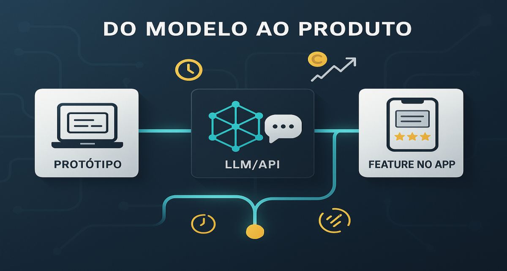
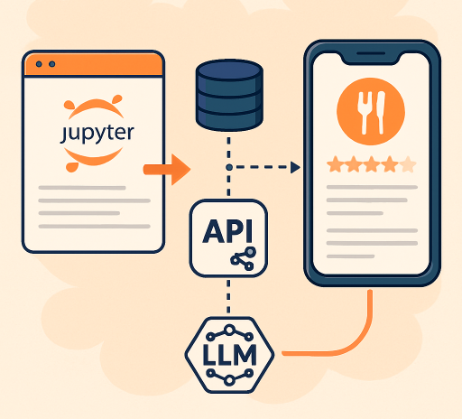

# Do modelo ao produto: como uma API de LLM vira funcionalidade em um app de entrega

<div align="center">
  
</div>

Você já parou para pensar por que grandes apps de delivery parecem "inteligentes" ao resumir avaliações de restaurantes? Não é mágica — é engenharia sólida por trás de um LLM simples. Neste post, vou desmistificar essa jornada: de um protótipo rápido em Jupyter para uma feature robusta em produção, lidando com latência, custos e escalabilidade. Como dev full stack e DevOps, vi isso na prática em apps de alto tráfego. Vamos mergulhar?

<div align="center">
  
  <p><em>Figura 1: Pipeline de LLM em produção: de protótipo a feature escalável</em></p>
</div>

## 1. Contexto e Propósito: Por que isso importa no mundo real?

Nos últimos anos, integrar LLMs virou algo trivial: gere uma chave de API, escreva poucas linhas de código e _voilà_ — respostas "inteligentes". Mas em um app de delivery processando milhares de pedidos por minuto, isso é só o começo.

O grande desafio? **Transformar essa capacidade bruta em valor real para o usuário**, sem quebrar o app com timeouts ou custos exorbitantes. Aqui, compartilho a jornada de protótipo para produção, focando em desafios de engenharia que todo dev precisa dominar.

> **Por que ler isso?** Se você constrói features com IA, vai evitar armadilhas comuns que eu já cometi — e escalar de forma sustentável.

## 2. Abordagem: Um caso prático em apps de delivery

Para tornar concreto, vamos usar um exemplo clássico: **resumir avaliações de restaurantes**. Em vez de listar dezenas de reviews, o app gera um parágrafo imparcial destacando prós e contras.

**Estrutura do post:**

- **Conceitos básicos**: Diferença entre modelo e feature.
- **Arquitetura**: Fluxo de dados do app ao LLM.
- **Código prático**: Implementação em Python/FastAPI.
- **Produção**: Métricas, riscos e soluções reais.

## 3. Conceitos Fundamentais: Alinhando o vocabulário

Antes de codar, vamos alinhar termos para evitar confusões.

| Termo              | Definição                                                 | Contexto de Delivery                        |
| :----------------- | :-------------------------------------------------------- | :------------------------------------------ |
| **O Modelo (LLM)** | O "cérebro" (GPT-4, Llama 3). Stateless e probabilístico. | A engine que processa o texto.              |
| **A Feature**      | O pacote completo.                                        | Inclui busca no DB, prompts, API e UI.      |
| **Context Window** | Limite de tokens processados de uma vez.                  | Foque nas últimas 20 avaliações para caber. |

> **Mudança de mindset chave**: Pare de tratar o LLM como oráculo infalível. Veja-o como um **transformador de texto** em um pipeline clássico de software.

## 4. Mão na Massa: Exemplo Prático - Implementando o endpoint

Agora, o prático: crie um endpoint GET /restaurants/{id}/reviews/summary. Ele pega as últimas 20 reviews textuais e retorna um resumo conciso.

O Fluxo Passo a Passo
App pede o resumo (ex: ao abrir a página do restaurante).
Backend consulta o banco (Postgres ou DynamoDB).
Backend constrói o prompt com as reviews.
Backend chama o LLM via API.
Backend formata a resposta e devolve ao app.
Código Exemplo (Python com FastAPI)
Aqui vai um snippet funcional — teste no seu ambiente local:

```python
import os
from typing import List
from fastapi import FastAPI, HTTPException
from openai import OpenAI

app = FastAPI()
# Certifique-se de ter a variável de ambiente OPENAI_API_KEY configurada
client = OpenAI(api_key=os.getenv("OPENAI_API_KEY"))

# Simula busca no banco (em prod: use SQLAlchemy ou similar)
def get_recent_reviews(restaurant_id: str) -> List[str]:
    return [
        "A comida chegou fria, mas estava saborosa.",
        "Entrega super rápida! O sushi estava fresco.",
        "Demorou muito e o entregador foi rude.",
        "Melhor hambúrguer da cidade, recomendo o de cheddar."
    ]

def generate_summary_prompt(reviews: List[str]) -> str:
    reviews_text = "\n".join([f"- {r}" for r in reviews])
    return f"""
    Você é um assistente útil de um app de delivery.
    Analise as seguintes avaliações de um restaurante e gere um resumo curto (max 3 linhas)
    destacando os pontos positivos e negativos. Seja imparcial.

    Avaliações:
    {reviews_text}

    Resumo:
    """

@app.get("/restaurants/{restaurant_id}/reviews/summary")
async def get_review_summary(restaurant_id: str):
    try:
        reviews = get_recent_reviews(restaurant_id)

        if not reviews:
            return {"summary": "Este restaurante ainda não possui avaliações suficientes."}

        prompt = generate_summary_prompt(reviews)

        # Chama LLM (em prod: use async e retry logic)
        response = client.chat.completions.create(
            model="gpt-3.5-turbo",
            messages=[{"role": "user", "content": prompt}],
            max_tokens=150,
            temperature=0.5  # Consistência > criatividade
        )

        summary = response.choices[0].message.content.strip()

        return {
            "restaurant_id": restaurant_id,
            "summary": summary,
            "source_count": len(reviews)
        }

    except Exception as e:
        print(f"Erro ao gerar resumo: {e}")  # Log real em prod
        raise HTTPException(status_code=503, detail="Resumo indisponível no momento.")
```

> [!TIP] > **Dica de Performance**: Em produção, troque por chamadas assíncronas (`aiohttp`) para não bloquear o endpoint.

<div align="center">
  
  <p><em>Figura 2: Fluxo de resumo de reviews em app de delivery</em></p>
</div>

## 5. Métricas, Riscos e Boas Práticas: Lidando com Latência, Custos e Falhas

Código pronto? Ótimo, mas em escala, LLMs são traiçoeiros. Aqui vão os pilares para tornar sua feature _production-ready_:

<div align="center">
  
  <p><em>Figura 3: Desafios de produção</em></p>
</div>

| Desafio               | Problema                               | Solução de Engenharia                                                                          |
| :-------------------- | :------------------------------------- | :--------------------------------------------------------------------------------------------- |
| **Latência** [Tempo]  | Chamadas de 2-10s geram abandono.      | **Cache (Redis)**: Gere resumos em batch ou cacheie por 24h. Leitura em ms.                    |
| **Custos** [Valor]    | Milhares de chamadas explodem a conta. | **Rate Limiting**: Limite por restaurante. Use modelos menores (GPT-3.5) para tarefas simples. |
| **Confiabilidade** [] | API cai ou alucina.                    | **Circuit Breaker**: Se falhar, retorne reviews originais. O app nunca quebra.                 |

> [!NOTE]
> Essas práticas vêm da engenharia tradicional — IA é só mais um componente.

## 6. Evidence & Exploration: Medindo o Impacto Real

Nao confie so em "parece bom". Teste com dados reais:

### Teste 1: A/B Testing Controlado

Divida seus usuarios em 2 grupos:

**Grupo A (50%)**: Veem resumo gerado por IA
**Grupo B (50%)**: Veem lista bruta de reviews

**Metricas a rastrear (durante 2 semanas)**:

- Taxa de clique na pagina do restaurante (aumentou com resumo?)
- Tempo medio gasto na pagina (usuario fica mais tempo lendo?)
- Taxa de pedido apos vizualizacao (converteu melhor?)
- Custo por feature (quanto gastei em chamadas de LLM?)

Resultado esperado em app real: Resumo + 15-25% em conversao, custo de ~$0.002/usuario/mes.

Codigo para rastrear:

```python
from datetime import datetime
import json

def log_feature_metric(user_id, variant, action, restaurant_id):
    metric = {
        "timestamp": datetime.utcnow().isoformat(),
        "user_id": user_id,
        "variant": variant,  # "summary" ou "raw_list"
        "action": action,    # "view", "engage", "purchase"
        "restaurant_id": restaurant_id
    }

    # Salve em analytics DB (BigQuery, Snowflake, etc)
    analytics_db.insert("feature_metrics", metric)

# Uso no endpoint
@app.get("/restaurants/{restaurant_id}")
async def get_restaurant(restaurant_id: str, user_id: str):
    variant = get_user_variant(user_id)  # "summary" ou "raw_list"

    log_feature_metric(user_id, variant, "view", restaurant_id)

    if variant == "summary":
        summary = get_review_summary(restaurant_id)
        return {"content": summary, "variant": "summary"}
    else:
        reviews = get_raw_reviews(restaurant_id)
        return {"content": reviews, "variant": "raw_list"}

# Analytics query: quantas conversoes por variante?
SELECT variant, COUNT(*) as purchases
FROM feature_metrics
WHERE action='purchase'
GROUP BY variant;
```

### Teste 2: Feedback Loop Human-in-the-Loop

Adicione botoes de feedback apos cada resumo:

```html
<div>
  <p>Resumo: {{summary}}</p>
  <button onclick="rate(this.dataset.id, 1)">Util</button>
  <button onclick="rate(this.dataset.id, -1)">Nao util</button>
</div>
```

```python
@app.post("/feedbacks/{summary_id}/rate")
async def rate_summary(summary_id: str, score: int):  # 1 ou -1
    db.update_summary_feedback(summary_id, score)

    # Se acumular 10+ dislikes, notifique data team
    feedback_stats = db.get_feedback_stats(summary_id)
    if feedback_stats['dislike_rate'] > 0.3:
        alert_team(f"Summary {summary_id} has high dislike rate")

    return {"status": "recorded"}
```

**Resultado**: Depois de 100k feedbacks, voce identifica quais prompts/restaurantes sao problematicos.

### Teste 3: Monitoramento de Custos

Rastreie cada chamada:

```json
{
  "call_id": "abc123",
  "restaurant_id": "rest_456",
  "model": "gpt-3.5-turbo",
  "prompt_tokens": 150,
  "completion_tokens": 45,
  "cost_usd": 0.0023,
  "latency_ms": 1250,
  "user_feedback": "useful",
  "timestamp": "2025-12-08T15:30:00Z"
}
```

**Dashboard esperado:**

- Custo total/dia: $500
- Custo medio/chamada: $0.002
- Latencia P95: 2300ms
- Taxa de erro: 0.2%
- Dislike rate: 5%

Se dislike rate > 10%, retorne reviews brutos (fallback).
Se latencia P95 > 5s, reduza batch size ou cache mais.
Se custo/dia > $1000, reduza requests via rate limiting.

### Teste 4: Reproducibilidade

Guarde todos os inputs/outputs:

```python
def store_summary_record(restaurant_id, reviews, prompt, response, model_version):
    record = {
        "restaurant_id": restaurant_id,
        "reviews": reviews,
        "prompt_used": prompt,
        "response": response,
        "model": model_version,
        "timestamp": datetime.utcnow(),
        "cost": calculate_cost(len(prompt), len(response))
    }

    # Armazene em audit log
    audit_db.insert("llm_calls", record)

    return record

# Query: Reproduza um resultado de 30 dias atras
SELECT * FROM llm_calls
WHERE restaurant_id='rest_123' AND DATE(timestamp) = '2025-11-08'
ORDER BY timestamp DESC LIMIT 1;
```

### Ferramentas Recomendadas

- **Analytics**: BigQuery, Mixpanel, Amplitude
- **Monitoring**: Datadog, New Relic, Grafana
- **Cost Tracking**: Lancedb, Mlytics, custom solution
- **Feedback**: Hotjar, Amplitude, custom DB

## 7. Reflexões Pessoais & Próximos Passos

### A Licao Mais Importante

Como dev full stack e DevOps, aprendi que **90% do sucesso com IA e engenharia classica**: cache, monitoramento, resiliencia, teste de carga. O prompt e o tempero. Sem base solida, nao escala.

A maioria dos fails com IA nao vem do modelo ser ruim. Vem de:

- Timeouts de infra (load balancer espera 60s, LLM demora 8s)
- Custos nao controlados (gerar 1 milhao de resumos/dia e falencia)
- Falha silenciosa (modelo alucina, ninguem ve ate Twitter explodir)
- Sem feedback loop (voce tera como saber se esta pior?)

### Roadmap para os Proximos Artigos

- **Artigo 2**: Prompt Engineering com PACE — como desenhar prompts que nao falham
- **Artigo 3**: RAG (Retrieval-Augmented Generation) — quando 10 restaurantes nao cabem no context window
- **Artigo 6**: Versionamento — como garantir reproducibilidade
- **Artigo 7**: Design de APIs para LLM — streaming, async, webhooks
- **Artigo 11**: MLOps/LLMOps — deploy seguro e iteracao rapida
- **Artigo 12**: Monitorando qualidade — detectar alucinacoes em escala

### Proximos Passos Praticos

1. Clone o codigo acima e rode localmente com sua chave OpenAI
2. Implemente cache Redis (ganhara 5x em latencia)
3. Configure circuit breaker (ja evita 80% dos problemas)
4. Rode A/B test por 2 semanas e meça de verdade
5. Se custo > $1000/mes, considere modelo menor ou RAG

### Chamada para Acao

Voce ja enfrentou LLMs em producao? Qual foi o maior desafio? Latencia? Custos? Alucinacoes? Compartilhe sua experiencia nos comentarios — sua historia pode salvar outro dev de uma madrugada de debugging!

Proxima parada: como desenhar prompts que de verdade funcionam. Porque mesmo com a melhor arquitetura, um prompt ruim quebra tudo.
