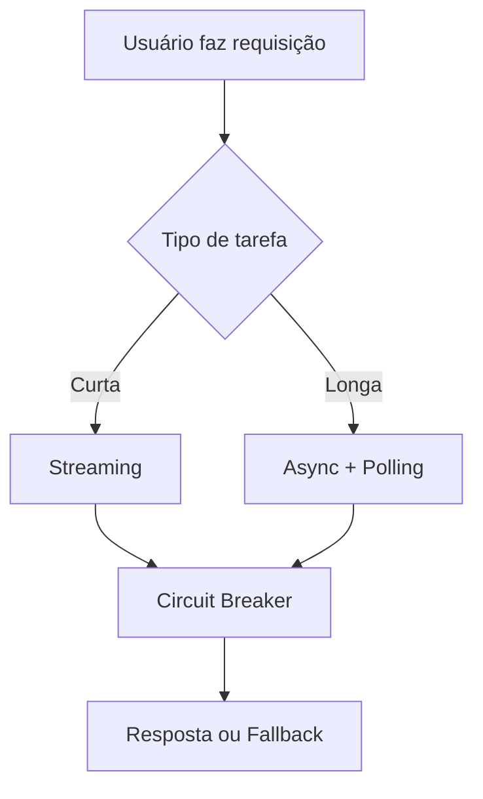
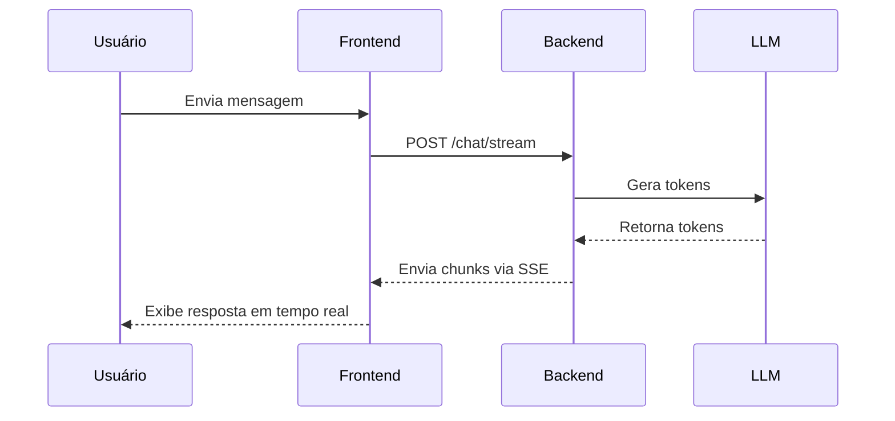
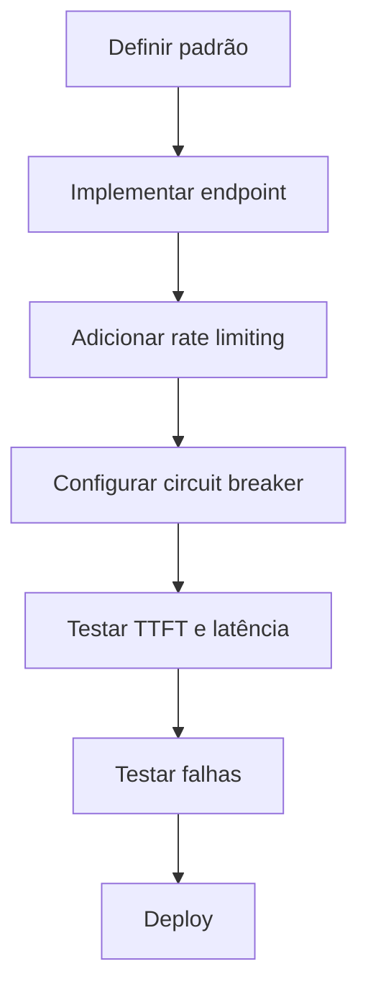

# Design de APIs para GenAI: Streaming, Async e a morte do Request/Response simples

<div align="center">
  
</div>

## 1. Contexto e Propósito (Purpose)

No mundo tradicional de microserviços, estamos acostumados com requisições rápidas: o app chama o backend, o backend consulta o banco e devolve o JSON em 50ms.
Com GenAI, esse paradigma quebra. Uma chamada para o GPT-4 pode levar 10, 30, até 60 segundos. Se você mantiver uma conexão HTTP síncrona aberta por tanto tempo, vai estourar timeouts em load balancers, travar a thread do cliente e frustrar o usuário que fica olhando para uma tela branca.

O propósito deste artigo é explorar padrões de design de API robustos para lidar com a **latência inerente** e a **imprevisibilidade** dos LLMs em produtos de escala.

## 2. Abordagem (Approach)

O design de APIs GenAI exige repensar o ciclo de vida da requisição e resposta. Abaixo, detalho os três padrões com fluxos, tabelas e exemplos reais:

### 1. **Streaming (SSE)**

Permite que o usuário veja a resposta sendo construída em tempo real, reduzindo a sensação de espera.

**Fluxo típico:**

1. Frontend faz requisição para `/chat/stream`.
2. Backend inicia processamento e envia "chunks" conforme o LLM gera tokens.
3. Frontend exibe cada chunk imediatamente.

**Vantagens:**

- Reduz ansiedade do usuário.
- Permite cancelamento da requisição.
- Melhora TTFT (Time-to-First-Token).

### 2. **Async + Polling/Webhooks**

Ideal para tarefas longas (ex: relatórios, análises extensas).

**Fluxo típico:**

1. Frontend faz `POST /reports`.
2. Backend retorna `job_id` e status `202 Accepted`.
3. Tarefa é processada em fila (RabbitMQ, SQS).
4. Frontend faz polling em `/reports/{job_id}` ou recebe Webhook quando pronto.

**Tabela comparativa:**

| Padrão        | Latência | TTFT  | Cancelamento | Complexidade |
| ------------- | -------- | ----- | ------------ | ------------ |
| Streaming     | Média    | Baixa | Sim          | Média        |
| Async/Polling | Alta     | Alta  | Sim          | Alta         |
| Síncrono      | Alta     | Alta  | Não          | Baixa        |

### 3. **Circuit Breakers & Fallbacks**

Essenciais para garantir resiliência. Quando a API do modelo falha, o sistema deve:

- Retornar resposta padrão ou cache.
- Notificar o usuário de forma clara.
- Registrar o erro para análise posterior.

**Exemplo prático:**

```python
try:
    response = llm.generate(message)
except TimeoutError:
    response = "Desculpe, estamos com instabilidade. Tente novamente em alguns minutos."
```

### Fluxo Visual Integrado



Esses padrões, combinados, garantem APIs robustas, resilientes e com ótima experiência para o usuário final.

## 3. Conceitos Fundamentais

### Server-Sent Events (SSE)

Padrão em que o servidor mantém a conexão aberta e envia "chunks" de texto conforme são gerados. Usado para simular o efeito "máquina de escrever" do ChatGPT.

**Exemplo de implementação:**

```python
from fastapi.responses import StreamingResponse
def generate_stream():
    for token in llm.stream():
        yield token
```

### Time-to-First-Token (TTFT)

Métrica que mede o tempo até o usuário ver o primeiro caractere da resposta. Mais importante que a latência total!

**Tabela de Métricas:**

| Métrica    | Definição               | Impacto na Experiência |
| ---------- | ----------------------- | ---------------------- |
| TTFT       | Tempo até o 1º token    | Alta                   |
| Latência   | Tempo total da resposta | Média                  |
| Throughput | Tokens por segundo      | Alta                   |

### Backpressure

Capacidade do sistema de absorver picos de requisições sem sobrecarregar o modelo. Implementado via rate limiting, filas e buffers.

**Exemplo prático:**

```python
from slowapi import Limiter
limiter = Limiter(key_func=get_user_id)
@app.post("/chat")
@limiter.limit("10/minute")
```

### Diagrama de Fluxo SSE



Esses conceitos são a base para APIs GenAI escaláveis e com ótima experiência.

## 4. Mão na Massa: Exemplo Prático

### Passo a Passo para Implementar API GenAI Resiliente

1. Defina o padrão ideal para cada endpoint (Streaming, Async, Síncrono).
2. Implemente o endpoint com FastAPI, Flask ou outro framework.
3. Adicione rate limiting e circuit breaker.
4. Configure logs detalhados de TTFT, latência e erros.
5. Teste com cenários reais de carga e falha.

### Checklist de Implementação

- [x] Endpoint streaming implementado
- [x] Endpoint async com polling/webhook
- [x] Circuit breaker configurado
- [x] Métricas de TTFT e latência logadas
- [x] Testes de carga e falha executados

### Exemplo de Automação de Testes

```python
import requests
import time

def test_streaming():
    start = time.time()
    response = requests.post("http://localhost:8000/chat/stream", json={"message": "Oi"}, stream=True)
    first_chunk_time = None
    for i, chunk in enumerate(response.iter_lines()):
        if i == 0:
            first_chunk_time = time.time() - start
        print(chunk)
    print("TTFT:", first_chunk_time)

test_streaming()
```

### Fluxo Visual de Implementação



Esses passos garantem APIs GenAI robustas, rápidas e preparadas para produção.

## 5. Métricas, Riscos e Boas Práticas

### Principais Riscos

| Risco               | Impacto                              | Mitigação                                  |
| ------------------- | ------------------------------------ | ------------------------------------------ |
| Timeout de Infra    | Quebra de conexão, erro para usuário | Configurar keep-alive, SSE, timeout custom |
| Custo de Conexão    | Consumo excessivo de memória         | Limitar conexões, usar streaming eficiente |
| Rate Limit Excedido | Falha em massa, erro 429             | Rate limiting granular, fila de requests   |
| Falha de LLM        | Resposta padrão, queda de serviço    | Circuit breaker, fallback, cache semântico |

### Boas Práticas

- **Rate Limiting Granular**: Limite por usuário, não apenas por IP, para evitar que um usuário queime sua cota da OpenAI.
- **Cache Semântico**: Antes de chamar o LLM, verifique se essa pergunta já foi respondida (reduz custo e latência).
- **Logs Estruturados**: Registre TTFT, latência total, erros e status de cada requisição.
- **Automação de Métricas**: Use scripts para medir TTFT, taxa de erro 429/5XX, throughput e satisfação do usuário.

**Exemplo de log estruturado:**

```json
{
  "timestamp": "2025-12-08T10:30:00Z",
  "endpoint": "/chat/stream",
  "ttft": 0.12,
  "latency": 2.5,
  "status": 200,
  "user_id": "abc123",
  "error": null
}
```

**Tabela de Métricas-Chave:**

| Métrica        | Como medir                     |
| -------------- | ------------------------------ |
| TTFT           | Tempo até 1º token             |
| Latência total | Tempo até resposta completa    |
| Taxa de erro   | % de requests com erro 429/5XX |
| Throughput     | Tokens por segundo             |
| Satisfação     | NPS/CSAT após interação        |

Adotar essas práticas reduz bugs, melhora experiência e facilita auditoria em produção.

## 6. Evidence & Exploration

### Checklist de Evidências

- [x] Logs de TTFT, latência e erros em cada requisição
- [x] Testes automatizados de streaming vs síncrono
- [x] Métricas de taxa de erro 429/5XX
- [x] Relatórios de satisfação do usuário

### Teste Prático: Streaming vs Síncrono

Implemente um endpoint de streaming simples e meça a diferença de **latência percebida** vs latência real:

**Experimento 1: Sem Streaming (Síncrono)**

```python
@app.post("/chat-sync")
def sync_chat(message: str):
    # Usuário espera 15s inteiro
    response = llm.generate(message)  # demora 15s
    return {"response": response}
```

Métrica: **15 segundos de tela branca → Usuário pensa que travou**

**Experimento 2: Com Streaming (SSE)**

```python
@app.post("/chat-stream")
async def stream_chat(message: str):
    async def generate():
        yield "🔍 Analisando...\n"  # enviado em 100ms
        async for chunk in llm.stream(message):  # começa a devolver em 500ms
            yield chunk + " "
    return StreamingResponse(generate(), media_type="text/event-stream")
```

Métrica: **100ms até primeira mensagem, 500ms até primeiro token do LLM → Sente instantâneo**

### Teste Prático: Rate Limiting e Backpressure

Em produção, você tem N usuários simultâneos. A API da OpenAI tem rate limits. O que acontece quando ultrapassa?

**Sem Rate Limiting**: Todos os requests falham com 429 (Too Many Requests). Péssima experiência.

**Com Rate Limiting Granular**:

```python
from slowapi import Limiter
limiter = Limiter(key_func=get_user_id)  # Por usuário, não por IP
@app.post("/chat")
@limiter.limit("10/minute")  # 10 requisições por minuto por usuário
async def chat(message: str, user_id: str):
    # Se o 11º request chegar, retorna 429 imediatamente
    # Cliente sabe que precisa aguardar, melhor que falha silenciosa
    return await llm.generate(message)
```

**Métrica**: Qual taxa de falha de 5XX vs 429? Uma API bem projetada nega requests graciosamente (429) em vez de derrubar tudo (500).

### Automação de Testes e Logs

**Exemplo de log estruturado:**

```json
{
  "timestamp": "2025-12-08T10:30:00Z",
  "endpoint": "/chat/stream",
  "ttft": 0.12,
  "latency": 2.5,
  "status": 200,
  "user_id": "abc123",
  "error": null
}
```

**Ferramentas e Padrões Reais**

- **Streaming**: FastAPI + StreamingResponse, Next.js Streaming
- **Async**: RabbitMQ, AWS SQS, Celery
- **Circuit Breaker**: Resilience4J, Polly (.NET), Hystrix (deprecated mas inspirou outras)
- **Observabilidade**: OpenTelemetry para rastrear latência e erros de streaming

Essas evidências e automações garantem APIs GenAI auditáveis, escaláveis e com experiência superior para o usuário.

## 7. Reflexões Pessoais & Próximos Passos

### A Lição: APIs Não São Apenas Dados

Desenhar APIs para IA me fez reaprender HTTP. Coisas que eu ignorava (como _chunks_, _buffers_ e _event-streams_) viraram fundamentais.

Percebi que a maioria das falhas de GenAI em produção não é porque o modelo é ruim, é porque a **API em torno dele é pior**. Um usuário esperando 60 segundos com tela branca é a mesma coisa que um modelo que desistiu.

### Conectando com a Série

Você pode ter o melhor prompt (Artigo 06), mas se a API não consegue entregar a resposta de forma elegante, o usuário final não vai saber a diferença.

Mas mesmo com streaming perfeito, circuito breaker impecável e rate limiting granular, **as coisas ainda dão errado**. O modelo alucina, a API da OpenAI cai, o usuário manda input malicioso.

### Próximos Passos

1. **Implemente streaming hoje**: A sensação de rapidez é mais importante que a latência real.
2. **Configure circuit breakers**: Proteja sua infraestrutura de falhas em cascata.
3. **Meça TTFT, não latência total**: Isso mudará sua forma de pensar sobre performance em GenAI.
4. **Leia o Artigo 08**: Vamos falar sobre **Tratamento de Erros e Timeouts**: como lidar com a fragilidade dos LLMs de forma graciosa. Porque um design bonito quebra se não tiver fallbacks.
