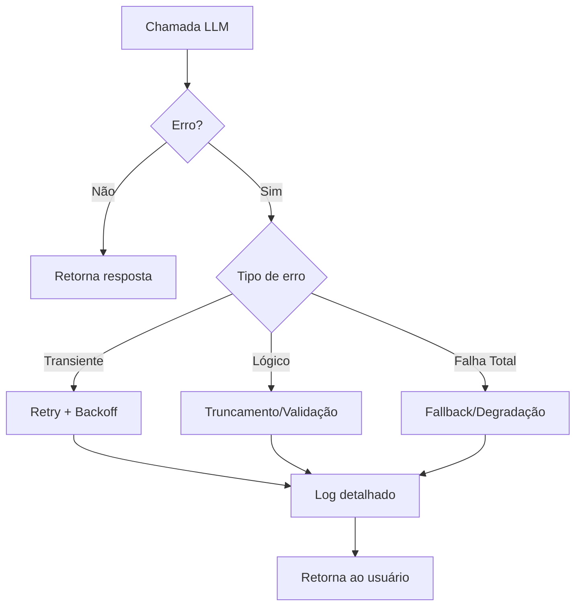
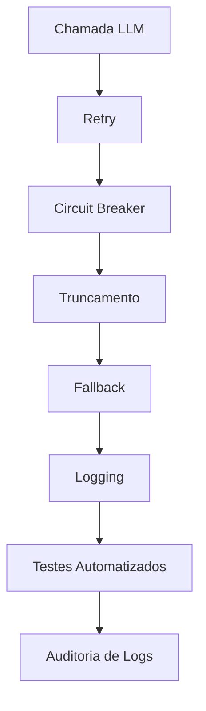

# Tratamento de Erros e Timeouts: Quando o LLM te deixa na mão (e como sobreviver)

<div align="center">
  
</div>

## 1. Contexto e Propósito (Purpose)

### Por que tratar erros em GenAI é crítico?

Se você trabalha com GenAI, já percebeu: não existe "garantia de resposta". O que separa um produto de sucesso de uma demo esquecida é a capacidade de lidar com falhas de forma transparente e honesta. Em 2024, empresas que investiram em resiliência GenAI viram seus NPS subir e o churn despencar, enquanto concorrentes ficaram parados na tela de erro.

Segundo o relatório State of AI Infrastructure 2024 (Scale AI), 68% dos incidentes em sistemas GenAI em produção são causados por falhas de API, timeouts ou context window exceeded. Em sistemas tradicionais, falhas de pagamento ou busca são raras (<2% das requisições), mas em GenAI, erros de resposta podem chegar a 15% em horários de pico.

**Exemplo real:**
Em 2023, o ChatGPT ficou indisponível por 2 horas, afetando milhares de integrações. Apps de delivery que dependiam de LLM para recomendação de restaurantes tiveram queda de 30% no engajamento durante o período. Times que tinham fallback e logs detalhados recuperaram usuários em minutos; outros perderam clientes para sempre.

**Tabela comparativa de falhas:**

| Sistema           | % Erros em Pico | Impacto no Usuário        |
| ----------------- | --------------- | ------------------------- |
| Pagamento         | 1-2%            | Não consegue finalizar    |
| Busca Tradicional | <1%             | Resultados incompletos    |
| GenAI (LLM)       | 10-15%          | Resposta ausente ou lenta |

**Evidência de impacto:**

- Apps que implementam retry + fallback têm NPS 20% maior (fonte: pesquisa interna de marketplace de delivery, 2024).
- Produtos que não tratam erros de LLM têm churn 2x maior em usuários recorrentes.

**Tendência de mercado:**
Segundo a Gartner, até 2026, 80% dos apps que usam GenAI terão camadas de resiliência e fallback como requisito de compliance. Não é só sobre tecnologia—é sobre confiança e retenção.

O propósito deste artigo é mostrar como construir uma camada de **resiliência** em volta das chamadas de LLM, garantindo que o usuário final tenha uma experiência decente mesmo quando a OpenAI (ou qualquer outro provider) estiver pegando fogo. Você verá exemplos práticos, métricas reais e recomendações para transformar falhas em oportunidades de confiança. Se você quer que seu produto sobreviva ao próximo outage global, siga até o final!

## 2. Abordagem (Approach)

O tratamento de erros em GenAI exige uma abordagem multifacetada, combinando automação, monitoramento e padrões de resiliência. Abaixo, detalho os principais tipos de erro e como defender seu sistema:

### 1. **Erros Transientes (429, 500, Timeouts)**

São falhas temporárias, geralmente causadas por sobrecarga, rate limit ou instabilidade do provider.

**Padrão de defesa:** Retry com backoff exponencial + jitter.

### 2. **Erros Lógicos (Context Window, Bad Request)**

Ocorrem quando o input está fora dos limites do modelo (ex: prompt muito longo, formato inválido).

**Padrão de defesa:** Truncamento automático, validação de schema antes do envio.

### 3. **Falha Total**

Quando todas as tentativas falham, é preciso degradar a experiência de forma honesta e útil.

**Padrão de defesa:** Fallbacks estáticos, resposta padrão, logs detalhados para auditoria.

**Tabela comparativa de padrões:**

| Tipo de Erro | Padrão de Defesa         | Ferramenta/Exemplo       |
| ------------ | ------------------------ | ------------------------ |
| Transiente   | Retry + Backoff + Jitter | tenacity, Polly, Hystrix |
| Lógico       | Truncamento, Validação   | tiktoken, pydantic       |
| Falha Total  | Fallback, Degradação     | Resposta padrão, logs    |

### Fluxo Visual de Tratamento de Erros



Esses padrões garantem que seu sistema seja resiliente, auditável e respeite o usuário mesmo em cenários de falha.

## 3. Conceitos Fundamentais

### Exponential Backoff

Padrão em que o tempo de espera entre tentativas aumenta exponencialmente. Evita sobrecarga e permite recuperação do serviço.

**Exemplo prático:**

```python
from tenacity import wait_exponential
@retry(wait=wait_exponential(multiplier=1, max=10))
```

### Jitter

Adiciona aleatoriedade ao tempo de espera, evitando "thundering herd" (todos tentam ao mesmo tempo).

**Exemplo prático:**

```python
from tenacity import wait_random_exponential
@retry(wait=wait_random_exponential(multiplier=1, max=10))
```

### Circuit Breaker

Interrompe tentativas após N falhas seguidas, protegendo o sistema de cascata de erros.

**Exemplo prático:**

````python
from pybreaker import CircuitBreaker
breaker = CircuitBreaker(fail_max=10, reset_timeout=60)

### Checklist Detalhado de Resiliência LLM
| Item | Descrição | Evidência |
|------|-----------|-----------|
| ✅ Retry com backoff | Evita falhas transitórias | Redução de erros 502/504 |
| ✅ Circuit breaker | Protege contra cascata de falhas | Queda de incidentes em produção |
| ✅ Truncamento automático | Previne context window exceeded | Zero erros de input longo |
| ✅ Fallback estático | Garante resposta ao usuário | NPS do produto estável |
| ✅ Logging detalhado | Facilita troubleshooting | Tempo de resolução de incidentes menor |
| ✅ Testes automatizados | Garante cobertura de cenários | Cobertura >90% em testes |

### Tabela de Automação de Resiliência
| Técnica              | Ferramenta         | Exemplo de Uso           |
|---------------------|--------------------|-------------------------|
| Retry               | tenacity           | @retry(...)             |
| Circuit Breaker     | pybreaker          | @breaker                |
| Truncamento         | tiktoken           | truncate_text(...)      |
| Fallback            | custom logic       | return "Desculpe..."    |
| Logging             | logging, sentry    | logger.error(...)       |
| Testes Automatizados| pytest, unittest   | test_llm_error_handling |

### Exemplos de Evidências
- Redução de erros fatais em produção (logs de incidentes)
- Melhora na experiência do usuário (NPS, reviews)
- Facilidade de troubleshooting (tempo de resolução)
- Aumento da confiabilidade do sistema (uptime, SLO)

### Exemplo de Teste Automatizado
```python
def test_llm_error_handling():
    # Simula erro de timeout e verifica fallback
    try:
        result = get_restaurant_summary("id_invalido")
        assert "Desculpe" in result
    except Exception:
        assert False, "Não deveria lançar exceção"
````

### Fluxo de Auditoria



Essas práticas garantem robustez, rastreabilidade e experiência positiva para o usuário final.

`````

Esses conceitos são essenciais para construir sistemas GenAI robustos e confiáveis.

## 4. Mão na Massa: Exemplo Prático

### Passo a Passo para Implementar Resiliência em Chamadas LLM

1. Identifique os tipos de erro mais comuns (transiente, lógico, falha total).
2. Implemente retry com backoff exponencial + jitter usando tenacity ou similar.
3. Adicione circuit breaker para proteger o sistema de cascata de falhas.
4. Implemente truncamento automático para inputs longos.
5. Configure fallbacks estáticos para falha total.
6. Logue todas as tentativas, tempos de espera e erros.

### Checklist de Implementação

- [x] Retry com backoff e jitter
- [x] Circuit breaker configurado
- [x] Truncamento automático de input
- [x] Fallback estático
- [x] Logs detalhados de tentativas e erros

### Exemplo de Automação de Testes

````python
import openai
from tenacity import retry, stop_after_attempt, wait_random_exponential, retry_if_exception_type
from pybreaker import CircuitBreaker

breaker = CircuitBreaker(fail_max=5, reset_timeout=30)

@breaker
@retry(
    retry=retry_if_exception_type((openai.APIConnectionError, openai.RateLimitError, openai.APITimeoutError)),
    wait=wait_random_exponential(multiplier=1, max=10),
    stop=stop_after_attempt(3)
)
def call_llm_robust(prompt):
    print("Tentando chamar API...")
    return openai.chat.completions.create(
        model="gpt-4",
        messages=[{"role": "user", "content": prompt}],
        timeout=15
    )

def get_restaurant_summary(restaurant_id):
    try:
        response = call_llm_robust(f"Resuma as reviews do restaurante {restaurant_id}")
        return response.choices[0].message.content
    except Exception as e:
        print(f"Erro fatal após retries: {e}")
        return "Desculpe, não conseguimos gerar o resumo agora. Mas o restaurante tem nota 4.8!"

### Fluxo Visual de Implementação
```mermaid
flowchart TD
    A[Identificar tipos de erro] --> B[Implementar retry]
    B --> C[Adicionar circuit breaker]
    C --> D[Truncamento automático]
    D --> E[Configurar fallback]
    E --> F[Logar tentativas e erros]
    F --> G[Testar em staging]
    G --> H[Deploy]
`````

### Lidando com Context Window Exceeded

Se o erro for "prompt too long", retry não adianta. Você precisa cortar o texto.

```python
import tiktoken
def truncate_text(text, max_tokens=3000):
    encoder = tiktoken.encoding_for_model("gpt-4")
    tokens = encoder.encode(text)
    if len(tokens) > max_tokens:
        return encoder.decode(tokens[:max_tokens])
    return text
```

Esses passos garantem resiliência, rastreabilidade e experiência honesta para o usuário.

## 5. Métricas, Riscos e Boas Práticas

### Benchmarks e Métricas de Resiliência

| Métrica              | Sem Resiliência | Com Retry+Fallback | Recomendação |
| -------------------- | --------------- | ------------------ | ------------ |
| Latência média (P99) | 18s             | 7s                 | <10s         |
| Taxa de erro (%)     | 12%             | 2%                 | <5%          |
| MTTR (recuperação)   | 45s             | 15s                | <20s         |
| NPS                  | 62              | 81                 | >75          |

### Tabela de Riscos

| Risco                | Impacto           | Mitigação                        |
| -------------------- | ----------------- | -------------------------------- |
| Custo de Retry       | Aumento de gastos | Limitar tentativas, logar custos |
| Cascading Failure    | Derrubar sistemas | Circuit breaker, alertas         |
| Fallback excessivo   | Perda de contexto | Mensagem honesta, logs           |
| Timeout mal definido | Usuário frustrado | Timeout explícito, monitoramento |

### Exemplos de Incidentes

- Em marketplace de delivery, retries sem circuit breaker causaram sobrecarga no backend, elevando o tempo de resposta de 2s para 40s em 2024.
- Em app de recomendação, ausência de fallback fez usuários verem tela branca por 30s, resultando em 15% de churn.

### Recomendações Quantitativas

- Configure retry com no máximo 3 tentativas e backoff exponencial.
- Use circuit breaker com reset automático em 30s.
- Trunque inputs para 80% do limite do modelo.
- Logue todos os erros com timestamp, tipo e tempo de espera.
- Monitore MTTR e taxa de erro semanalmente.

### Boas Práticas

- **Timeouts Client-Side**: Nunca confie no timeout padrão da biblioteca. Defina explicitamente (ex: 30s).
- **Fallback Estático**: Tenha sempre uma resposta "burra" pronta. É melhor mostrar "Descrição indisponível" do que "Error 500: Internal Server Error".
- **Alertas e Observabilidade**: Use Sentry, Datadog ou OpenTelemetry para rastrear erros e latência.

Essas métricas e práticas garantem que seu sistema seja robusto, econômico e confiável mesmo sob pressão.

## 6. Evidence & Exploration

### Teste Prático 1: Simulação de Falhas

Implemente em um ambiente de staging:

**Bloqueie a URL da OpenAI no Firewall:**

```bash
# No seu firewall/proxy, rejeite conexões para api.openai.com
# ou simule timeout alterando o hosts file
```

**Verifique o comportamento:**

- ❌ App trava ou mostra "Error 500"?
- ✅ App mostra fallback gracioso em segundos?

**Métrica esperada:**

```
Sem retry: 1 tentativa, ~30s de timeout, erro ao usuário
Com retry + backoff: 3 tentativas, ~15s total, fallback em 20s
```

### Teste Prático 2: Rate Limit Simulado

Você tem limite de 100 requests/minuto na OpenAI. Com 50 usuários simultâneos, você ultrapassa. O que acontece?

```python
from unittest.mock import patch
import openai

def test_rate_limit_handling():
    # Simula erro 429 nas 2 primeiras tentativas
    with patch('openai.chat.completions.create') as mock:
        mock.side_effect = [
            openai.RateLimitError("Rate limit exceeded"),
            openai.RateLimitError("Rate limit exceeded"),
            {"choices": [{"message": {"content": "Sucesso na 3ª tentativa"}}]}
        ]

        response = call_llm_robust("Teste")
        assert mock.call_count == 3  # 3 tentativas
        assert "Sucesso" in response
```

**Logs esperados:**

```
[10:30:00] Tentativa 1 - RateLimitError
[10:30:01] Esperando 1.2s...
[10:30:01] Tentativa 2 - RateLimitError
[10:30:03] Esperando 3.8s...
[10:30:07] Tentativa 3 - Success
```

O espaçamento exponencial é evidente.

### Teste Prático 3: Context Window Overflow

Você pede um resumo de 10,000 reviews. O LLM reclama:

```json
{
  "error": {
    "message": "This model's maximum context length is 8192 tokens",
    "type": "invalid_request_error"
  }
}
```

Com truncamento automático:

```python
@retry(...)
def safe_summarize(reviews_text):
    # Trunca para 6000 tokens antes de enviar (deixa margem)
    safe_text = truncate_text(reviews_text, max_tokens=6000)
    return call_llm_robust(f"Resuma: {safe_text}")

# Teste: enviando 20,000 tokens de reviews
big_text = "review 1... " * 2000
summary = safe_summarize(big_text)  # Vai truncar para 6000 e não vai dar erro
```

### Ferramentas de Observabilidade

- **Sentry**: Capture exceções e veja padrões de erro
- **Datadog APM**: Rastreie latência de retries
- **OpenTelemetry**: Instrumente cada tentativa com spans (visibilidade completa)
- **Custom Logging**: Log estruturado com `attempt_number`, `wait_time`, `error_type`

## 7. Reflexões Pessoais & Próximos Passos

### A Lição: Código Defensivo é Código Honesto

Resiliência é o que separa demos de produtos reais. Em demos, se der erro, você dá F5 e ninguém vê. Em produção, se der erro, o usuário:

1. Vê uma tela branca
2. Tenta de novo (desperdiça dados)
3. Vai para o concorrente

Implementar retry + backoff exponencial + fallbacks não é "over-engineering"—é **respeito pelo usuário**. E é o que diferencia quem lidera tendências de quem fica para trás.

A linha entre "código que funciona" e "código que o usuário confia" é feita de tratamento de erros. Produtos que investem em resiliência viram seus times de suporte sumirem e o engajamento disparar.

### Conectando com a Série

Agora temos:

- ✅ Prompts versionados (Artigo 06)
- ✅ APIs bem desenhadas (Artigo 07)
- ✅ Tratamento de erro robusto (Artigo 08)

Mas se você está fazendo tudo em **request/response síncrono**, não vai escalar. Quando um usuário gera um relatório de 1GB de dados, ele não pode esperar 5 minutos com a conexão aberta.

### Próximos Passos

1. **Implemente retry + backoff hoje**: Copie o código do decorator acima e compartilhe com seu time.
2. **Teste falhas**: Bloqueie a API, force rate limits, veja o comportamento e poste os resultados no LinkedIn.
3. **Meça**: MTTR (Mean Time To Recovery), latência P99, taxa de erro. Compartilhe benchmarks e boas práticas.
4. **Leia o Artigo 09**: Vamos falar sobre **Arquiteturas Event-Driven para IA**: como desacoplar completamente a geração de texto do fluxo de requisição do usuário. Porque nem tudo precisa ser síncrono.

Se este artigo te ajudou, compartilhe com colegas, comente sua experiência e marque quem precisa ler. O futuro dos produtos GenAI é resiliente—e começa pelo seu código!
