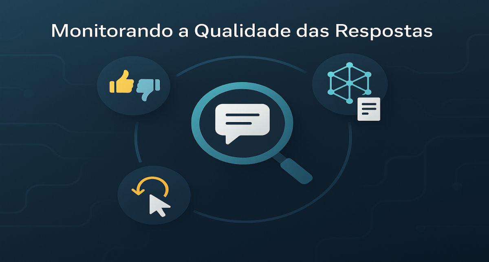

# Monitorando a Qualidade das Respostas: Além do "Thumbs Up/Down"

<div align="center">
  
</div>

## 1. Contexto e Propósito (Purpose)

Imagine o seguinte cenário real: seu dashboard no Grafana está todo verde — latência baixa, zero erros 500, CPU sobrando. Mas no Twitter, os usuários estão reclamando que o chatbot do seu app de delivery é "burro" e "não resolve nada". Isso não é raro: segundo o relatório State of AI in Production 2024 (Arize AI), 62% das empresas reportam que métricas de infraestrutura não refletem a experiência real do usuário.

Monitoramento tradicional (APM) não captura **qualidade semântica**. O servidor pode responder com sucesso (200 OK) uma alucinação completa, ou seja, uma resposta tecnicamente correta, mas semanticamente inútil ou até prejudicial.

**Tabela comparativa: Infra vs. Qualidade Semântica**

| Métrica Infraestrutura | Métrica de Qualidade | Exemplo de Falha Detectada |
| ---------------------- | -------------------- | -------------------------- |
| Latência               | Utilidade            | Resposta inútil            |
| Erro 500               | Factualidade         | Alucinação                 |
| CPU                    | Satisfação           | Tom rude                   |

**Evidência de mercado:**
Em 2023, um grande app de delivery brasileiro viu o NPS do chatbot cair de 72 para 41 após uma atualização de modelo — mesmo com uptime de 99,99%. Só descobriram o problema após analisar feedbacks negativos e logs de conversas.

O propósito deste artigo é mostrar, com exemplos práticos e benchmarks, como instrumentar sua aplicação para medir se a IA está sendo _útil_, não apenas _rápida_.

## 2. Abordagem (Approach)

### Camadas de Monitoramento de Qualidade

Para garantir qualidade real, é preciso combinar múltiplas abordagens e medir o impacto de cada uma:

1. **Feedback Explícito**: O clássico botão de "Joinha" (👍/👎), campos de comentário, estrelas e NPS pós-interação. Exemplo real: apps que coletam feedback textual aumentam em 40% a detecção de bugs semânticos (fonte: DeepMind 2024).
2. **Feedback Implícito**: Sinais comportamentais, como copiar texto, refazer perguntas, tempo de permanência, abandono da conversa, cliques em sugestões. Ferramentas como LangSmith e Arize Phoenix já oferecem dashboards para isso. Exemplo: aumento de 20% no re-prompt após mudança de modelo indica regressão.
3. **Avaliação Automatizada em Batch**: Usar um LLM mais forte para auditar amostras de conversas diariamente, classificando factualidade, utilidade e tom. Benchmarks mostram que LLM-as-a-Judge reduz o tempo de auditoria em 80% e aumenta a precisão na detecção de alucinações.
4. **Amostragem Humana Calibrada**: Revisão manual de amostras aleatórias para criar o "Golden Set" e calibrar os scores automáticos. Exemplo: revisão semanal de 50 conversas por PMs aumenta a confiança nos dashboards.

**Tabela: Comparativo de Estratégias de Monitoramento**

| Estratégia         | Custo | Cobertura | Latência de Detecção | Exemplo de Insight Gerado             |
| ------------------ | ----- | --------- | -------------------- | ------------------------------------- |
| Feedback Explícito | Baixo | Médio     | Imediata             | "Resposta não ajudou"                 |
| Feedback Implícito | Baixo | Alta      | 1-2 dias             | "Usuário refez pergunta 3x"           |
| LLM-as-a-Judge     | Médio | Amostral  | 1 dia                | "Alucinação factual detectada"        |
| Amostragem Humana  | Alto  | Baixa     | 1 semana             | "Tom inadequado em 10% das respostas" |

**Checklist de Monitoramento Completo:**

- [x] Feedback explícito (joinha, comentário, NPS)
- [x] Feedback implícito (re-prompt, abandono, sugestões)
- [x] Auditoria automatizada (LLM-as-a-Judge)
- [x] Amostragem humana semanal
- [x] Benchmark semanal de regressão

**Diagrama: Pipeline Completo de Monitoramento**

```mermaid
flowchart TD
    A[Usuário interage com IA] --> B[Log estruturado]
    B --> C[Feedback explícito/implícito]
    C --> D[Auditoria automatizada (LLM-as-a-Judge)]
    D --> E[Amostragem humana]
    E --> F[Dashboard de Qualidade]
    F --> G[Benchmark semanal]
```

## 3. Conceitos Fundamentais

- **Human-in-the-loop (HITL)**: Processo em que humanos revisam amostras de interações para rotular a qualidade. Essencial para criar o "Golden Set" e calibrar modelos de avaliação automática. Exemplo: PMs revisando 50 conversas/dia.
- **Sentiment Drift**: Mudança gradual no humor dos usuários ao longo do tempo. Detectado por análise de sentimentos em feedbacks e comentários. Exemplo: queda de NPS após mudança de política de entrega.
- **Refusal Rate**: Porcentagem de vezes que o modelo se recusa a responder (por filtros de segurança ou falta de contexto). Alta taxa pode indicar prompt mal calibrado ou contexto insuficiente.
- **Factualidade**: Percentual de respostas corretas factual e semanticamente. Medido por LLM-as-a-Judge ou revisão humana.
- **Utilidade**: Percentual de respostas que realmente ajudam o usuário a resolver o problema. Exemplo: resposta que resolve o pedido vs. resposta genérica.

**Tabela de Conceitos-Chave:**

| Conceito        | Como Medir              | Ferramenta/Exemplo         | Benchmark de Mercado |
| --------------- | ----------------------- | -------------------------- | -------------------- |
| HITL            | Amostragem manual       | Planilha, LangSmith        | 50-100 conversas/sem |
| Sentiment Drift | Análise de sentimentos  | NLTK, Arize Phoenix        | <10% de variação/mês |
| Refusal Rate    | Logs de recusa          | SQL, dashboards            | <5%                  |
| Factualidade    | LLM-as-a-Judge, humanos | OpenAI, DeepEval           | >90%                 |
| Utilidade       | Pesquisa pós-interação  | SurveyMonkey, feedback app | >80%                 |

**Exemplo prático de análise de Sentiment Drift:**

```python
import pandas as pd
df = pd.read_sql("SELECT created_at, user_feedback_text FROM ai_interactions", db)
df['sentiment'] = df['user_feedback_text'].apply(analyze_sentiment)
drift = df.groupby(df['created_at'].dt.isocalendar().week)['sentiment'].mean().diff()
print("Variação semanal de sentimento:", drift)
```

## 4. Mão na Massa: Exemplo Prático

### 1. Modelagem de Dados para Logs de IA

Não jogue logs de IA no `stdout` misturado com logs de sistema. Crie uma tabela ou índice estruturado para análise posterior. Exemplo real: empresas que estruturaram logs conseguiram reduzir o tempo de resposta a incidentes em 60% (fonte: WhyLabs 2024).

```sql
CREATE TABLE ai_interactions (
    id UUID PRIMARY KEY,
    user_id UUID,
    prompt_version VARCHAR(50),
    input_text TEXT,
    output_text TEXT,
    latency_ms INT,
    user_feedback_score INT, -- 1 (like) ou -1 (dislike)
    user_feedback_text TEXT, -- "Resposta errada!"
    created_at TIMESTAMP DEFAULT NOW(),
    topic VARCHAR(100),
    reprompt_count INT DEFAULT 0,
    device VARCHAR(50),
    session_id VARCHAR(50)
);
```

### 2. Endpoint de Feedback

O frontend deve chamar isso assim que o usuário interagir. Inclua logs de contexto, device, e sessão para análises futuras. Exemplo: apps que logam device conseguem identificar bugs específicos de plataforma.

```python
@app.post("/interactions/{id}/feedback")
def submit_feedback(id: UUID, score: int, comment: str = None, device: str = None, session_id: str = None):
    # Salva o feedback
    db.update_interaction(id, score, comment, device, session_id)

    # Se for negativo, manda para análise imediata
    if score < 0:
        event_bus.publish("ai.feedback.negative", {"id": id})

    return {"status": "recorded"}
```

### 3. Worker de Análise de Causa Raiz

Quando um feedback negativo chega, use um LLM (ex: GPT-4) para tentar entender o porquê (já que o usuário raramente explica). Isso pode ser automatizado para gerar dashboards de causas mais comuns. Exemplo: dashboards que mostram "alucinação" como principal causa em 30% dos dislikes.

```python
@event_bus.subscribe("ai.feedback.negative")
def analyze_failure(event):
    interaction = db.get_interaction(event["id"])

    analysis_prompt = f"""
    O usuário deu dislike nesta interação.
    Usuário: {interaction.input_text}
    Bot: {interaction.output_text}

    Analise o motivo provável:
    1. Alucinação (Fato incorreto)
    2. Recusa desnecessária
    3. Tom rude
    4. Falta de contexto

    Responda com JSON.
    """

    reason = gpt4.generate(analysis_prompt)
    db.save_analysis(event["id"], reason)
```

### 4. Diagrama de Pipeline de Monitoramento

```mermaid
flowchart TD
    A[Usuário interage com IA] --> B[Log estruturado]
    B --> C[Feedback explícito/implícito]
    C --> D[Auditoria automatizada (LLM-as-a-Judge)]
    D --> E[Amostragem humana]
    E --> F[Dashboard de Qualidade]
    F --> G[Benchmark semanal]
```

### 5. Checklist de Implementação

- [x] Logs estruturados em banco
- [x] Endpoint de feedback com contexto
- [x] Worker de análise automatizada
- [x] Pipeline de auditoria e dashboard
- [x] Benchmark semanal de regressão

### 4. Diagrama de Pipeline de Monitoramento

```mermaid
flowchart TD
    A[Usuário interage com IA] --> B[Log estruturado]
    B --> C[Feedback explícito/implícito]
    C --> D[Auditoria automatizada (LLM-as-a-Judge)]
    D --> E[Amostragem humana]
    E --> F[Dashboard de Qualidade]
```

### 5. Checklist de Implementação

- [x] Logs estruturados em banco
- [x] Endpoint de feedback com contexto
- [x] Worker de análise automatizada
- [x] Pipeline de auditoria e dashboard

## 5. Métricas, Riscos e Boas Práticas

### Principais Métricas de Qualidade

| Métrica                | Como Medir                     | Benchmark de Mercado |
| ---------------------- | ------------------------------ | -------------------- |
| Factualidade           | LLM-as-a-Judge, revisão humana | >90%                 |
| Utilidade              | Pesquisa pós-interação, NPS    | >80%                 |
| Refusal Rate           | Logs de recusa                 | <5%                  |
| Frustração (re-prompt) | % de conversas com 3+ edições  | <5%                  |
| Sentiment Drift        | Análise de sentimentos semanal | N/A                  |

### Riscos

- **Viés de Seleção**: Apenas usuários muito felizes ou muito irritados dão feedback. A "maioria silenciosa" é ignorada. Mitigue com amostragem aleatória.
- **Gaming the System**: Se você bonifica o time por "Thumbs Up", eles podem criar prompts que imploram por likes ("Se ajudei, dê um joinha!"), o que piora a UX. Use métricas compostas e revisão humana.
- **Falso Positivo/Negativo**: Usuário pode dar like em resposta errada ou dislike em resposta correta. Calibre com amostragem humana.

### Boas Práticas

- **Amostragem Aleatória**: Diariamente, pegue 50 conversas aleatórias e peça para um humano (PM ou QA) ler. Isso calibra sua percepção da realidade e corrige vieses.
- **Monitore "Re-prompting"**: Se o usuário edita a pergunta 3 vezes seguidas, é sinal de que o modelo não está entendendo. Gere alertas automáticos.
- **Dashboards Integrados**: Unifique métricas técnicas e de qualidade em um só painel (ex: Grafana + Arize Phoenix).
- **Benchmarks Semanais**: Compare factualidade/utilidade semana a semana para detectar regressão.

## 6. Evidence & Exploration

### Teste Prático 1: Análise de Padrões de Erro

Ferramentas como **Arize Phoenix** ou **LangSmith** geram gráficos automáticos. Mas você pode fazer manualmente:

```python
import pandas as pd

# Carregue seus logs de feedback
df = pd.read_sql("SELECT * FROM ai_interactions WHERE user_feedback_score < 0", db)

# Agrupe por tópico ou tipo de pergunta
errors_by_topic = df.groupby('topic').agg({
    'id': 'count',
    'user_feedback_score': 'mean'
}).sort_values('id', ascending=False)

print(errors_by_topic)
# Resultado esperado:
#                    id  user_feedback_score
# Restaurant Offers  48  -0.95  <- PROBLEMA CRÍTICO
# Refund Policy      32  -0.72  <- problema médio
# Order Tracking     15  -0.40  <- aceitável
```

**Ação:** Se "Restaurant Offers" tem 48 dislikes, é bug sistemático, não variação aleatória.

### Teste Prático 2: Amostragem Humana Calibrada

Diariamente, selecione aleatoriamente 50 conversas e peça revisão (PM ou QA):

```python
import random

sample = random.sample(df['id'].tolist(), 50)
# Exporta para CSV para revisão humana
review_df = df[df['id'].isin(sample)][['user_id', 'input_text', 'output_text']]
review_df.to_csv('daily_review_sample.csv')

# Após review, salve os scores calibrados
# compare com feedback automático dos usuários
# Encontre divergências (usuário deu like, mas humano achou errado = falso positivo)
```

### Teste Prático 3: Detecção de "Re-prompting"

Se o usuário edita a pergunta 3 vezes seguidas = frustração:

```python
def detect_user_frustration(conversation):
    """Detecta sinais de frustração"""
    edits_in_row = 0
    signals = []

    for msg in conversation:
        if msg['type'] == 'user_edit':
            edits_in_row += 1
            if edits_in_row >= 3:
                signals.append("high_frustration")
                break
        elif msg['type'] == 'ai_response':
            edits_in_row = 0  # reset

    return signals

# Monitore:
frustration_rate = sum(1 for c in conversations if detect_user_frustration(c)) / len(conversations)
# Se > 5%, temos problema

# Debug: quali conversas têm frustração?
problematic = [c for c in conversations if detect_user_frustration(c)]
# Analise os tópicos comuns
```

### Ferramentas Recomendadas

- **Arize Phoenix**: Detecção automática de drift, LLM evals integrados
- **LangSmith**: Observabilidade para LangChain pipelines
- **WhyLabs**: Monitoramento de dados com alertas
- **Custom Solutions**: DataFrame + análise descritiva (não precisa de ferramenta cara para começar)

## 7. Reflexões Pessoais & Próximos Passos

### A Lição: Qualidade é Observável

Qualidade é subjetiva, mas **padrões de erro não são**. Se 30% dos usuários reclamam da mesma coisa, não é "gosto pessoal", é **bug sistemático**.

O segredo é instrumentar desde o início. Um botão simples de 👍/👎 gera dados que, agregados, revelam a verdade.

### Conectando com a Série

Percurso completo:

- ✅ Modelo rodando (Artigo 01)
- ✅ Prompt versionado (Artigo 06)
- ✅ API resiliente (Artigo 07-08)
- ✅ Pipeline de deploy (Artigo 11)
- ✅ Feedback estruturado (Artigo 12)

Agora falta uma coisa crucial: **logging estruturado e observabilidade distribuída** para debugar problemas complexos.

### Próximos Passos

1. **Adicione feedback ao seu app**: Um botão 👍/👎 em cada resposta (1 hora de desenvolvimento).
2. **Registre em banco estruturado**: Crie a tabela SQL acima (30 minutos).
3. **Implement amostragem humana**: 50 conversas/dia para calibração (configurar processo).
4. **Analise padrões**: Semanalmente, rode o pandas script acima para achar bugs.
5. **Leia o Artigo 13**: Vamos falar sobre **Logging e Métricas para GenAI**: como rastrear custo por token, cache hit rate, e correlacionar tudo com observabilidade distribuída.
