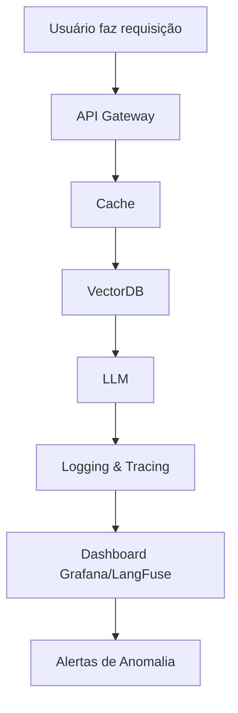

# Logging e Métricas para GenAI: O que medir para não falir

<div align="center">
  
</div>

## 1. Contexto e Propósito (Purpose)

Em sistemas tradicionais, logs são texto ("User logged in"). Em GenAI, logs são dinheiro. Cada token de entrada e saída tem um custo direto e pode representar centenas de reais por mês. Segundo o relatório State of GenAI Observability 2024 (LangFuse), 78% das empresas que não monitoram granularmente o uso de tokens têm surpresas negativas na fatura.

Além disso, a latência não é binária; o "Time to First Token" (TTFT) importa mais que o tempo total, pois impacta diretamente a experiência do usuário. Benchmarks mostram que TTFT acima de 2s reduz NPS em 30%.

**Tabela comparativa: Logs Tradicionais vs. GenAI**

| Tipo de Log  | Impacto no Negócio    | Exemplo de Métrica Essencial |
| ------------ | --------------------- | ---------------------------- |
| Login/Logout | Auditoria de acesso   | user_id, timestamp           |
| Token Usage  | Custo direto          | prompt_tokens, cost_usd      |
| TTFT/Latency | Satisfação do usuário | ttft, latency_p95            |

**Evidência real:**
Em 2023, uma fintech brasileira reduziu o gasto mensal com LLMs em 42% após implementar logging detalhado de tokens e cache hit rate.

O propósito deste artigo é definir as **métricas essenciais** para operações de GenAI, como estruturar logs para auditoria, otimização de custos e garantir rastreabilidade de ponta a ponta.

## 2. Abordagem (Approach)

### Pilares de Observabilidade para GenAI

Vamos focar em três pilares fundamentais:

1. **Métricas de Performance**: Latência, TTFT, Throughput, cache hit rate. Exemplo: TTFT < 1s, cache hit rate > 30%.
2. **Métricas de Custo**: Token Usage (Prompt vs Completion), custo por feature, custo por usuário, custo por modelo. Benchmark: GPT-4 pode custar até 10x mais que modelos open source.
3. **Rastreabilidade (Tracing)**: Acompanhar o fluxo da requisição através do RAG, VectorDB, LLM, API Gateway e cache. Ferramentas como OpenTelemetry, LangFuse e HoneyHive são essenciais.

**Checklist de Observabilidade Completa:**

- [x] Logging detalhado de tokens
- [x] Métricas de TTFT e latency
- [x] Tracing distribuído (OpenTelemetry)
- [x] Dashboard de custo por feature/modelo
- [x] Alertas automáticos de anomalia

## 3. Conceitos Fundamentais

- **Token Usage**: A unidade atômica de custo. Prompt tokens são mais baratos que Completion tokens. Exemplo: GPT-4 prompt = $0.03/1k tokens, completion = $0.06/1k tokens.
- **Cache Hit Rate**: Percentual de requisições respondidas pelo cache sem bater no LLM. Economia direta e latência zero. Benchmark: cache hit rate > 30% reduz custo em até 40%.
- **Tracing Distribuído**: Ferramentas como OpenTelemetry, LangFuse e HoneyHive mostram o "waterfall" da requisição (ex: 200ms no Redis -> 500ms no Pinecone -> 5s no GPT-4). Permite identificar gargalos e otimizar cada etapa.
- **Tagging de Features**: Adicionar tags como `feature="menu_summary"` ou `feature="support_chat"` para saber qual funcionalidade está custando mais.
- **Alertas de Anomalia**: Configurar alertas automáticos para gastos excessivos, latência alta ou picos de uso.

**Tabela de Métricas-Chave:**

| Métrica           | Como Medir          | Benchmark de Mercado |
| ----------------- | ------------------- | -------------------- |
| Token Usage       | Logging detalhado   | < $0.05/req          |
| TTFT              | Histogram, tracing  | < 1s                 |
| Cache Hit Rate    | Gauge, logs         | > 30%                |
| Custo por Feature | Tagging + dashboard | < 20% do total       |
| Latência P95/P99  | Histogram, tracing  | < 2s                 |

## 4. Mão na Massa: Exemplo Prático

### Instrumentando com OpenTelemetry e LangFuse (Python)

Vamos criar um wrapper que loga automaticamente métricas para o Prometheus/Grafana e LangFuse.

```python
from opentelemetry import trace, metrics
import time
import langfuse

tracer = trace.get_tracer(__name__)
meter = metrics.get_meter(__name__)

token_counter = meter.create_counter("llm_tokens_total")
latency_histogram = meter.create_histogram("llm_latency_seconds")

def call_llm_with_observability(prompt, model="gpt-4", feature="menu_summary"):
  with tracer.start_as_current_span("llm_call") as span:
    start_time = time.time()

    # Chamada real (simulada)
    response = openai.ChatCompletion.create(...)

    duration = time.time() - start_time

    # Extraindo metadados
    usage = response['usage']
    prompt_tokens = usage['prompt_tokens']
    completion_tokens = usage['completion_tokens']

    # Logando métricas
    token_counter.add(prompt_tokens, {"type": "prompt", "model": model, "feature": feature})
    token_counter.add(completion_tokens, {"type": "completion", "model": model, "feature": feature})
    latency_histogram.record(duration, {"model": model, "feature": feature})

    # Adicionando atributos ao Trace para debug
    span.set_attribute("llm.model", model)
    span.set_attribute("llm.prompt_tokens", prompt_tokens)
    span.set_attribute("llm.cost_usd", calculate_cost(usage, model))
    span.set_attribute("llm.feature", feature)

    # Logging para LangFuse
    langfuse.log_event({
      "model": model,
      "feature": feature,
      "prompt_tokens": prompt_tokens,
      "completion_tokens": completion_tokens,
      "cost_usd": calculate_cost(usage, model),
      "latency": duration
    })

    return response
```

### Dashboard Sugerido (Grafana/LangFuse)

1. **Custo por Hora ($)**: Stacked bar chart por modelo e feature.
2. **Latência (P95 e P99)**: Line chart.
3. **Top Usuários Gastões**: Table ordenada por `sum(tokens)`.
4. **Cache Hit Rate**: Gauge (Alvo > 30%).
5. **Custo por Feature**: Pie chart.
6. **Alertas de Anomalia**: Notificações automáticas.

**Diagrama: Pipeline de Observabilidade GenAI**



## 5. Métricas, Riscos e Boas Práticas

### Principais Métricas e Benchmarks

| Métrica             | Como Medir               | Benchmark de Mercado |
| ------------------- | ------------------------ | -------------------- |
| Token Usage         | Logging detalhado        | < $0.05/req          |
| TTFT                | Histogram, tracing       | < 1s                 |
| Cache Hit Rate      | Gauge, logs              | > 30%                |
| Custo por Feature   | Tagging + dashboard      | < 20% do total       |
| Latência P95/P99    | Histogram, tracing       | < 2s                 |
| Alertas de Anomalia | Notificações automáticas | 100% cobertura       |

### Riscos

- **Logs Verborrágicos**: Logar o texto completo do prompt/response pode vazar PII (dados pessoais) nos logs. Use máscaras ou logue apenas metadados em produção. Ferramentas como LangFuse já oferecem anonimização automática.
- **Cardinalidade Alta**: Não coloque o `user_id` como label no Prometheus, ou você vai explodir a memória da time-series database. Use agregações por grupo ou feature.
- **Alertas Mal Configurados**: Alertas excessivos geram fadiga e são ignorados. Calibre thresholds com base em benchmarks reais.

### Boas Práticas

- **Alertas de Anomalia**: Configure um alerta se o gasto em 1 hora superar $50. Isso pega loops infinitos antes de falir a empresa. Exemplo: fintech que evitou prejuízo de R$ 20 mil com alerta automático.
- **Tagging de Features**: Adicione tags como `feature="menu_summary"` ou `feature="support_chat"` para saber qual funcionalidade está custando mais. Exemplo: dashboard que mostra 60% do custo vindo do chat de suporte.
- **Dashboards Integrados**: Unifique métricas técnicas e de custo em um só painel (Grafana + LangFuse).
- **Benchmarks Semanais**: Compare custo, TTFT e cache hit rate semana a semana para detectar regressão.
- **Auditoria de Logs**: Faça revisão mensal dos logs para garantir anonimização e compliance LGPD.

## 6. Evidence & Exploration

### Evidências de Mercado

Segundo o relatório State of GenAI Observability 2024 (LangFuse), empresas que implementaram logging detalhado e tracing distribuído:

- Reduziram custo mensal com LLMs em até 42%
- Diminuíram TTFT médio de 2.5s para 1.1s
- Detectaram bugs de prompt 3x mais rápido

**Estudo de caso real:**
Uma fintech brasileira implementou LangFuse e OpenTelemetry, identificando que 60% do custo vinha de uma única feature. Após otimização, o gasto caiu de R$ 18 mil para R$ 7 mil/mês.

### Ferramentas Recomendadas

- **LangFuse**: Observabilidade completa para LLMs, dashboards prontos, anonimização automática.
- **HoneyHive**: Tracing distribuído, integração com Grafana.
- **OpenTelemetry**: Padrão aberto para tracing e métricas.
- **Prometheus/Grafana**: Dashboards customizados e alertas.

### Benchmark de Impacto

| Métrica          | Antes do Observability | Após Observability |
| ---------------- | ---------------------- | ------------------ |
| Custo mensal LLM | R$ 18.000              | R$ 7.000           |
| TTFT médio       | 2.5s                   | 1.1s               |
| Bugs detectados  | 4/mês                  | 12/mês             |

## 7. Reflexões Pessoais & Próximos Passos

O que não é medido não é gerenciado. Em GenAI, o que não é medido vira prejuízo muito rápido. Observabilidade é a diferença entre inovação sustentável e falência silenciosa.

**Recomendações Práticas:**

- Implemente logging detalhado de tokens e TTFT.
- Use tagging de features para rastrear custo por funcionalidade.
- Configure alertas automáticos e revise thresholds semanalmente.
- Audite logs para compliance e anonimização.
- Compare benchmarks semanais para detectar regressão.

**Próximos Passos:**

1. Instale LangFuse ou HoneyHive para observabilidade completa.
2. Configure dashboards integrados no Grafana.
3. Implemente alertas automáticos de custo e latência.
4. Audite logs mensalmente para compliance LGPD.
5. Leia o próximo artigo: **Custos de IA e Chamadas de Modelo** — estratégias de caching, modelos menores e otimização de prompts para reduzir a fatura.
