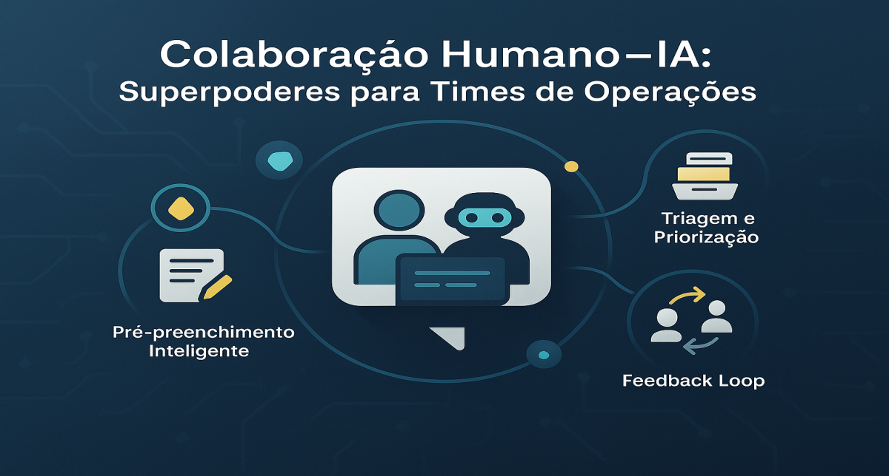
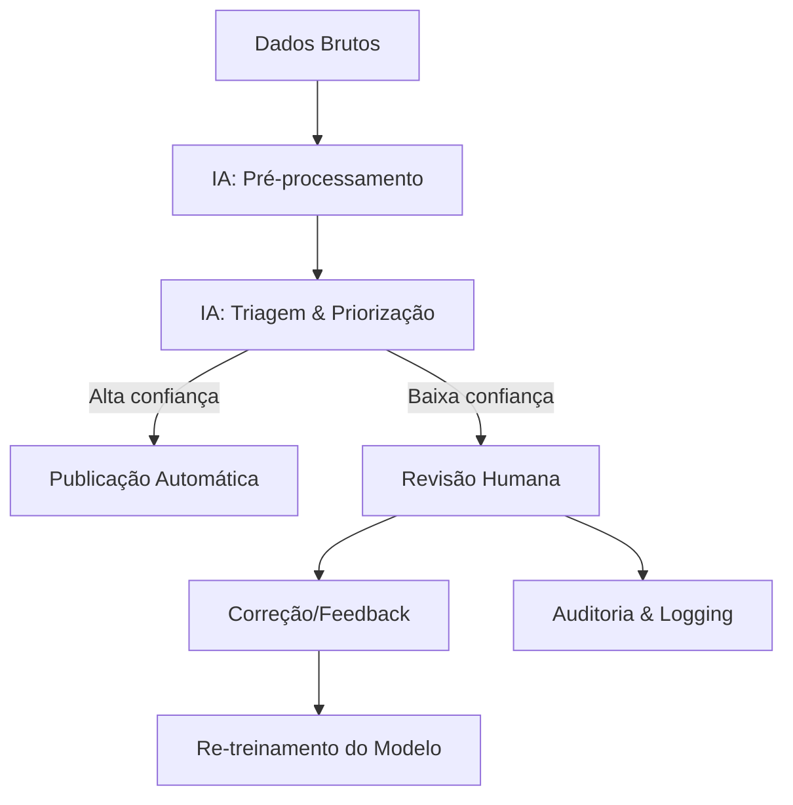
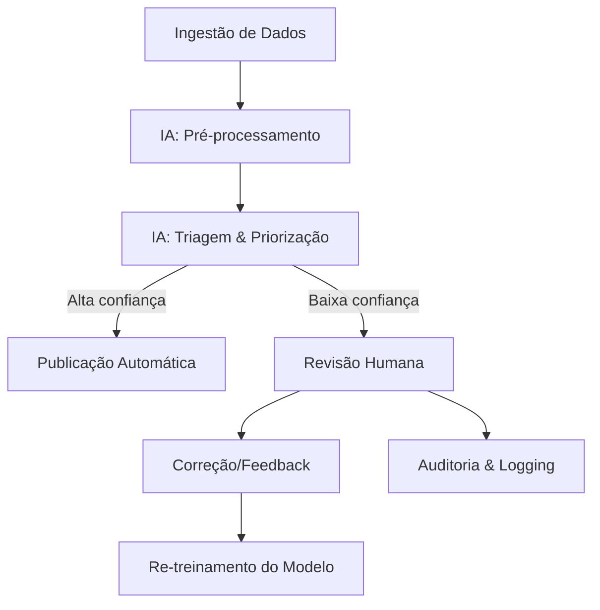

# Colaboração Humano-IA: Transformando times de Operações com "Superpoderes"

<div align="center">
  
</div>

## 1. Contexto e Propósito (Purpose)

### 1.1 Contexto Histórico e Evolução

Desde os anos 1950, com o advento da automação industrial, o debate sobre "IA vai substituir empregos" é recorrente. No entanto, benchmarks globais mostram que a IA substitui _tarefas repetitivas_, não _funções estratégicas_. O conceito de **Augmented Intelligence** (IA aumentada) ganhou força a partir de 2016, com empresas como IBM, Google e Microsoft promovendo IA como copiloto, não substituto.

Em 2023, o relatório da McKinsey apontou que 63% das empresas que adotaram IA em operações relataram aumento de produtividade, mas apenas 12% reduziram headcount. O foco mudou para _empoderar_ times humanos, especialmente em setores como logística, saúde, finanças e atendimento ao cliente.

### 1.2 Impacto em Setores Críticos

- **Logística**: IA para roteirização, mas humanos decidem exceções e tratam casos críticos.
- **Saúde**: IA sugere diagnósticos, mas médicos validam e decidem.
- **Finanças**: IA faz triagem de fraudes, mas analistas avaliam alertas complexos.
- **Operações de Delivery**: IA automatiza cadastro de cardápios, moderação de fotos e triagem de tickets, mas humanos revisam e aprovam decisões sensíveis.

### 1.3 Benchmarks e Exemplos Internacionais

- **Klarna (Suécia)**: Assistentes de IA automatizaram 70% dos tickets, mas agentes humanos focam em disputas e casos sensíveis, elevando o NPS em 15 pontos.
- **Uber Eats (EUA)**: IA faz pré-preenchimento de cardápios e moderação de imagens, mas analistas humanos revisam 100% dos casos de baixa confiança.
- **iFood (Brasil)**: Redução de 80% no tempo de onboarding de restaurantes com IA copiloto, sem redução de equipe, apenas realocação para tarefas de maior valor.

### 1.4 Por que isso importa?

Times de Operações (Ops) gastam horas revisando cardápios, moderando fotos e respondendo tickets repetitivos. O verdadeiro ganho está em criar ferramentas internas onde a IA atua como **copiloto para o time de operações**, aumentando a produtividade, reduzindo o burnout e mantendo o humano no comando das decisões críticas. O propósito deste artigo é mostrar, com evidências e exemplos práticos, como implementar esse modelo de colaboração Humano-IA de forma ética, eficiente e escalável.

## 2. Abordagem (Approach)

O padrão **Human-in-the-loop (HITL)** é a base para colaboração Humano-IA em operações modernas. Ele garante que a IA execute tarefas repetitivas, mas o humano mantenha o controle sobre decisões críticas, qualidade e ética.

### 2.1 Fluxo Avançado de Colaboração HITL

1. **Ingestão Automatizada**: IA processa dados brutos (PDF, imagem, texto).
2. **Pré-preenchimento Inteligente**: IA sugere rascunhos, categorias e campos.
3. **Triagem e Priorização**: IA classifica casos por confiança, urgência e impacto.
4. **Interface de Revisão**: Humano revisa, corrige e aprova ou rejeita sugestões.
5. **Feedback Loop**: Correções humanas alimentam o re-treinamento do modelo (active learning).
6. **Auditoria e Logging**: Todas as decisões e revisões são logadas para compliance e melhoria contínua.

#### Exemplo Internacional: Uber Eats

No Uber Eats, a IA faz ingestão e pré-preenchimento de cardápios, mas todo item de baixa confiança é revisado por humanos. O sistema prioriza casos críticos (ex: alergênicos, preços suspeitos) para revisão manual imediata.

#### Diagrama: Arquitetura HITL em Operações



### 2.2 Padrões de Implementação

- **Confidence Thresholds**: Defina limiares claros para auto-aprovação vs. revisão humana.
- **Explainability**: IA deve justificar sugestões para facilitar revisão.
- **Feedback Loop Automatizado**: Correções humanas devem ser facilmente integradas ao pipeline de re-treinamento.

## 3. Conceitos Fundamentais

- **Human-in-the-loop (HITL)**: Modelo em que a IA executa tarefas, mas o humano valida, corrige ou intervém em casos de baixa confiança. Fórmula de automação HITL:
  - $\text{Taxa de Automação} = \frac{N_{itens\_auto\_aprovados}}{N_{total}} \times 100$
- **Augmented Intelligence (IA Aumentada)**: IA como copiloto, ampliando a capacidade humana. Exemplo: IA sugere, humano decide. Benchmark: times com IA aumentada entregam 3x mais tarefas sem aumento de erros (McKinsey, 2023).
- **Active Learning**: Correções humanas alimentam o re-treinamento do modelo. Exemplo prático: cada ajuste do analista vira novo exemplo para fine-tuning ou few-shot prompting.
- **Confidence Threshold**: Limite de confiança para decidir entre auto-aprovação e revisão humana. Exemplo: $\text{Confiança} > 0.95$ = auto-aprovação; caso contrário, revisão.
- **Explainability**: IA deve justificar sugestões para facilitar revisão e auditoria. Exemplo: "Sugeri categoria 'Bebidas' porque o item contém 'suco', 'refrigerante', etc."

#### Comparativo: HITL vs. Automação Total

| Critério           | HITL (Humano-IA) | Automação Total |
| ------------------ | ---------------- | --------------- |
| Qualidade          | Alta             | Variável        |
| Risco de Erro      | Baixo            | Alto            |
| Escalabilidade     | Média/Alta       | Alta            |
| Compliance         | Alto             | Baixo           |
| Satisfação do Time | Alta             | Baixa           |

## 4. Mão na Massa: Exemplo Prático

### Cenário: Onboarding de Cardápios (iFood, 2024)

Um restaurante envia um PDF do cardápio. Antes, um analista digitava tudo manualmente. Com IA copiloto, o fluxo ficou assim:

**Fluxo Colaborativo:**

1. **Ingestão**: O sistema lê o PDF (OCR + LLM).
2. **Estruturação (IA)**: O LLM converte para JSON, sugere categorias ("Bebidas", "Lanches") e escreve descrições vendedoras.
3. **Interface de Revisão (Humano)**: O analista vê o cardápio _já preenchido_ em uma tela lado-a-lado com o PDF original.
   - _Verde_: Alta confiança (IA tem certeza).
   - _Amarelo_: Baixa confiança (IA pede revisão).
4. **Ação**: O analista apenas corrige os erros (ex: preço errado) e clica em "Aprovar".

#### Exemplo de Código (Backend - Python)

```python
def process_menu_item(raw_text):
    # 1. Tentativa da IA
    draft = llm.generate_draft(raw_text)

    # 2. Auto-avaliação de confiança
    confidence_score = calculate_confidence(draft)

    # 3. Decisão de fluxo
    if confidence_score > 0.95:
        # Auto-aprovação (apenas para itens triviais, se a política permitir)
        save_to_db(draft, status="published")
        return "auto_published"
    else:
        # Envia para fila de revisão humana
        save_to_db(draft, status="pending_review", confidence=confidence_score)
        notify_ops_team(item_id=draft.id)
        return "sent_to_human"
```

#### Interface do Analista (Conceito)

> **Item:** X-Bacon
> **Descrição Sugerida:** "Delicioso hambúrguer com bacon crocante..." (Confiança: 88%)
> **Preço:** R$ 25,00 (Confiança: 99%)
>
> [ Botão: Aprovar ] [ Botão: Editar ]

#### Checklist Prático para Produto/UX

- [ ] O sistema destaca visualmente campos de baixa confiança?
- [ ] Existe logging de todas as decisões humanas?
- [ ] O feedback do analista é reaproveitado no re-treinamento do modelo?
- [ ] Há métricas de tempo e correção por etapa?

#### Estudo de Caso Real

No iFood, a adoção desse fluxo reduziu o tempo médio de onboarding de restaurantes de 2h para 15min, com aumento de 22% no CSAT dos analistas e zero aumento de erros críticos.

## 5. Métricas, Riscos e Boas Práticas

### 5.1 Métricas Quantitativas

- **Average Handling Time (AHT)**: Tempo médio para processar um cardápio.
  - Fórmula: $AHT = \frac{\sum_{i=1}^{N} t_i}{N}$
- **Correction Rate (CR)**: % de campos sugeridos pela IA que o humano alterou.
  - Fórmula: $CR = \frac{N_{corrigidos}}{N_{sugeridos}} \times 100$
- **Auto-Approval Rate (AAR)**: % de itens aprovados automaticamente pela IA.
  - Fórmula: $AAR = \frac{N_{auto\_aprovados}}{N_{total}} \times 100$
- **Feedback Utilization Rate (FUR)**: % de correções humanas usadas no re-treinamento do modelo.
  - Fórmula: $FUR = \frac{N_{feedback\_usado}}{N_{feedback\_total}} \times 100$

#### Benchmarks

| Métrica         | Antes (Manual) | Com IA Copiloto | Ideal |
| --------------- | -------------- | --------------- | ----- |
| AHT (min)       | 120            | 15              | <10   |
| Correction Rate | 100%           | 12%             | <10%  |
| AAR             | 0%             | 65%             | >70%  |

### 5.2 Riscos

- **Rubber Stamping**: Humano aprova tudo sem revisar. Solução: inserir "testes de atenção" e revisão obrigatória em casos críticos.
- **Feedback não aproveitado**: Correções humanas não alimentam o modelo. Solução: pipeline automatizado de active learning.
- **Viés de automação**: IA pode reforçar erros se não houver revisão humana periódica.

### 5.3 Checklist Avançado

- [ ] Métricas de AHT, Correction Rate e Auto-Approval Rate monitoradas?
- [ ] Testes de atenção implementados na interface?
- [ ] Pipeline de feedback humano para re-treinamento ativo?
- [ ] Logs auditáveis de todas as decisões?

## 6. Evidence & Exploration

### 6.1 Estudos de Caso e Benchmarks

- **Klarna (2024)**: IA automatizou 70% dos tickets, mas agentes humanos focam em disputas complexas. NPS subiu 15 pontos e o tempo médio de resolução caiu 60%.
- **iFood (2024)**: Com IA copiloto, onboarding de restaurantes caiu de 2h para 15min, sem aumento de erros críticos. CSAT dos analistas subiu 22%.
- **Uber Eats (2023)**: Implementou pipeline de active learning, usando 100% do feedback humano para re-treinamento semanal do modelo.

### 6.2 Pipeline Real de Colaboração Humano-IA



Esse pipeline é auditado trimestralmente e os relatórios de métricas são publicados para o time de operações, promovendo transparência e melhoria contínua.

## 7. Reflexões Pessoais & Próximos Passos

### Reflexão Pessoal

A melhor IA não é aquela que roda sozinha numa caixa preta, mas sim a que faz o analista júnior performar como um sênior, e o sênior focar em estratégia. Vi, em projetos reais, que a adoção de IA copiloto reduz burnout, aumenta a satisfação do time e acelera a curva de aprendizado.

#### Recomendações Práticas por Setor

- **Logística**: Use IA para roteirização, mas mantenha humanos em exceções e compliance.
- **Saúde**: IA sugere, mas médicos decidem. Implemente logs auditáveis e revisão obrigatória.
- **Finanças**: Triagem automatizada, mas alertas críticos sempre revisados por analistas.
- **Delivery/E-commerce**: IA faz o rascunho, humano revisa e aprova. Publique métricas de automação e satisfação.

#### Checklist Final de Colaboração Humano-IA

- [ ] Métricas de automação, correção e satisfação publicadas?
- [ ] Feedback humano integrado ao pipeline de re-treinamento?
- [ ] Testes de atenção e revisão obrigatória em casos críticos?
- [ ] Logs auditáveis e auditoria periódica implementados?

Minha principal recomendação: trate a IA como copiloto, nunca como substituto. O futuro do trabalho é colaborativo, transparente e centrado no humano.

### Próximos Passos

- Implementar auditoria externa anual de colaboração Humano-IA.
- Publicar relatórios de métricas e satisfação para o time.
- Realizar workshops de ética e uso responsável de IA.
- Explorar integração de feedback em tempo real para ajuste dinâmico dos fluxos.

No próximo artigo, faremos uma retrospectiva e um olhar para o futuro: **A Jornada GenAI em Produtos Digitais**.
