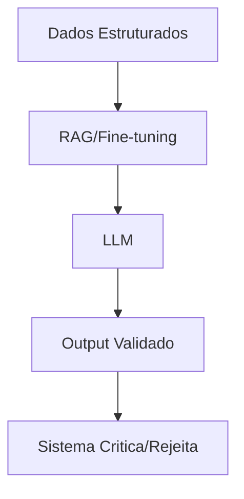
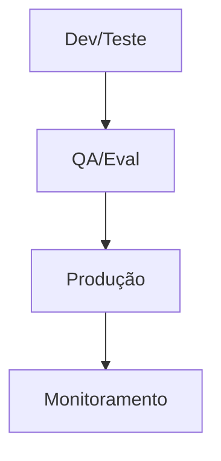
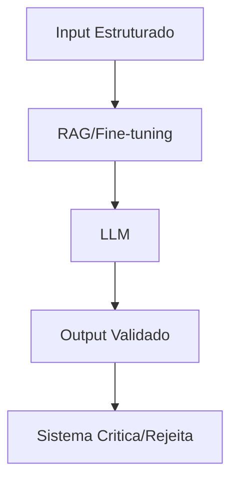

# A Jornada GenAI em Produtos Digitais: Do Hype à Engenharia Sólida

<div align="center">
  
</div>

## 1. Contexto e Propósito (Purpose)

Ao final desta série, é essencial entender que a jornada GenAI em produtos digitais vai muito além do hype inicial. O mercado evoluiu de demos impressionantes para demandas reais de robustez, escalabilidade e responsabilidade. Empresas enfrentam desafios como:

- **Escalabilidade de soluções GenAI**: Como sair do protótipo para sistemas que suportam milhões de usuários?
- **Governança e Compliance**: Como garantir privacidade, segurança e ética em sistemas que aprendem e se adaptam?
- **Eficiência operacional**: Como equilibrar custos, latência e qualidade das respostas?

Este artigo consolida os aprendizados em um **Framework de Maturidade GenAI**, inspirado em modelos como ML Maturity Model, DataOps e AI Engineering, adaptado para times que querem transformar experimentos em produtos sólidos. O objetivo é servir como guia prático para líderes técnicos, engenheiros e PMs que buscam entregar valor real com IA generativa, evitando armadilhas comuns e acelerando a curva de aprendizado.

> **Recomendação Técnica:** Adote frameworks de maturidade (ex: ML Maturity Model, AI Engineering Lifecycle) para mapear o estágio do seu produto GenAI e definir próximos passos claros. Avalie continuamente gaps em observabilidade, governança e automação.

## 2. Abordagem (Approach)

Para transformar GenAI em produto digital robusto, é preciso evoluir por fases de maturidade, cada uma com desafios e benchmarks específicos. Abaixo, detalho cada fase com frameworks e exemplos práticos:

### Fase 1: O Brinquedo (Experimentação)

- **Características:** Prototipagem rápida, prompts manuais, demos para stakeholders, pouca documentação.
- **Frameworks:** Design Thinking, Lean Startup para validação rápida de hipóteses.
- **Benchmarks:** Tempo de prototipagem (<1 semana), engajamento inicial, feedback qualitativo.

### Fase 2: O Produto (Produção)

- **Características:** Implementação de RAG, tratamento de erros, controle de custos, versionamento de prompts.
- **Frameworks:** MLOps básico, CI/CD para APIs GenAI, observabilidade mínima.
- **Benchmarks:** Latência <1s, custo por chamada <R$0,01, cobertura de testes >70%.

### Fase 3: A Plataforma (Escala)

- **Características:** Automação de deploy, testes automatizados, governança de dados, monitoramento de métricas.
- **Frameworks:** DataOps, AI Engineering Lifecycle, pipelines de dados e modelos.
- **Benchmarks:** Uptime >99,9%, tempo de rollback <10min, métricas de qualidade (ex: hallucination rate <5%).

### Fase 4: A Responsabilidade (Ética)

- **Características:** Mitigação de viés, transparência, interfaces honestas, impacto social monitorado.
- **Frameworks:** Responsible AI, Red Teaming, auditoria de modelos.
- **Benchmarks:** Taxa de viés <2%, conformidade LGPD/GDPR, satisfação do usuário (>80 NPS).

> **Recomendação Técnica:** Use frameworks como Responsible AI e AI Engineering para mapear gaps em cada fase. Implemente benchmarks claros para medir evolução e maturidade do produto GenAI.

## 3. Conceitos Fundamentais

### AI Engineering

A disciplina que une Engenharia de Software, Ciência de Dados e Operações. O foco não é apenas treinar modelos, mas construir sistemas resilientes _ao redor_ de modelos probabilísticos, com observabilidade, automação e governança.

**Exemplo:** Implementar pipelines de dados, versionamento de modelos, monitoramento de métricas e fallback automático para garantir robustez.

### Probabilistic Software

Em GenAI, `f(x)` pode retornar múltiplos resultados para o mesmo input. O código precisa tratar incerteza, ambiguidade e falhas como cidadãos de primeira classe.

**Exemplo:** Implementar lógica de retry, validação de outputs, e fluxos de aprovação humana para casos críticos.

### Value-Driven AI

IA deve ser usada para resolver problemas reais de negócio, com métricas claras de impacto (ex: redução de custos, aumento de conversão, melhoria de experiência).

**Exemplo:** Medir o impacto da IA em KPIs do produto, como churn, NPS, ou receita incremental.

### Diagrama Conceitual



> **Recomendação Técnica:** Adote práticas de AI Engineering para garantir que GenAI seja parte de um sistema robusto, auditável e escalável. Trate incerteza como parte do design e monitore impacto de negócio continuamente.

## 4. Mão na Massa: Exemplo Prático

### Checklist de Go-Live GenAI

Antes de colocar sua próxima feature de GenAI em produção, siga este checklist prático, com exemplos e links para artigos anteriores:

#### Arquitetura & Código

- [ ] **Timeout e Retry:** Implemente tratamento de timeout e retry com backoff exponencial ([Artigo 08](./08-tratamento-erros-timeouts-llm.md)).

  ```python
  import time
  def retry_with_backoff(func, max_retries=3):
    for i in range(max_retries):
      try:
        return func()
      except Exception:
        time.sleep(2 ** i)
    raise Exception("Max retries reached")
  ```

- [ ] **Versionamento de Prompts:** Use Git para versionar prompts como código ([Artigo 06](./06-versionamento-prompts-dados-modelos.md)).
- [ ] **Arquitetura Assíncrona:** Adote arquitetura event-driven para processos longos ([Artigo 09](./09-arquiteturas-event-driven-ia.md)).

#### Qualidade & Testes

- [ ] **Golden Questions:** Tenha um dataset de "Golden Questions" para avaliação (Evals) ([Artigo 10](./10-testes-automatizados-sistemas-ia.md)).
- [ ] **Monitoramento de Alucinações:** Implemente métricas para alucinações e drift de respostas ([Artigo 12](./12-monitorando-qualidade-respostas.md), [Artigo 16](./16-alucinacoes-llm-mitigacao.md)).
- [ ] **Red Teaming:** Realize testes de viés e injeção de prompt ([Artigo 17](./17-bias-modelos-ia.md)).

#### Operação & Negócio

- [ ] **Unit Economics:** Calcule o custo por chamada e avalie viabilidade do produto ([Artigo 14](./14-custos-ia-chamadas-modelo.md)).
- [ ] **Bot Disclosure:** Garanta que a interface deixa claro que é uma IA ([Artigo 18](./18-interfaces-conversacionais-honestas.md)).
- [ ] **Fallback:** Tenha plano de fallback se o modelo cair ([Artigo 01](./01-do-modelo-ao-produto.md)).

### Fluxo Prático de Deploy GenAI



> **Recomendação Técnica:** Automatize o checklist em pipelines CI/CD, monitore métricas em tempo real e documente aprendizados para acelerar evolução do produto GenAI.

## 5. Métricas, Riscos e Boas Práticas

### KPIs e Métricas Essenciais

Para garantir evolução e robustez do produto GenAI, monitore KPIs técnicos e de negócio:

- **Hallucination Rate:** % de respostas incorretas ou inventadas. Meta: <5%.
- **Latency:** Tempo médio de resposta. Meta: <1s para casos críticos.
- **Cost per Call:** Custo médio por chamada de modelo. Meta: <R$0,01.
- **Coverage:** % de casos de uso cobertos por testes automatizados. Meta: >80%.
- **User Satisfaction (NPS):** Satisfação do usuário final. Meta: >80.

### Estratégias de Medição

- Implemente dashboards de métricas em tempo real (ex: Prometheus, Grafana).
- Realize avaliações periódicas com "Golden Questions" e Red Teaming.
- Monitore drift de dados e respostas para antecipar problemas.

### Riscos e Mitigação

- **Dívida Técnica de IA:** Os últimos 20% (casos de borda, segurança, latência) custam 80% do esforço. Invista em observabilidade ([Artigo 13](./13-logging-metricas-genai.md)) desde o início.
- **Escalabilidade:** Planeje para crescimento exponencial, com automação de deploy e rollback.
- **Compliance e Ética:** Monitore conformidade LGPD/GDPR e implemente auditoria contínua.

### Boas Práticas Finais

- **Comece Simples:** Prompt Engineering > RAG > Fine-tuning. Só suba a escada se necessário ([Artigo 04](./04-finetuning-vs-prompt-vs-rag.md)).
- **Humanos no Comando:** Use IA para empoderar, não apenas substituir ([Artigo 19](./19-colaboracao-humano-ia.md)).

> **Recomendação Técnica:** Defina KPIs claros, monitore-os em tempo real e ajuste estratégias conforme evolução do produto. Documente aprendizados e compartilhe com o time para acelerar maturidade.

## 6. Evidence & Exploration

### Dados da Prática Real

Empresas líderes como iFood, Uber, DoorDash e Stripe aplicam GenAI para resolver problemas críticos de negócio, indo muito além de chatbots:

- **iFood:** Classificação automática de cardápios, recomendação personalizada, análise de sentimentos em avaliações, automação de atendimento.
- **Uber:** Detecção de fraudes em tempo real, otimização dinâmica de rotas, automação de suporte, previsão de demanda.
- **DoorDash:** Previsão de tempo de entrega, agrupamento inteligente de pedidos, chatbots de suporte, análise de feedbacks.
- **Stripe:** Detecção de fraude em transações, análise de risco em tempo real, automação de compliance.

### Pattern Emergente

Essas aplicações seguem um padrão robusto:

1. **Input estruturado** → (RAG ou Fine-tuning) → **LLM** → **Output validado** → **Sistema critica/rejeita**



### Referências Técnicas

- [ML Maturity Model (Google)](https://cloud.google.com/architecture/mlops-continuous-delivery-and-automation-pipelines-in-machine-learning)
- [AI Engineering Lifecycle (CMU)](https://ai.engineering.cmu.edu/)
- [Responsible AI (Microsoft)](https://www.microsoft.com/en-us/ai/responsible-ai)
- [DataOps Manifesto](https://www.dataopsmanifesto.org/)

### Recomendações Finais

- Adote frameworks de maturidade para mapear evolução do seu produto GenAI.
- Implemente automação, observabilidade e governança desde o início.
- Compartilhe aprendizados e erros com a comunidade para acelerar evolução coletiva.

> **Recomendação Técnica:** Estude casos reais, adapte padrões emergentes e mantenha-se atualizado com benchmarks do mercado. A maturidade GenAI é um processo contínuo, não um destino.

Nenhuma delas entrega 100% para o LLM. Todas têm **guardrails, loops de validação e fallbacks**.

### Case Study Simplificado: Recomendação no iFood

```
1. Usuário abre o app (6 PM, quinta-feira)
2. Sistema recupera:
   - Histórico: "Você pediu sushi 5x"
   - Contexto: "Está chovendo, 5 restaurantes a 500m"
   - Embedding: busca semântica por "prato rápido e quentinho"
3. RAG monta prompt: "Baseado em [...], recomende algo"
4. LLM retorna: "Sugiro pizza da Domino's"
5. Validação: "Pizza não está em 'sushi' e nem 'rápido'?"
6. Rejeita output > volta para ranking tradicional
7. Usuário vê recomendação confiável
```

Essa orquestração invisible é o que separa demos de produtos.

### Ferramentas e Operações

- **Observabilidade**: Datadog, New Relic, OpenTelemetry (rastreie CADA chamada ao LLM)
- **Feature Flags**: LaunchDarkly, Unleash (teste novos prompts/modelos gradualmente)
- **A/B Testing**: Optimizely, VWO (mas customizado para outputs de LLM)
- **MLOps**: Kubeflow, Airflow (orquestração de pipelines de IA)

## 7. Reflexões Pessoais & Próximos Passos

### Por que Essas Lições Importam

Escrever estes 20 artigos foi uma forma de estruturar meu próprio aprendizado. A área de GenAI muda toda semana—novos modelos, novos papers, novas frameworks. Mas os princípios de **construir software robusto, testável e centrado no usuário** são atemporais.

Observei que times que ganham com IA não são os que têm o prompt mais criativo. São os que:

1. **Investem em observabilidade desde o dia 1** (não "depois que escalar")
2. **Automatizam testes** para não regressionar em qualidade
3. **Medem o que importa**: ROI, latência, satisfação—não apenas acurácia
4. **Tratam a IA como um componente**, não como um silver bullet

### O Mapa de Maturidade (Revisitado)

```
FASE 1: Brinquedo
├─ 1 dev, 1 notebook, 0 testes
├─ "Cara, que legal!"
└─ Deploy em produção = rolar dados

FASE 2: Produto
├─ Prompts versionados, testes manual, logging
├─ Tratamento de erro básico
└─ Deploy com nervosismo

FASE 3: Plataforma
├─ MLOps, testes automatizados, observabilidade
├─ Feature flags, A/B testing
└─ Deploy com confiança

FASE 4: Escala Responsável
├─ Governança de dados, auditoria de viés
├─ Transparência ao usuário
└─ Deploy com propósito
```

Você não precisa estar na Fase 4 para ganhar. Mas precisa estar constantemente evoluindo.

### Ação Imediata

Se você leu até aqui, obrigado! Agora vem a parte importante:

1. **Identifique um problema real** do seu produto onde IA pode ajudar (não o mais sexy, o mais valioso)
2. **Aplique o PACE**: Purpose → Approach → Content → Evidence
3. **Comece na Fase 1 com seriedade**: Logging desde o dia 1, testes desde o dia 1
4. **Escale gradualmente**: Quando estiver confiante, suba de fase

### O Que Vem Depois

Esta série é o **alicerce**. Os próximos artigos podem ser:

- Deep dive em LangChain, LLaMA Index, ou outras frameworks
- Estudos de caso de falhas reais (e como foram corrigidas)
- Exploração de modelos open-source vs closed (trade-offs)
- Construção de sistemas multi-modais (texto + imagem + áudio)

Mas o conhecimento fundamental—que você tem agora—nunca vai ficar obsoleto.

---

**Fim da série GenAI Delivery Engineering Notes.**

_Construa com IA. Construa com engenharia. Construa com propósito._
